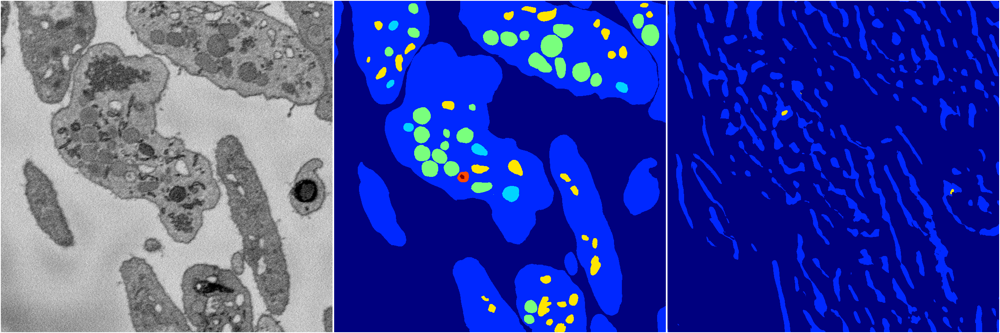

[Back](..)&nbsp;&nbsp;&nbsp;&nbsp;&nbsp;[Home](https://leapmanlab.github.io/snapshots)

---

<a href="1"><h2>random_2d_ed_dense / 0410 / 82 / 1</h2></a>
Created 07 May 2019, 10:52:49

<i>Click for more details</i>

**ari**: 0.0347. **miou**: 0.0952. **accuracy**: 0.5275. **n_params**: 1272904.0000. 

---

<a href="0"><h2>random_2d_ed_dense / 0410 / 82 / 0</h2></a>
Created 07 May 2019, 10:52:49

<i>Click for more details</i>

**ari**: 0.4816. **miou**: 0.1032. **accuracy**: 0.3797. **n_params**: 1272904.0000. 

---

[Back](..)&nbsp;&nbsp;&nbsp;&nbsp;&nbsp;[Home](https://leapmanlab.github.io/snapshots)

---