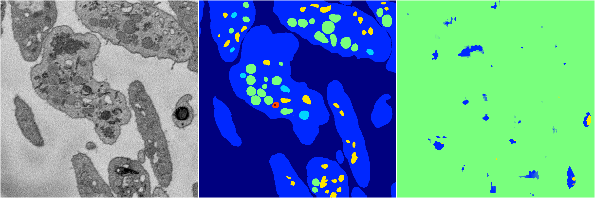

[Back](..)&nbsp;&nbsp;&nbsp;&nbsp;&nbsp;[Home](https://leapmanlab.github.io/snapshots)

---

<a href="1"><h2>random_2d_ed_dense / 0410 / 83 / 1</h2></a>
Created 20 Apr 2019, 00:17:07

<i>Click for more details</i>

**ari**: -0.0019. **miou**: 0.0697. **accuracy**: 0.4763. **n_params**: 5314431.0000. 

---

<a href="0"><h2>random_2d_ed_dense / 0410 / 83 / 0</h2></a>
Created 20 Apr 2019, 00:17:07

<i>Click for more details</i>

**ari**: 0.0084. **miou**: 0.0101. **accuracy**: 0.0480. **n_params**: 5314431.0000. 

---

[Back](..)&nbsp;&nbsp;&nbsp;&nbsp;&nbsp;[Home](https://leapmanlab.github.io/snapshots)

---