[Back](..)&nbsp;&nbsp;&nbsp;&nbsp;&nbsp;[Home](https://leapmanlab.github.io/snapshots)

---

<a href="299"><h2>random_2d_ed_dense / 0410 / 299</h2></a>
Created 16 Apr 2019, 17:08:33

<a href="299">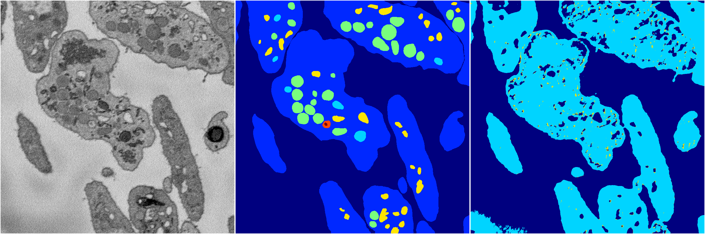</a>
<i>Click image for more details</i>

1 nets

**ari**: min 0.6570. max 0.6570. mean 0.6570.  ([best net](299/0))

**miou**: min 0.1305. max 0.1305. mean 0.1305.  ([best net](299/0))

**accuracy**: min 0.4641. max 0.4641. mean 0.4641.  ([best net](299/0))

**n_params**: min 6529951.0000. max 6529951.0000. mean 6529951.0000.  ([best net](299/0))

---

<a href="297"><h2>random_2d_ed_dense / 0410 / 297</h2></a>
Created 16 Apr 2019, 17:08:33

<a href="297">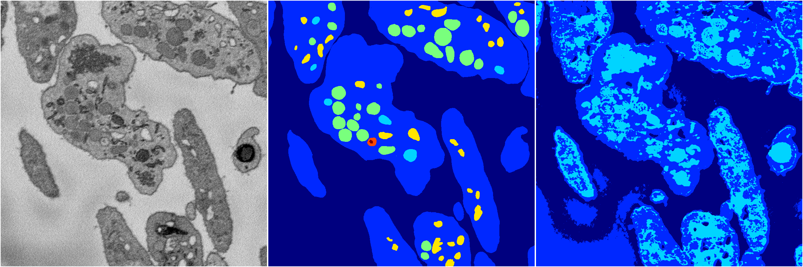</a>
<i>Click image for more details</i>

2 nets

**ari**: min 0.0273. max 0.4709. mean 0.2491.  ([best net](297/0))

**miou**: min 0.0616. max 0.1924. mean 0.1270.  ([best net](297/0))

**accuracy**: min 0.4015. max 0.6808. mean 0.5412.  ([best net](297/0))

**n_params**: min 857496.0000. max 857496.0000. mean 857496.0000.  ([best net](297/0))

---

<a href="289"><h2>random_2d_ed_dense / 0410 / 289</h2></a>
Created 16 Apr 2019, 17:08:32

<a href="289">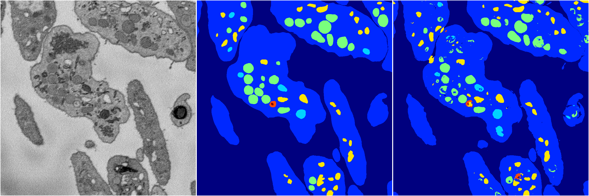</a>
<i>Click image for more details</i>

2 nets

**ari**: min 0.7424. max 0.8233. mean 0.7829.  ([best net](289/0))

**miou**: min 0.3797. max 0.5709. mean 0.4753.  ([best net](289/0))

**accuracy**: min 0.8869. max 0.9340. mean 0.9104.  ([best net](289/0))

**n_params**: min 9239104.0000. max 9239104.0000. mean 9239104.0000.  ([best net](289/0))

---

<a href="288"><h2>random_2d_ed_dense / 0410 / 288</h2></a>
Created 16 Apr 2019, 17:08:32

<a href="288">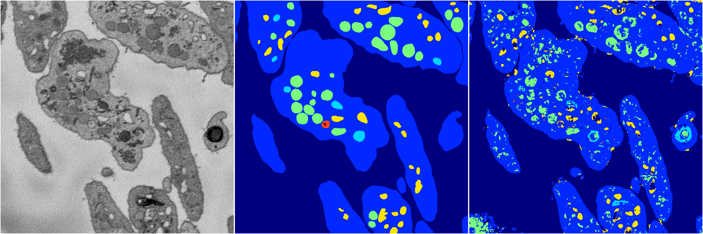</a>
<i>Click image for more details</i>

2 nets

**ari**: min 0.6431. max 0.7262. mean 0.6847.  ([best net](288/1))

**miou**: min 0.2980. max 0.4008. mean 0.3494.  ([best net](288/1))

**accuracy**: min 0.8399. max 0.8801. mean 0.8600.  ([best net](288/1))

**n_params**: min 744538.0000. max 744538.0000. mean 744538.0000.  ([best net](288/1))

---

<a href="281"><h2>random_2d_ed_dense / 0410 / 281</h2></a>
Created 16 Apr 2019, 17:08:32

<a href="281">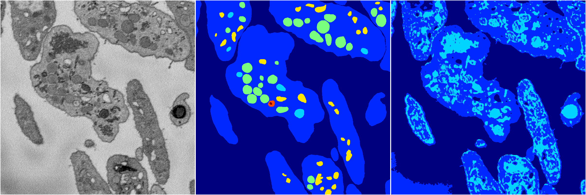</a>
<i>Click image for more details</i>

2 nets

**ari**: min 0.5594. max 0.5701. mean 0.5648.  ([best net](281/1))

**miou**: min 0.1648. max 0.2237. mean 0.1943.  ([best net](281/0))

**accuracy**: min 0.5413. max 0.7525. mean 0.6469.  ([best net](281/0))

**n_params**: min 1515341.0000. max 1515341.0000. mean 1515341.0000.  ([best net](281/0))

---

<a href="280"><h2>random_2d_ed_dense / 0410 / 280</h2></a>
Created 16 Apr 2019, 17:08:32

<a href="280">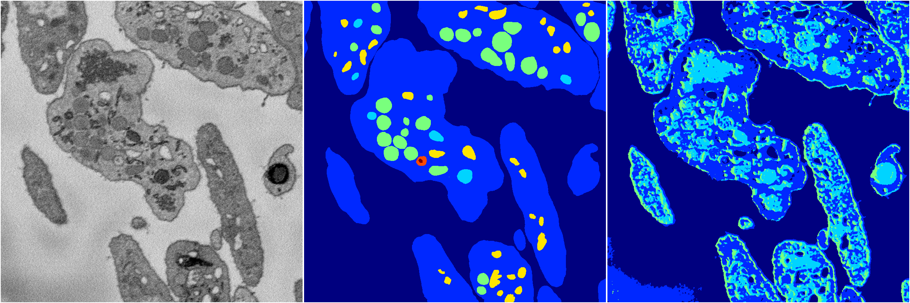</a>
<i>Click image for more details</i>

2 nets

**ari**: min 0.1920. max 0.5077. mean 0.3499.  ([best net](280/0))

**miou**: min 0.1544. max 0.2106. mean 0.1825.  ([best net](280/0))

**accuracy**: min 0.5727. max 0.6981. mean 0.6354.  ([best net](280/0))

**n_params**: min 4463532.0000. max 4463532.0000. mean 4463532.0000.  ([best net](280/0))

---

<a href="279"><h2>random_2d_ed_dense / 0410 / 279</h2></a>
Created 16 Apr 2019, 17:08:32

<i>Click image for more details</i>

2 nets

**ari**: min -0.0013. max 0.0000. mean -0.0007.  ([best net](279/1))

**miou**: min 0.0602. max 0.0612. mean 0.0607.  ([best net](279/0))

**accuracy**: min 0.4215. max 0.4243. mean 0.4229.  ([best net](279/0))

**n_params**: min 1602801.0000. max 1602801.0000. mean 1602801.0000.  ([best net](279/1))

---

<a href="272"><h2>random_2d_ed_dense / 0410 / 272</h2></a>
Created 16 Apr 2019, 17:08:32

<a href="272">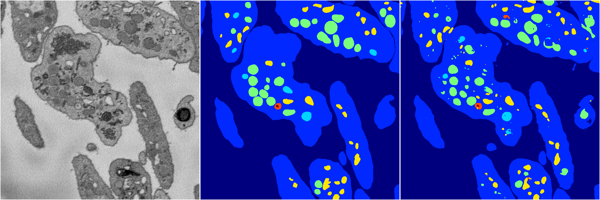</a>
<i>Click image for more details</i>

2 nets

**ari**: min 0.8164. max 0.8254. mean 0.8209.  ([best net](272/0))

**miou**: min 0.4664. max 0.5915. mean 0.5289.  ([best net](272/0))

**accuracy**: min 0.9303. max 0.9348. mean 0.9326.  ([best net](272/0))

**n_params**: min 6995088.0000. max 6995088.0000. mean 6995088.0000.  ([best net](272/1))

---

<a href="270"><h2>random_2d_ed_dense / 0410 / 270</h2></a>
Created 16 Apr 2019, 17:08:32

<a href="270">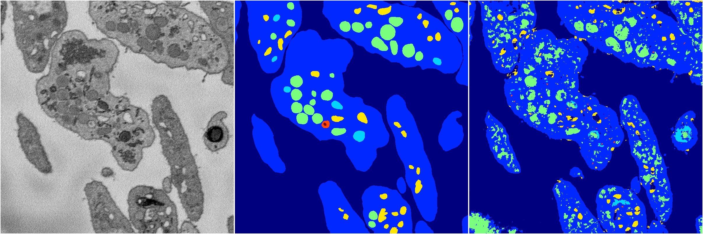</a>
<i>Click image for more details</i>

1 nets

**ari**: min 0.7128. max 0.7128. mean 0.7128.  ([best net](270/1))

**miou**: min 0.3469. max 0.3469. mean 0.3469.  ([best net](270/1))

**accuracy**: min 0.8694. max 0.8694. mean 0.8694.  ([best net](270/1))

**n_params**: min 2944187.0000. max 2944187.0000. mean 2944187.0000.  ([best net](270/1))

---

<a href="271"><h2>random_2d_ed_dense / 0410 / 271</h2></a>
Created 16 Apr 2019, 17:08:32

<a href="271">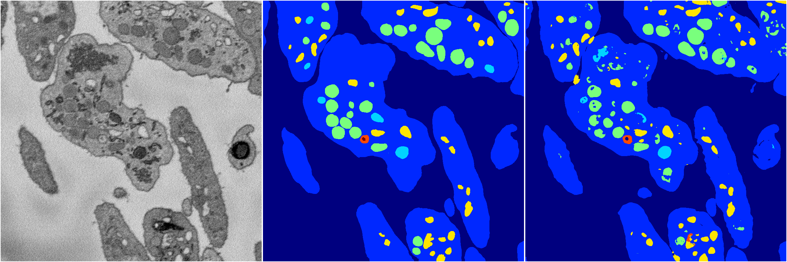</a>
<i>Click image for more details</i>

2 nets

**ari**: min 0.7257. max 0.8206. mean 0.7732.  ([best net](271/0))

**miou**: min 0.3841. max 0.5281. mean 0.4561.  ([best net](271/0))

**accuracy**: min 0.8766. max 0.9332. mean 0.9049.  ([best net](271/0))

**n_params**: min 3860250.0000. max 3860250.0000. mean 3860250.0000.  ([best net](271/1))

---

<a href="262"><h2>random_2d_ed_dense / 0410 / 262</h2></a>
Created 16 Apr 2019, 17:08:32

<a href="262">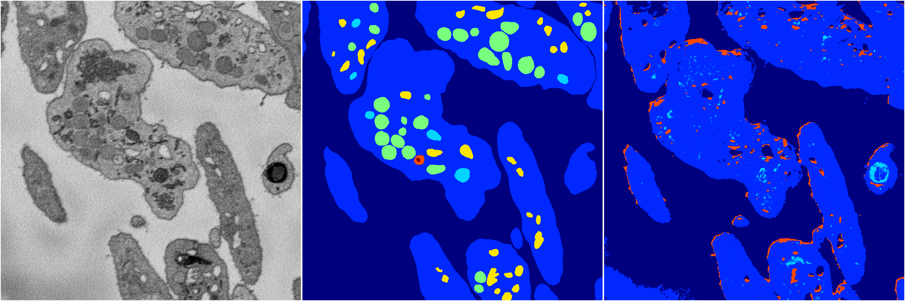</a>
<i>Click image for more details</i>

2 nets

**ari**: min -0.0066. max 0.6790. mean 0.3362.  ([best net](262/0))

**miou**: min 0.0728. max 0.2591. mean 0.1659.  ([best net](262/0))

**accuracy**: min 0.4471. max 0.8677. mean 0.6574.  ([best net](262/0))

**n_params**: min 11941521.0000. max 11941521.0000. mean 11941521.0000.  ([best net](262/0))

---

<a href="261"><h2>random_2d_ed_dense / 0410 / 261</h2></a>
Created 16 Apr 2019, 17:08:31

<i>Click image for more details</i>

2 nets

**ari**: min 0.2160. max 0.6833. mean 0.4496.  ([best net](261/1))

**miou**: min 0.1003. max 0.2450. mean 0.1727.  ([best net](261/1))

**accuracy**: min 0.4943. max 0.8833. mean 0.6888.  ([best net](261/1))

**n_params**: min 4994176.0000. max 4994176.0000. mean 4994176.0000.  ([best net](261/0))

---

<a href="253"><h2>random_2d_ed_dense / 0410 / 253</h2></a>
Created 16 Apr 2019, 17:08:31

<i>Click image for more details</i>

1 nets

**ari**: min 0.6950. max 0.6950. mean 0.6950.  ([best net](253/0))

**miou**: min 0.2997. max 0.2997. mean 0.2997.  ([best net](253/0))

**accuracy**: min 0.8809. max 0.8809. mean 0.8809.  ([best net](253/0))

**n_params**: min 3976644.0000. max 3976644.0000. mean 3976644.0000.  ([best net](253/0))

---

<a href="254"><h2>random_2d_ed_dense / 0410 / 254</h2></a>
Created 16 Apr 2019, 17:08:31

<a href="254">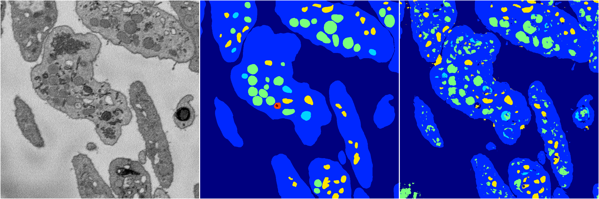</a>
<i>Click image for more details</i>

1 nets

**ari**: min 0.7426. max 0.7426. mean 0.7426.  ([best net](254/0))

**miou**: min 0.4123. max 0.4123. mean 0.4123.  ([best net](254/0))

**accuracy**: min 0.8903. max 0.8903. mean 0.8903.  ([best net](254/0))

**n_params**: min 1071731.0000. max 1071731.0000. mean 1071731.0000.  ([best net](254/0))

---

<a href="252"><h2>random_2d_ed_dense / 0410 / 252</h2></a>
Created 16 Apr 2019, 17:08:31

<a href="252">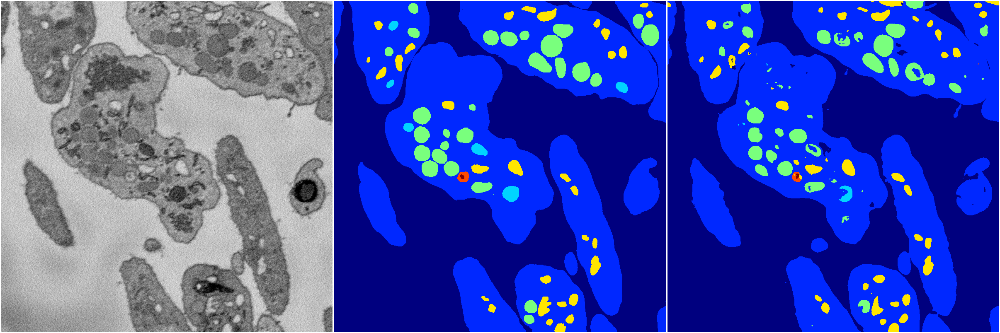</a>
<i>Click image for more details</i>

2 nets

**ari**: min 0.8136. max 0.8216. mean 0.8176.  ([best net](252/1))

**miou**: min 0.4600. max 0.5111. mean 0.4855.  ([best net](252/1))

**accuracy**: min 0.9304. max 0.9333. mean 0.9318.  ([best net](252/1))

**n_params**: min 4005266.0000. max 4005266.0000. mean 4005266.0000.  ([best net](252/0))

---

<a href="245"><h2>random_2d_ed_dense / 0410 / 245</h2></a>
Created 16 Apr 2019, 17:08:31

<i>Click image for more details</i>

1 nets

**ari**: min -0.0018. max -0.0018. mean -0.0018.  ([best net](245/1))

**miou**: min 0.0706. max 0.0706. mean 0.0706.  ([best net](245/1))

**accuracy**: min 0.4454. max 0.4454. mean 0.4454.  ([best net](245/1))

**n_params**: min 6066238.0000. max 6066238.0000. mean 6066238.0000.  ([best net](245/1))

---

<a href="244"><h2>random_2d_ed_dense / 0410 / 244</h2></a>
Created 16 Apr 2019, 17:08:31

<a href="244">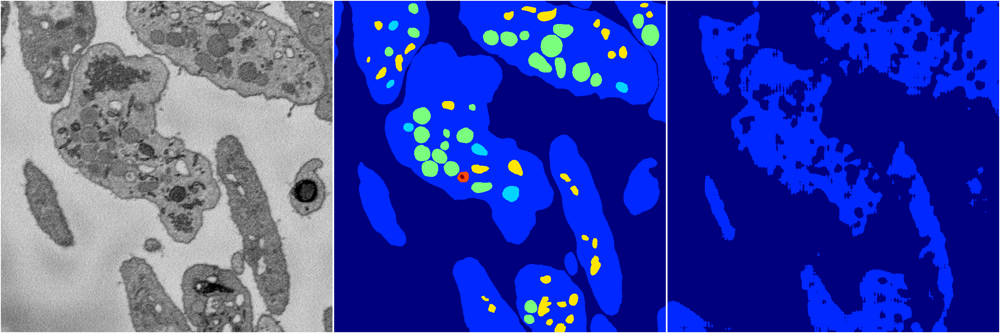</a>
<i>Click image for more details</i>

1 nets

**ari**: min 0.2095. max 0.2095. mean 0.2095.  ([best net](244/1))

**miou**: min 0.1494. max 0.1494. mean 0.1494.  ([best net](244/1))

**accuracy**: min 0.6832. max 0.6832. mean 0.6832.  ([best net](244/1))

**n_params**: min 5391978.0000. max 5391978.0000. mean 5391978.0000.  ([best net](244/1))

---

<a href="243"><h2>random_2d_ed_dense / 0410 / 243</h2></a>
Created 16 Apr 2019, 17:08:31

<a href="243">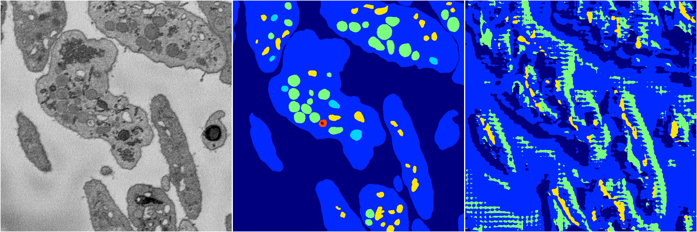</a>
<i>Click image for more details</i>

2 nets

**ari**: min 0.0065. max 0.0584. mean 0.0324.  ([best net](243/1))

**miou**: min 0.0252. max 0.0701. mean 0.0476.  ([best net](243/1))

**accuracy**: min 0.0925. max 0.3393. mean 0.2159.  ([best net](243/1))

**n_params**: min 2343590.0000. max 2343590.0000. mean 2343590.0000.  ([best net](243/1))

---

<a href="236"><h2>random_2d_ed_dense / 0410 / 236</h2></a>
Created 16 Apr 2019, 17:08:31

<a href="236">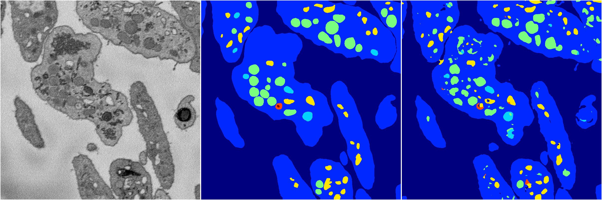</a>
<i>Click image for more details</i>

2 nets

**ari**: min 0.6977. max 0.8125. mean 0.7551.  ([best net](236/0))

**miou**: min 0.2422. max 0.5693. mean 0.4058.  ([best net](236/0))

**accuracy**: min 0.8889. max 0.9281. mean 0.9085.  ([best net](236/0))

**n_params**: min 11115915.0000. max 11115915.0000. mean 11115915.0000.  ([best net](236/1))

---

<a href="235"><h2>random_2d_ed_dense / 0410 / 235</h2></a>
Created 16 Apr 2019, 17:08:31

<i>Click image for more details</i>

2 nets

**ari**: min 0.6503. max 0.7431. mean 0.6967.  ([best net](235/0))

**miou**: min 0.2877. max 0.4428. mean 0.3653.  ([best net](235/0))

**accuracy**: min 0.8509. max 0.8876. mean 0.8692.  ([best net](235/0))

**n_params**: min 895974.0000. max 895974.0000. mean 895974.0000.  ([best net](235/0))

---

<a href="234"><h2>random_2d_ed_dense / 0410 / 234</h2></a>
Created 16 Apr 2019, 17:08:31

<a href="234">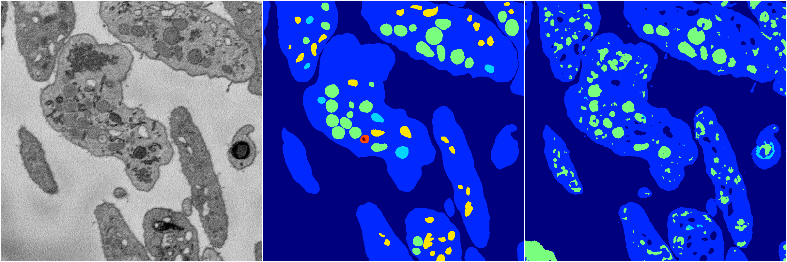</a>
<i>Click image for more details</i>

2 nets

**ari**: min 0.6103. max 0.7222. mean 0.6662.  ([best net](234/0))

**miou**: min 0.2791. max 0.2954. mean 0.2872.  ([best net](234/0))

**accuracy**: min 0.8300. max 0.8723. mean 0.8512.  ([best net](234/0))

**n_params**: min 481295.0000. max 481295.0000. mean 481295.0000.  ([best net](234/1))

---

<a href="227"><h2>random_2d_ed_dense / 0410 / 227</h2></a>
Created 16 Apr 2019, 17:08:31

<a href="227">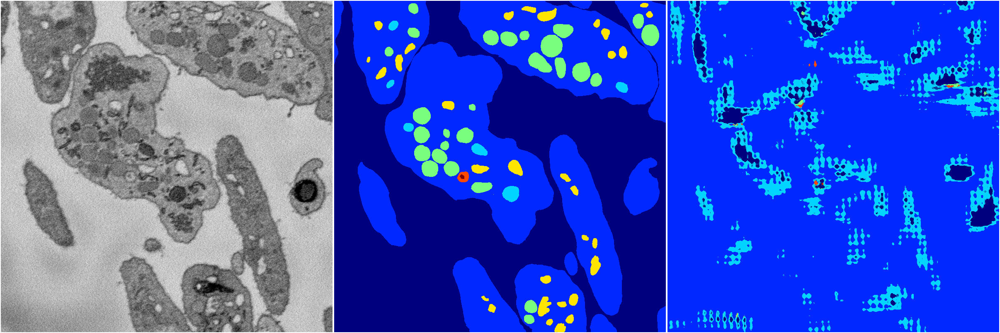</a>
<i>Click image for more details</i>

1 nets

**ari**: min 0.0259. max 0.0259. mean 0.0259.  ([best net](227/1))

**miou**: min 0.0610. max 0.0610. mean 0.0610.  ([best net](227/1))

**accuracy**: min 0.3820. max 0.3820. mean 0.3820.  ([best net](227/1))

**n_params**: min 49701896.0000. max 49701896.0000. mean 49701896.0000.  ([best net](227/1))

---

<a href="225"><h2>random_2d_ed_dense / 0410 / 225</h2></a>
Created 16 Apr 2019, 17:08:31

<i>Click image for more details</i>

1 nets

**ari**: min -0.0000. max -0.0000. mean -0.0000.  ([best net](225/1))

**miou**: min 0.0656. max 0.0656. mean 0.0656.  ([best net](225/1))

**accuracy**: min 0.4592. max 0.4592. mean 0.4592.  ([best net](225/1))

**n_params**: min 7759005.0000. max 7759005.0000. mean 7759005.0000.  ([best net](225/1))

---

<a href="208"><h2>random_2d_ed_dense / 0410 / 208</h2></a>
Created 16 Apr 2019, 17:08:31

<a href="208">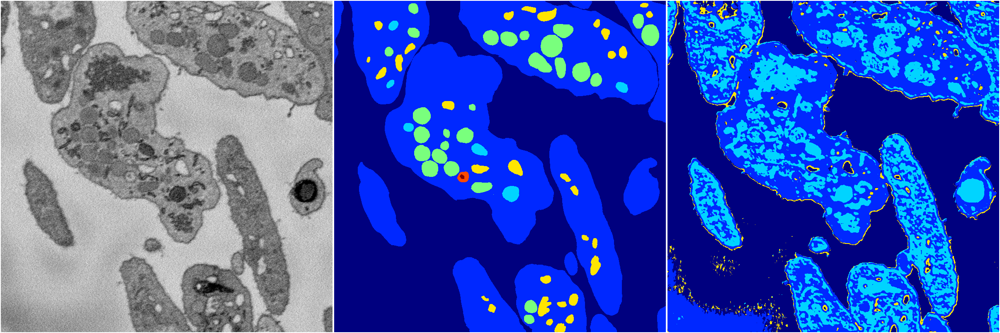</a>
<i>Click image for more details</i>

1 nets

**ari**: min 0.5364. max 0.5364. mean 0.5364.  ([best net](208/1))

**miou**: min 0.2160. max 0.2160. mean 0.2160.  ([best net](208/1))

**accuracy**: min 0.6949. max 0.6949. mean 0.6949.  ([best net](208/1))

**n_params**: min 27109085.0000. max 27109085.0000. mean 27109085.0000.  ([best net](208/1))

---

<a href="218"><h2>random_2d_ed_dense / 0410 / 218</h2></a>
Created 16 Apr 2019, 17:08:31

<a href="218">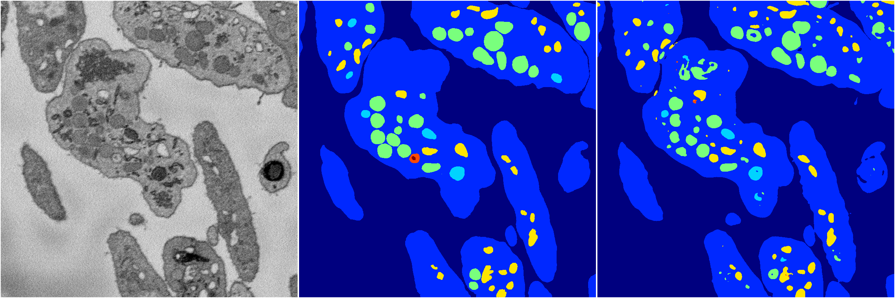</a>
<i>Click image for more details</i>

1 nets

**ari**: min 0.8237. max 0.8237. mean 0.8237.  ([best net](218/0))

**miou**: min 0.6090. max 0.6090. mean 0.6090.  ([best net](218/0))

**accuracy**: min 0.9330. max 0.9330. mean 0.9330.  ([best net](218/0))

**n_params**: min 11869389.0000. max 11869389.0000. mean 11869389.0000.  ([best net](218/0))

---

<a href="216"><h2>random_2d_ed_dense / 0410 / 216</h2></a>
Created 16 Apr 2019, 17:08:31

<i>Click image for more details</i>

1 nets

**ari**: min 0.7930. max 0.7930. mean 0.7930.  ([best net](216/1))

**miou**: min 0.5256. max 0.5256. mean 0.5256.  ([best net](216/1))

**accuracy**: min 0.9165. max 0.9165. mean 0.9165.  ([best net](216/1))

**n_params**: min 558368.0000. max 558368.0000. mean 558368.0000.  ([best net](216/1))

---

<a href="209"><h2>random_2d_ed_dense / 0410 / 209</h2></a>
Created 16 Apr 2019, 17:08:31

<i>Click image for more details</i>

1 nets

**ari**: min 0.1493. max 0.1493. mean 0.1493.  ([best net](209/1))

**miou**: min 0.1046. max 0.1046. mean 0.1046.  ([best net](209/1))

**accuracy**: min 0.4645. max 0.4645. mean 0.4645.  ([best net](209/1))

**n_params**: min 4326088.0000. max 4326088.0000. mean 4326088.0000.  ([best net](209/1))

---

<a href="207"><h2>random_2d_ed_dense / 0410 / 207</h2></a>
Created 16 Apr 2019, 17:08:30

<a href="207">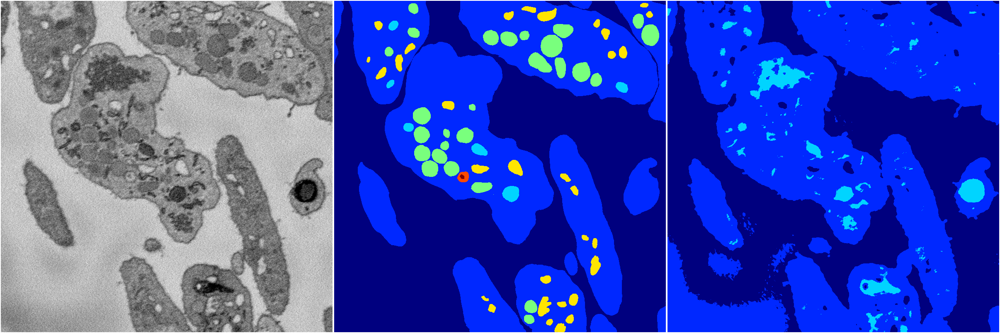</a>
<i>Click image for more details</i>

2 nets

**ari**: min 0.0388. max 0.5815. mean 0.3102.  ([best net](207/1))

**miou**: min 0.0858. max 0.2717. mean 0.1787.  ([best net](207/1))

**accuracy**: min 0.5190. max 0.8361. mean 0.6776.  ([best net](207/1))

**n_params**: min 915357.0000. max 915357.0000. mean 915357.0000.  ([best net](207/0))

---

<a href="199"><h2>random_2d_ed_dense / 0410 / 199</h2></a>
Created 16 Apr 2019, 17:08:30

<i>Click image for more details</i>

1 nets

**ari**: min 0.7414. max 0.7414. mean 0.7414.  ([best net](199/1))

**miou**: min 0.4077. max 0.4077. mean 0.4077.  ([best net](199/1))

**accuracy**: min 0.8902. max 0.8902. mean 0.8902.  ([best net](199/1))

**n_params**: min 1595702.0000. max 1595702.0000. mean 1595702.0000.  ([best net](199/1))

---

<a href="198"><h2>random_2d_ed_dense / 0410 / 198</h2></a>
Created 16 Apr 2019, 17:08:30

<i>Click image for more details</i>

2 nets

**ari**: min 0.6692. max 0.7126. mean 0.6909.  ([best net](198/0))

**miou**: min 0.2788. max 0.3765. mean 0.3277.  ([best net](198/0))

**accuracy**: min 0.8727. max 0.8752. mean 0.8739.  ([best net](198/0))

**n_params**: min 200815.0000. max 200815.0000. mean 200815.0000.  ([best net](198/1))

---

<a href="191"><h2>random_2d_ed_dense / 0410 / 191</h2></a>
Created 16 Apr 2019, 17:08:30

<a href="191">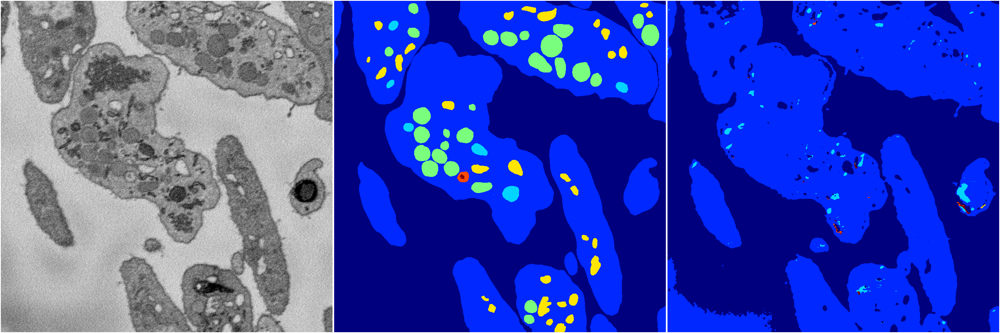</a>
<i>Click image for more details</i>

1 nets

**ari**: min 0.6854. max 0.6854. mean 0.6854.  ([best net](191/1))

**miou**: min 0.2468. max 0.2468. mean 0.2468.  ([best net](191/1))

**accuracy**: min 0.8809. max 0.8809. mean 0.8809.  ([best net](191/1))

**n_params**: min 8762535.0000. max 8762535.0000. mean 8762535.0000.  ([best net](191/1))

---

<a href="189"><h2>random_2d_ed_dense / 0410 / 189</h2></a>
Created 16 Apr 2019, 17:08:30

<a href="189">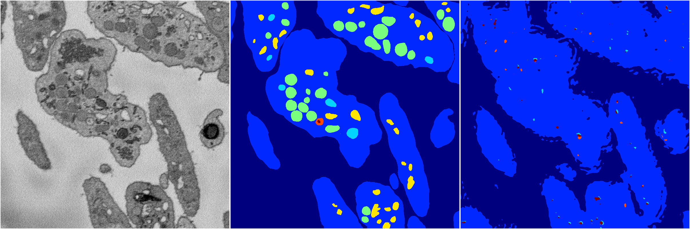</a>
<i>Click image for more details</i>

2 nets

**ari**: min 0.5063. max 0.5241. mean 0.5152.  ([best net](189/0))

**miou**: min 0.1488. max 0.2173. mean 0.1831.  ([best net](189/1))

**accuracy**: min 0.4930. max 0.8284. mean 0.6607.  ([best net](189/1))

**n_params**: min 1024013.0000. max 1024013.0000. mean 1024013.0000.  ([best net](189/1))

---

<a href="190"><h2>random_2d_ed_dense / 0410 / 190</h2></a>
Created 16 Apr 2019, 17:08:30

<i>Click image for more details</i>

1 nets

**ari**: min -0.0000. max -0.0000. mean -0.0000.  ([best net](190/0))

**miou**: min 0.0589. max 0.0589. mean 0.0589.  ([best net](190/0))

**accuracy**: min 0.4123. max 0.4123. mean 0.4123.  ([best net](190/0))

**n_params**: min 54110.0000. max 54110.0000. mean 54110.0000.  ([best net](190/0))

---

<a href="182"><h2>random_2d_ed_dense / 0410 / 182</h2></a>
Created 16 Apr 2019, 17:08:30

<i>Click image for more details</i>

1 nets

**ari**: min 0.0000. max 0.0000. mean 0.0000.  ([best net](182/1))

**miou**: min 0.0592. max 0.0592. mean 0.0592.  ([best net](182/1))

**accuracy**: min 0.4146. max 0.4146. mean 0.4146.  ([best net](182/1))

**n_params**: min 445115.0000. max 445115.0000. mean 445115.0000.  ([best net](182/1))

---

<a href="181"><h2>random_2d_ed_dense / 0410 / 181</h2></a>
Created 16 Apr 2019, 17:08:30

<a href="181">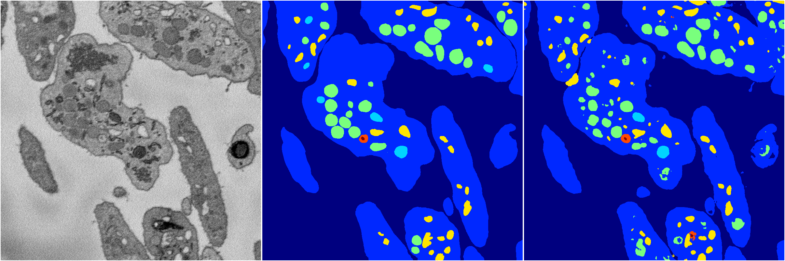</a>
<i>Click image for more details</i>

1 nets

**ari**: min 0.8058. max 0.8058. mean 0.8058.  ([best net](181/0))

**miou**: min 0.5511. max 0.5511. mean 0.5511.  ([best net](181/0))

**accuracy**: min 0.9217. max 0.9217. mean 0.9217.  ([best net](181/0))

**n_params**: min 400770.0000. max 400770.0000. mean 400770.0000.  ([best net](181/0))

---

<a href="172"><h2>random_2d_ed_dense / 0410 / 172</h2></a>
Created 16 Apr 2019, 17:08:30

<a href="172">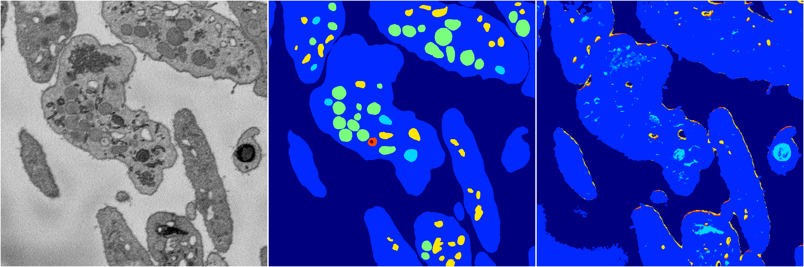</a>
<i>Click image for more details</i>

2 nets

**ari**: min 0.4169. max 0.6049. mean 0.5109.  ([best net](172/0))

**miou**: min 0.1167. max 0.2864. mean 0.2016.  ([best net](172/0))

**accuracy**: min 0.4399. max 0.8495. mean 0.6447.  ([best net](172/0))

**n_params**: min 2702581.0000. max 2702581.0000. mean 2702581.0000.  ([best net](172/0))

---

<a href="173"><h2>random_2d_ed_dense / 0410 / 173</h2></a>
Created 16 Apr 2019, 17:08:30

<a href="173">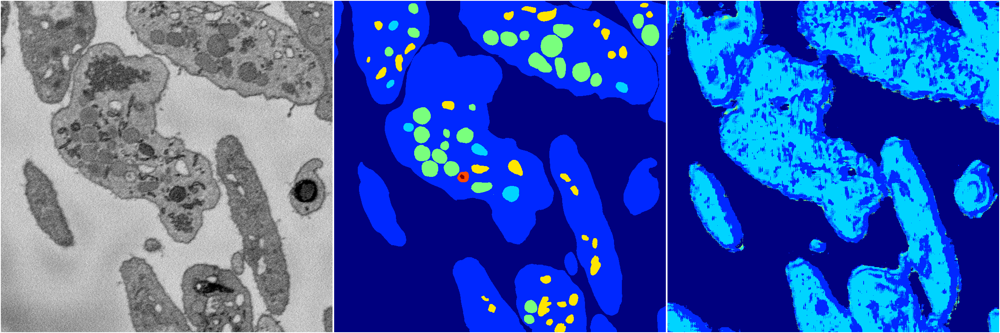</a>
<i>Click image for more details</i>

1 nets

**ari**: min 0.5074. max 0.5074. mean 0.5074.  ([best net](173/1))

**miou**: min 0.1706. max 0.1706. mean 0.1706.  ([best net](173/1))

**accuracy**: min 0.5654. max 0.5654. mean 0.5654.  ([best net](173/1))

**n_params**: min 248127.0000. max 248127.0000. mean 248127.0000.  ([best net](173/1))

---

<a href="171"><h2>random_2d_ed_dense / 0410 / 171</h2></a>
Created 16 Apr 2019, 17:08:30

<i>Click image for more details</i>

1 nets

**ari**: min 0.6254. max 0.6254. mean 0.6254.  ([best net](171/1))

**miou**: min 0.2340. max 0.2340. mean 0.2340.  ([best net](171/1))

**accuracy**: min 0.8616. max 0.8616. mean 0.8616.  ([best net](171/1))

**n_params**: min 887584.0000. max 887584.0000. mean 887584.0000.  ([best net](171/1))

---

<a href="163"><h2>random_2d_ed_dense / 0410 / 163</h2></a>
Created 16 Apr 2019, 17:08:30

<a href="163">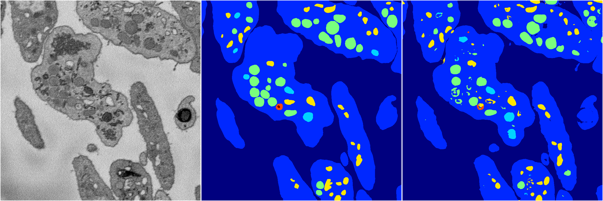</a>
<i>Click image for more details</i>

2 nets

**ari**: min 0.7598. max 0.8237. mean 0.7917.  ([best net](163/1))

**miou**: min 0.4130. max 0.5405. mean 0.4767.  ([best net](163/1))

**accuracy**: min 0.8979. max 0.9354. mean 0.9167.  ([best net](163/1))

**n_params**: min 5461191.0000. max 5461191.0000. mean 5461191.0000.  ([best net](163/0))

---

<a href="164"><h2>random_2d_ed_dense / 0410 / 164</h2></a>
Created 16 Apr 2019, 17:08:30

<i>Click image for more details</i>

2 nets

**ari**: min 0.6163. max 0.7411. mean 0.6787.  ([best net](164/1))

**miou**: min 0.2853. max 0.4390. mean 0.3621.  ([best net](164/1))

**accuracy**: min 0.8268. max 0.8868. mean 0.8568.  ([best net](164/1))

**n_params**: min 422620.0000. max 422620.0000. mean 422620.0000.  ([best net](164/0))

---

<a href="154"><h2>random_2d_ed_dense / 0410 / 154</h2></a>
Created 16 Apr 2019, 17:08:29

<a href="154">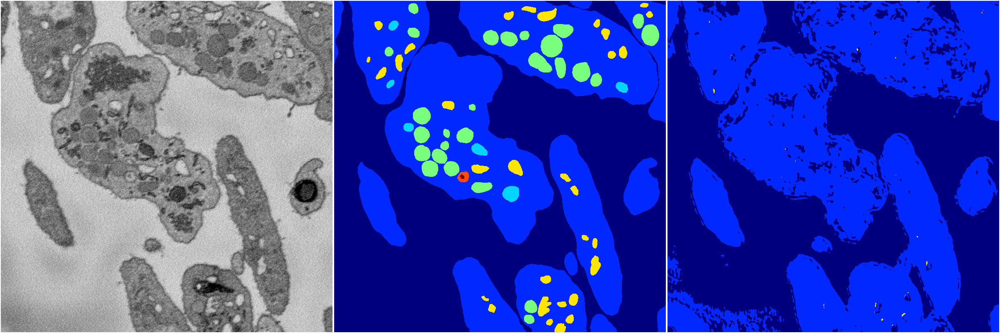</a>
<i>Click image for more details</i>

1 nets

**ari**: min 0.5013. max 0.5013. mean 0.5013.  ([best net](154/1))

**miou**: min 0.2141. max 0.2141. mean 0.2141.  ([best net](154/1))

**accuracy**: min 0.8175. max 0.8175. mean 0.8175.  ([best net](154/1))

**n_params**: min 3037111.0000. max 3037111.0000. mean 3037111.0000.  ([best net](154/1))

---

<a href="153"><h2>random_2d_ed_dense / 0410 / 153</h2></a>
Created 16 Apr 2019, 17:08:29

<i>Click image for more details</i>

1 nets

**ari**: min 0.6298. max 0.6298. mean 0.6298.  ([best net](153/1))

**miou**: min 0.2589. max 0.2589. mean 0.2589.  ([best net](153/1))

**accuracy**: min 0.8634. max 0.8634. mean 0.8634.  ([best net](153/1))

**n_params**: min 1927288.0000. max 1927288.0000. mean 1927288.0000.  ([best net](153/1))

---

<a href="146"><h2>random_2d_ed_dense / 0410 / 146</h2></a>
Created 16 Apr 2019, 17:08:29

<i>Click image for more details</i>

2 nets

**ari**: min 0.8106. max 0.8225. mean 0.8166.  ([best net](146/0))

**miou**: min 0.5005. max 0.5899. mean 0.5452.  ([best net](146/0))

**accuracy**: min 0.9254. max 0.9329. mean 0.9292.  ([best net](146/0))

**n_params**: min 2069525.0000. max 2069525.0000. mean 2069525.0000.  ([best net](146/0))

---

<a href="145"><h2>random_2d_ed_dense / 0410 / 145</h2></a>
Created 16 Apr 2019, 17:08:29

<a href="145">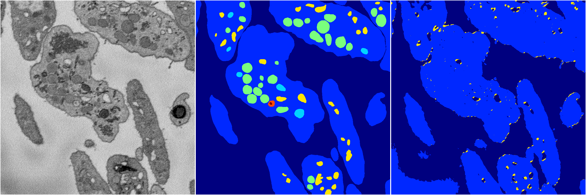</a>
<i>Click image for more details</i>

2 nets

**ari**: min 0.6386. max 0.6656. mean 0.6521.  ([best net](145/0))

**miou**: min 0.2476. max 0.2590. mean 0.2533.  ([best net](145/0))

**accuracy**: min 0.8603. max 0.8696. mean 0.8650.  ([best net](145/0))

**n_params**: min 220112.0000. max 220112.0000. mean 220112.0000.  ([best net](145/0))

---

<a href="136"><h2>random_2d_ed_dense / 0410 / 136</h2></a>
Created 16 Apr 2019, 17:08:29

<a href="136">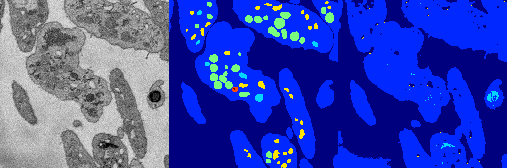</a>
<i>Click image for more details</i>

2 nets

**ari**: min 0.0018. max 0.6660. mean 0.3339.  ([best net](136/1))

**miou**: min 0.0682. max 0.2502. mean 0.1592.  ([best net](136/1))

**accuracy**: min 0.4617. max 0.8798. mean 0.6707.  ([best net](136/1))

**n_params**: min 5498341.0000. max 5498341.0000. mean 5498341.0000.  ([best net](136/0))

---

<a href="137"><h2>random_2d_ed_dense / 0410 / 137</h2></a>
Created 16 Apr 2019, 17:08:29

<a href="137">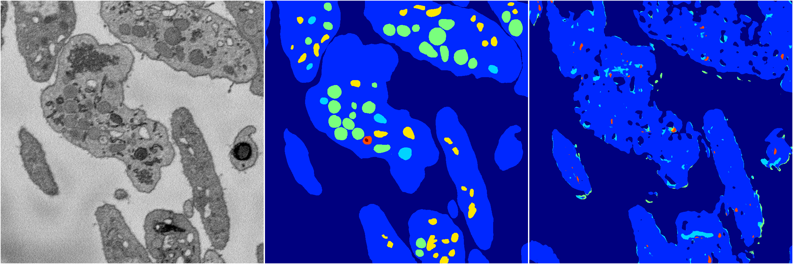</a>
<i>Click image for more details</i>

2 nets

**ari**: min 0.4056. max 0.4378. mean 0.4217.  ([best net](137/1))

**miou**: min 0.0321. max 0.2005. mean 0.1163.  ([best net](137/1))

**accuracy**: min 0.1118. max 0.7765. mean 0.4442.  ([best net](137/1))

**n_params**: min 954843.0000. max 954843.0000. mean 954843.0000.  ([best net](137/1))

---

<a href="126"><h2>random_2d_ed_dense / 0410 / 126</h2></a>
Created 16 Apr 2019, 17:08:29

<a href="126">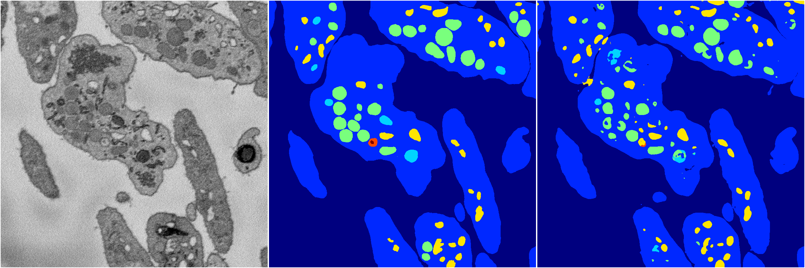</a>
<i>Click image for more details</i>

2 nets

**ari**: min 0.7012. max 0.8138. mean 0.7575.  ([best net](126/1))

**miou**: min 0.2793. max 0.5060. mean 0.3927.  ([best net](126/1))

**accuracy**: min 0.8804. max 0.9289. mean 0.9046.  ([best net](126/1))

**n_params**: min 1834367.0000. max 1834367.0000. mean 1834367.0000.  ([best net](126/0))

---

<a href="127"><h2>random_2d_ed_dense / 0410 / 127</h2></a>
Created 16 Apr 2019, 17:08:29

<a href="127">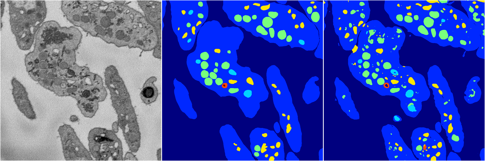</a>
<i>Click image for more details</i>

2 nets

**ari**: min 0.7967. max 0.8131. mean 0.8049.  ([best net](127/0))

**miou**: min 0.4767. max 0.5137. mean 0.4952.  ([best net](127/1))

**accuracy**: min 0.9191. max 0.9277. mean 0.9234.  ([best net](127/0))

**n_params**: min 6961648.0000. max 6961648.0000. mean 6961648.0000.  ([best net](127/1))

---

<a href="128"><h2>random_2d_ed_dense / 0410 / 128</h2></a>
Created 16 Apr 2019, 17:08:28

<i>Click image for more details</i>

2 nets

**ari**: min 0.6698. max 0.6940. mean 0.6819.  ([best net](128/0))

**miou**: min 0.3444. max 0.3528. mean 0.3486.  ([best net](128/0))

**accuracy**: min 0.8433. max 0.8632. mean 0.8533.  ([best net](128/0))

**n_params**: min 522489.0000. max 522489.0000. mean 522489.0000.  ([best net](128/0))

---

<a href="119"><h2>random_2d_ed_dense / 0410 / 119</h2></a>
Created 16 Apr 2019, 17:08:28

<a href="119">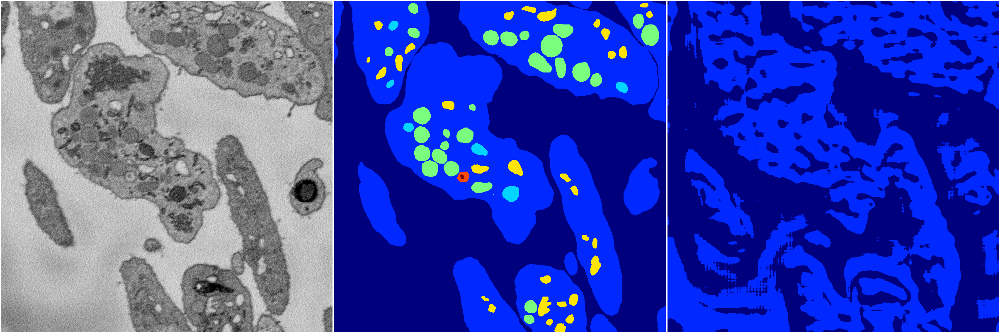</a>
<i>Click image for more details</i>

1 nets

**ari**: min 0.1147. max 0.1147. mean 0.1147.  ([best net](119/1))

**miou**: min 0.1382. max 0.1382. mean 0.1382.  ([best net](119/1))

**accuracy**: min 0.6320. max 0.6320. mean 0.6320.  ([best net](119/1))

**n_params**: min 7404326.0000. max 7404326.0000. mean 7404326.0000.  ([best net](119/1))

---

<a href="118"><h2>random_2d_ed_dense / 0410 / 118</h2></a>
Created 16 Apr 2019, 17:08:28

<i>Click image for more details</i>

1 nets

**ari**: min 0.5712. max 0.5712. mean 0.5712.  ([best net](118/0))

**miou**: min 0.2602. max 0.2602. mean 0.2602.  ([best net](118/0))

**accuracy**: min 0.7933. max 0.7933. mean 0.7933.  ([best net](118/0))

**n_params**: min 307923.0000. max 307923.0000. mean 307923.0000.  ([best net](118/0))

---

<a href="117"><h2>random_2d_ed_dense / 0410 / 117</h2></a>
Created 16 Apr 2019, 17:08:28

<a href="117">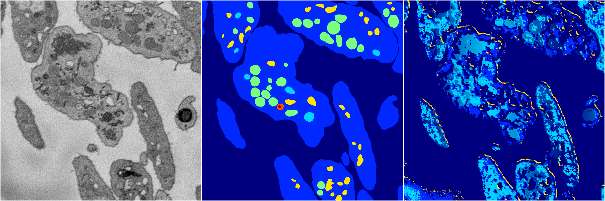</a>
<i>Click image for more details</i>

2 nets

**ari**: min -0.0107. max 0.1163. mean 0.0528.  ([best net](117/0))

**miou**: min 0.0859. max 0.1278. mean 0.1069.  ([best net](117/0))

**accuracy**: min 0.4371. max 0.5209. mean 0.4790.  ([best net](117/0))

**n_params**: min 56320.0000. max 56320.0000. mean 56320.0000.  ([best net](117/1))

---

<a href="110"><h2>random_2d_ed_dense / 0410 / 110</h2></a>
Created 16 Apr 2019, 17:08:28

<i>Click image for more details</i>

2 nets

**ari**: min 0.0000. max 0.8128. mean 0.4064.  ([best net](110/0))

**miou**: min 0.0688. max 0.5438. mean 0.3063.  ([best net](110/0))

**accuracy**: min 0.4816. max 0.9257. mean 0.7037.  ([best net](110/0))

**n_params**: min 14344583.0000. max 14344583.0000. mean 14344583.0000.  ([best net](110/1))

---

<a href="109"><h2>random_2d_ed_dense / 0410 / 109</h2></a>
Created 16 Apr 2019, 17:08:28

<a href="109">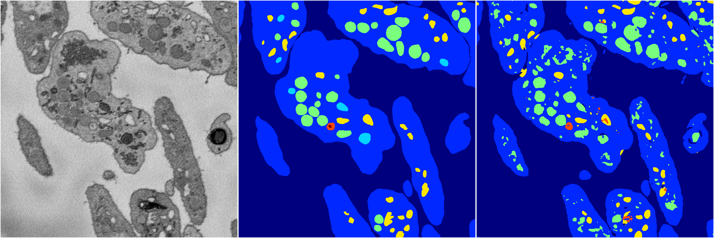</a>
<i>Click image for more details</i>

2 nets

**ari**: min 0.5764. max 0.7746. mean 0.6755.  ([best net](109/0))

**miou**: min 0.2765. max 0.4150. mean 0.3458.  ([best net](109/0))

**accuracy**: min 0.8212. max 0.9014. mean 0.8613.  ([best net](109/0))

**n_params**: min 2733253.0000. max 2733253.0000. mean 2733253.0000.  ([best net](109/1))

---

<a href="108"><h2>random_2d_ed_dense / 0410 / 108</h2></a>
Created 16 Apr 2019, 17:08:28

<i>Click image for more details</i>

2 nets

**ari**: min 0.8098. max 0.8233. mean 0.8165.  ([best net](108/1))

**miou**: min 0.4261. max 0.6063. mean 0.5162.  ([best net](108/1))

**accuracy**: min 0.9235. max 0.9342. mean 0.9289.  ([best net](108/1))

**n_params**: min 6540929.0000. max 6540929.0000. mean 6540929.0000.  ([best net](108/0))

---

<a href="101"><h2>random_2d_ed_dense / 0410 / 101</h2></a>
Created 16 Apr 2019, 17:08:28

<a href="101">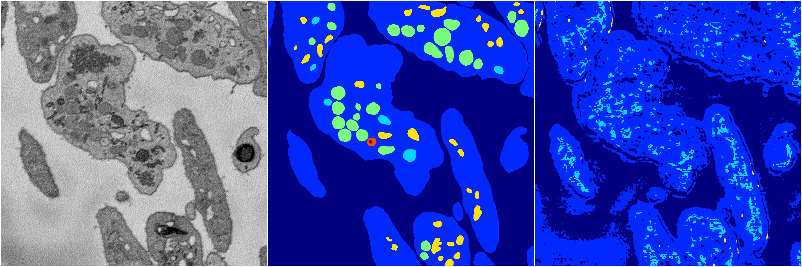</a>
<i>Click image for more details</i>

2 nets

**ari**: min -0.0008. max 0.2862. mean 0.1427.  ([best net](101/1))

**miou**: min 0.0710. max 0.1835. mean 0.1272.  ([best net](101/1))

**accuracy**: min 0.4965. max 0.7115. mean 0.6040.  ([best net](101/1))

**n_params**: min 996605.0000. max 996605.0000. mean 996605.0000.  ([best net](101/0))

---

<a href="100"><h2>random_2d_ed_dense / 0410 / 100</h2></a>
Created 16 Apr 2019, 17:08:27

<a href="100">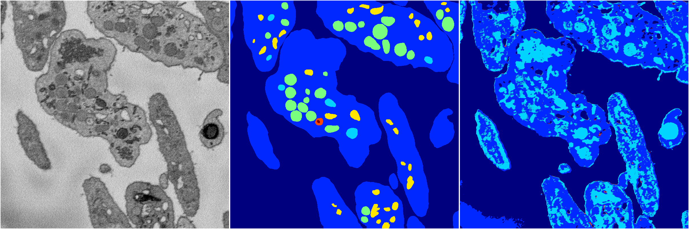</a>
<i>Click image for more details</i>

2 nets

**ari**: min 0.5443. max 0.5663. mean 0.5553.  ([best net](100/1))

**miou**: min 0.1240. max 0.2236. mean 0.1738.  ([best net](100/1))

**accuracy**: min 0.4550. max 0.7463. mean 0.6007.  ([best net](100/1))

**n_params**: min 2342629.0000. max 2342629.0000. mean 2342629.0000.  ([best net](100/0))

---

<a href="92"><h2>random_2d_ed_dense / 0410 / 92</h2></a>
Created 16 Apr 2019, 17:08:27

<i>Click image for more details</i>

2 nets

**ari**: min 0.5791. max 0.6914. mean 0.6352.  ([best net](92/0))

**miou**: min 0.2872. max 0.3239. mean 0.3056.  ([best net](92/0))

**accuracy**: min 0.8061. max 0.8531. mean 0.8296.  ([best net](92/0))

**n_params**: min 328413.0000. max 328413.0000. mean 328413.0000.  ([best net](92/0))

---

<a href="91"><h2>random_2d_ed_dense / 0410 / 91</h2></a>
Created 16 Apr 2019, 17:08:27

<i>Click image for more details</i>

2 nets

**ari**: min 0.6328. max 0.7434. mean 0.6881.  ([best net](91/1))

**miou**: min 0.2490. max 0.4105. mean 0.3297.  ([best net](91/1))

**accuracy**: min 0.8551. max 0.8864. mean 0.8707.  ([best net](91/1))

**n_params**: min 284624.0000. max 284624.0000. mean 284624.0000.  ([best net](91/0))

---

<a href="90"><h2>random_2d_ed_dense / 0410 / 90</h2></a>
Created 16 Apr 2019, 17:08:27

<i>Click image for more details</i>

2 nets

**ari**: min 0.6815. max 0.7356. mean 0.7086.  ([best net](90/0))

**miou**: min 0.3767. max 0.4311. mean 0.4039.  ([best net](90/0))

**accuracy**: min 0.8549. max 0.8858. mean 0.8704.  ([best net](90/0))

**n_params**: min 1744603.0000. max 1744603.0000. mean 1744603.0000.  ([best net](90/0))

---

<a href="83"><h2>random_2d_ed_dense / 0410 / 83</h2></a>
Created 16 Apr 2019, 17:08:27

<a href="83">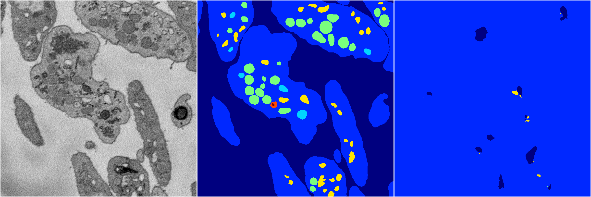</a>
<i>Click image for more details</i>

2 nets

**ari**: min -0.0019. max 0.0084. mean 0.0032.  ([best net](83/0))

**miou**: min 0.0101. max 0.0697. mean 0.0399.  ([best net](83/1))

**accuracy**: min 0.0480. max 0.4763. mean 0.2621.  ([best net](83/1))

**n_params**: min 5314431.0000. max 5314431.0000. mean 5314431.0000.  ([best net](83/0))

---

<a href="82"><h2>random_2d_ed_dense / 0410 / 82</h2></a>
Created 16 Apr 2019, 17:08:27

<a href="82">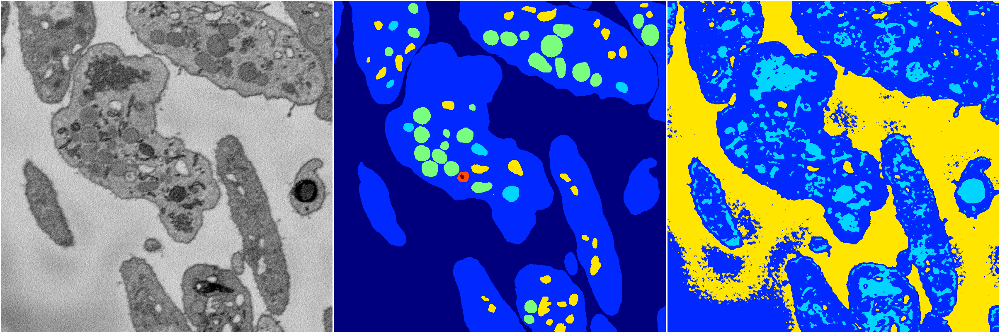</a>
<i>Click image for more details</i>

2 nets

**ari**: min 0.0347. max 0.4816. mean 0.2581.  ([best net](82/0))

**miou**: min 0.0952. max 0.1032. mean 0.0992.  ([best net](82/0))

**accuracy**: min 0.3797. max 0.5275. mean 0.4536.  ([best net](82/1))

**n_params**: min 1272904.0000. max 1272904.0000. mean 1272904.0000.  ([best net](82/0))

---

<a href="74"><h2>random_2d_ed_dense / 0410 / 74</h2></a>
Created 16 Apr 2019, 17:08:27

<i>Click image for more details</i>

2 nets

**ari**: min 0.6788. max 0.7677. mean 0.7233.  ([best net](74/1))

**miou**: min 0.2771. max 0.4243. mean 0.3507.  ([best net](74/1))

**accuracy**: min 0.8671. max 0.9028. mean 0.8849.  ([best net](74/1))

**n_params**: min 500793.0000. max 500793.0000. mean 500793.0000.  ([best net](74/0))

---

<a href="73"><h2>random_2d_ed_dense / 0410 / 73</h2></a>
Created 16 Apr 2019, 17:08:27

<a href="73">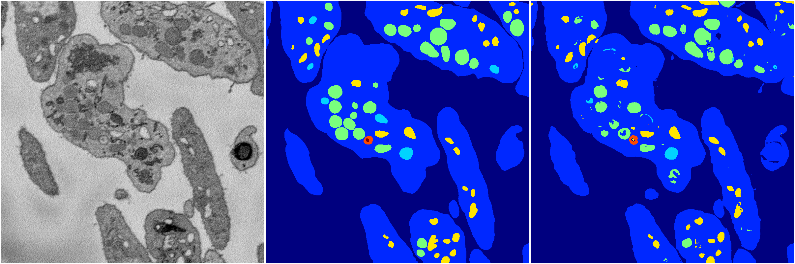</a>
<i>Click image for more details</i>

2 nets

**ari**: min 0.8252. max 0.8254. mean 0.8253.  ([best net](73/0))

**miou**: min 0.5290. max 0.5295. mean 0.5293.  ([best net](73/0))

**accuracy**: min 0.9357. max 0.9366. mean 0.9361.  ([best net](73/0))

**n_params**: min 19969413.0000. max 19969413.0000. mean 19969413.0000.  ([best net](73/0))

---

<a href="72"><h2>random_2d_ed_dense / 0410 / 72</h2></a>
Created 16 Apr 2019, 17:08:26

<a href="72">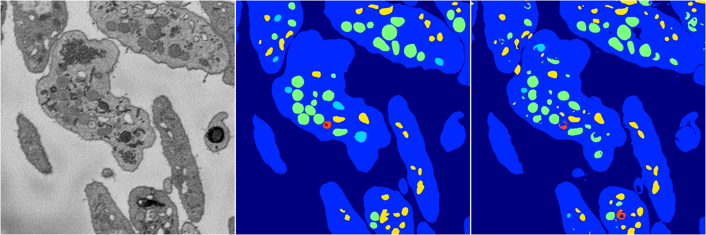</a>
<i>Click image for more details</i>

2 nets

**ari**: min 0.8056. max 0.8184. mean 0.8120.  ([best net](72/1))

**miou**: min 0.4557. max 0.4828. mean 0.4692.  ([best net](72/1))

**accuracy**: min 0.9259. max 0.9320. mean 0.9289.  ([best net](72/1))

**n_params**: min 11713083.0000. max 11713083.0000. mean 11713083.0000.  ([best net](72/0))

---

<a href="65"><h2>random_2d_ed_dense / 0410 / 65</h2></a>
Created 16 Apr 2019, 17:08:26

<a href="65">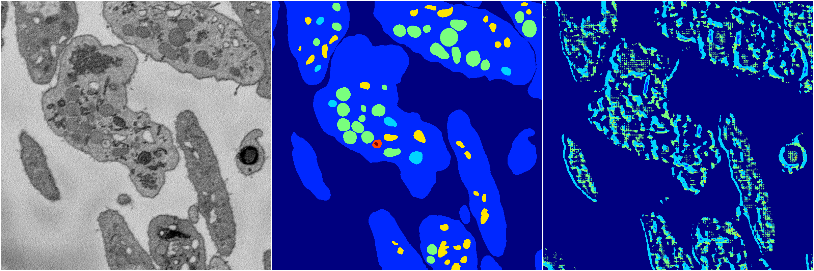</a>
<i>Click image for more details</i>

2 nets

**ari**: min 0.0349. max 0.1010. mean 0.0679.  ([best net](65/0))

**miou**: min 0.0423. max 0.0921. mean 0.0672.  ([best net](65/0))

**accuracy**: min 0.1732. max 0.4907. mean 0.3320.  ([best net](65/0))

**n_params**: min 10074526.0000. max 10074526.0000. mean 10074526.0000.  ([best net](65/0))

---

<a href="64"><h2>random_2d_ed_dense / 0410 / 64</h2></a>
Created 16 Apr 2019, 17:08:26

<a href="64">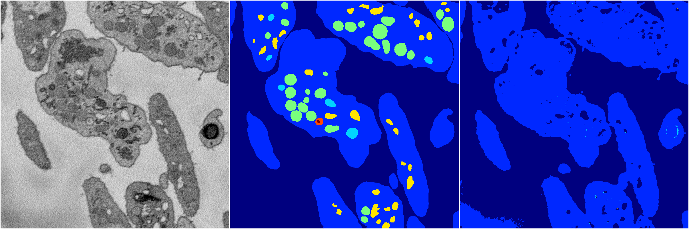</a>
<i>Click image for more details</i>

2 nets

**ari**: min 0.5174. max 0.6715. mean 0.5944.  ([best net](64/1))

**miou**: min 0.0162. max 0.2401. mean 0.1282.  ([best net](64/1))

**accuracy**: min 0.1006. max 0.8716. mean 0.4861.  ([best net](64/1))

**n_params**: min 1587465.0000. max 1587465.0000. mean 1587465.0000.  ([best net](64/0))

---

<a href="63"><h2>random_2d_ed_dense / 0410 / 63</h2></a>
Created 16 Apr 2019, 17:08:26

<i>Click image for more details</i>

2 nets

**ari**: min 0.2029. max 0.5909. mean 0.3969.  ([best net](63/0))

**miou**: min 0.1440. max 0.2293. mean 0.1866.  ([best net](63/0))

**accuracy**: min 0.5972. max 0.8511. mean 0.7241.  ([best net](63/0))

**n_params**: min 52600.0000. max 52600.0000. mean 52600.0000.  ([best net](63/1))

---

<a href="55"><h2>random_2d_ed_dense / 0410 / 55</h2></a>
Created 16 Apr 2019, 17:08:26

<a href="55">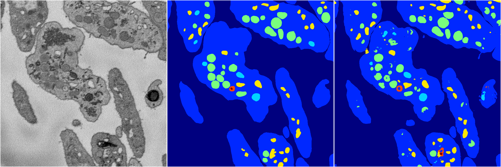</a>
<i>Click image for more details</i>

2 nets

**ari**: min 0.7595. max 0.8095. mean 0.7845.  ([best net](55/0))

**miou**: min 0.4629. max 0.5631. mean 0.5130.  ([best net](55/0))

**accuracy**: min 0.9051. max 0.9268. mean 0.9159.  ([best net](55/0))

**n_params**: min 9710606.0000. max 9710606.0000. mean 9710606.0000.  ([best net](55/0))

---

<a href="56"><h2>random_2d_ed_dense / 0410 / 56</h2></a>
Created 16 Apr 2019, 17:08:26

<a href="56">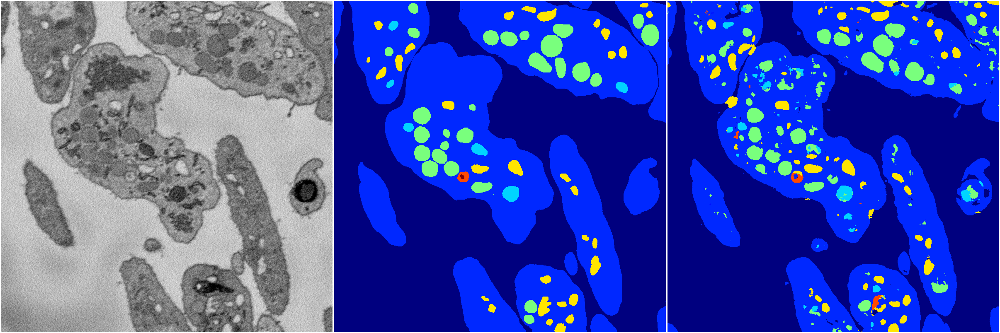</a>
<i>Click image for more details</i>

2 nets

**ari**: min 0.7799. max 0.7912. mean 0.7855.  ([best net](56/0))

**miou**: min 0.5163. max 0.5251. mean 0.5207.  ([best net](56/1))

**accuracy**: min 0.9109. max 0.9126. mean 0.9117.  ([best net](56/0))

**n_params**: min 1232550.0000. max 1232550.0000. mean 1232550.0000.  ([best net](56/1))

---

<a href="47"><h2>random_2d_ed_dense / 0410 / 47</h2></a>
Created 16 Apr 2019, 17:08:26

<a href="47">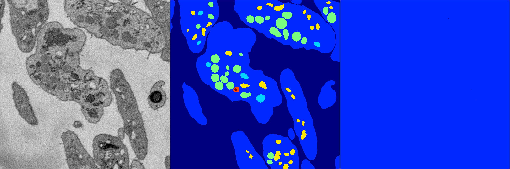</a>
<i>Click image for more details</i>

2 nets

**ari**: min 0.0000. max 0.2018. mean 0.1009.  ([best net](47/1))

**miou**: min 0.0390. max 0.0666. mean 0.0528.  ([best net](47/0))

**accuracy**: min 0.2342. max 0.4664. mean 0.3503.  ([best net](47/0))

**n_params**: min 7840065.0000. max 7840065.0000. mean 7840065.0000.  ([best net](47/0))

---

<a href="54"><h2>random_2d_ed_dense / 0410 / 54</h2></a>
Created 16 Apr 2019, 17:08:26

<a href="54">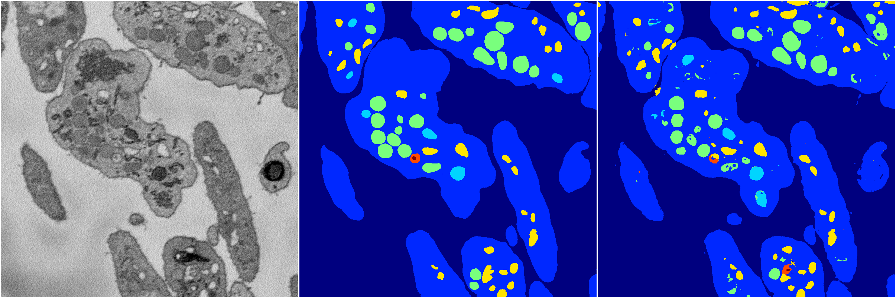</a>
<i>Click image for more details</i>

2 nets

**ari**: min 0.6990. max 0.8282. mean 0.7636.  ([best net](54/0))

**miou**: min 0.2634. max 0.5647. mean 0.4141.  ([best net](54/0))

**accuracy**: min 0.8890. max 0.9359. mean 0.9125.  ([best net](54/0))

**n_params**: min 4935668.0000. max 4935668.0000. mean 4935668.0000.  ([best net](54/1))

---

<a href="46"><h2>random_2d_ed_dense / 0410 / 46</h2></a>
Created 16 Apr 2019, 17:08:26

<a href="46">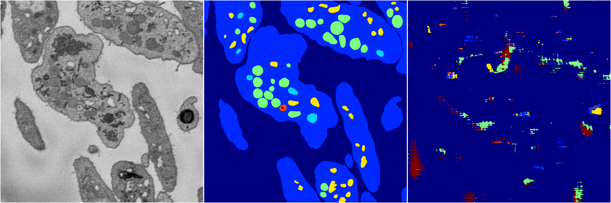</a>
<i>Click image for more details</i>

2 nets

**ari**: min -0.0022. max 0.0009. mean -0.0006.  ([best net](46/0))

**miou**: min 0.0654. max 0.0691. mean 0.0673.  ([best net](46/1))

**accuracy**: min 0.4566. max 0.4577. mean 0.4572.  ([best net](46/1))

**n_params**: min 3269626.0000. max 3269626.0000. mean 3269626.0000.  ([best net](46/0))

---

<a href="45"><h2>random_2d_ed_dense / 0410 / 45</h2></a>
Created 16 Apr 2019, 17:08:26

<a href="45">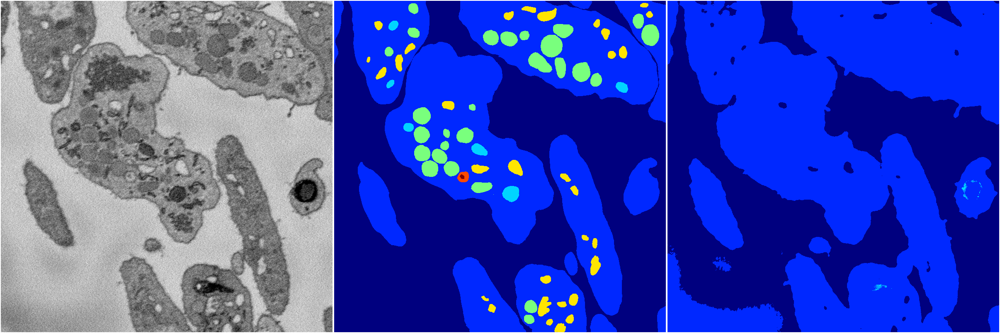</a>
<i>Click image for more details</i>

2 nets

**ari**: min 0.0000. max 0.5943. mean 0.2971.  ([best net](45/0))

**miou**: min 0.0590. max 0.2307. mean 0.1449.  ([best net](45/0))

**accuracy**: min 0.4133. max 0.8524. mean 0.6329.  ([best net](45/0))

**n_params**: min 666510.0000. max 666510.0000. mean 666510.0000.  ([best net](45/0))

---

<a href="81"><h2>random_2d_ed_dense / 0410 / 81</h2></a>
Created 16 Apr 2019, 17:08:26

<a href="81">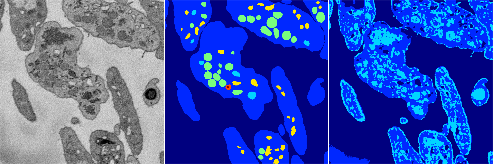</a>
<i>Click image for more details</i>

2 nets

**ari**: min 0.0204. max 0.5583. mean 0.2894.  ([best net](81/0))

**miou**: min 0.0701. max 0.2224. mean 0.1462.  ([best net](81/0))

**accuracy**: min 0.4287. max 0.7406. mean 0.5847.  ([best net](81/0))

**n_params**: min 1366753.0000. max 1366753.0000. mean 1366753.0000.  ([best net](81/0))

---

<a href="38"><h2>random_2d_ed_dense / 0410 / 38</h2></a>
Created 16 Apr 2019, 17:08:26

<a href="38">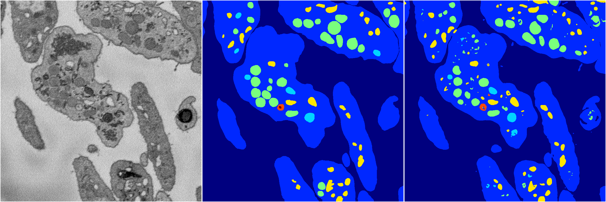</a>
<i>Click image for more details</i>

2 nets

**ari**: min 0.8080. max 0.8241. mean 0.8161.  ([best net](38/0))

**miou**: min 0.4581. max 0.5205. mean 0.4893.  ([best net](38/0))

**accuracy**: min 0.9255. max 0.9336. mean 0.9295.  ([best net](38/0))

**n_params**: min 4450080.0000. max 4450080.0000. mean 4450080.0000.  ([best net](38/0))

---

<a href="37"><h2>random_2d_ed_dense / 0410 / 37</h2></a>
Created 16 Apr 2019, 17:08:26

<a href="37">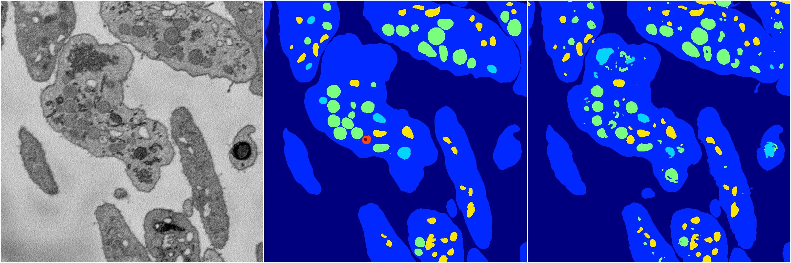</a>
<i>Click image for more details</i>

2 nets

**ari**: min 0.6605. max 0.8118. mean 0.7361.  ([best net](37/1))

**miou**: min 0.2977. max 0.5030. mean 0.4003.  ([best net](37/1))

**accuracy**: min 0.8561. max 0.9295. mean 0.8928.  ([best net](37/1))

**n_params**: min 27703180.0000. max 27703180.0000. mean 27703180.0000.  ([best net](37/0))

---

<a href="36"><h2>random_2d_ed_dense / 0410 / 36</h2></a>
Created 16 Apr 2019, 17:08:26

<a href="36">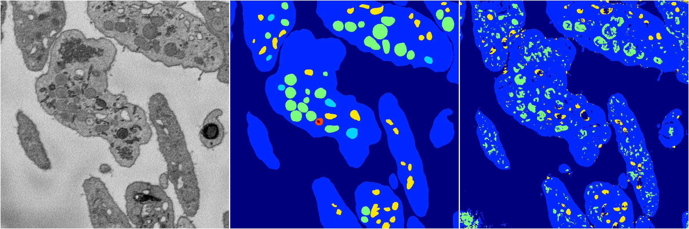</a>
<i>Click image for more details</i>

2 nets

**ari**: min 0.6835. max 0.7136. mean 0.6986.  ([best net](36/1))

**miou**: min 0.2870. max 0.3318. mean 0.3094.  ([best net](36/1))

**accuracy**: min 0.8750. max 0.8770. mean 0.8760.  ([best net](36/0))

**n_params**: min 115247.0000. max 115247.0000. mean 115247.0000.  ([best net](36/0))

---

<a href="29"><h2>random_2d_ed_dense / 0410 / 29</h2></a>
Created 16 Apr 2019, 17:08:25

<a href="29">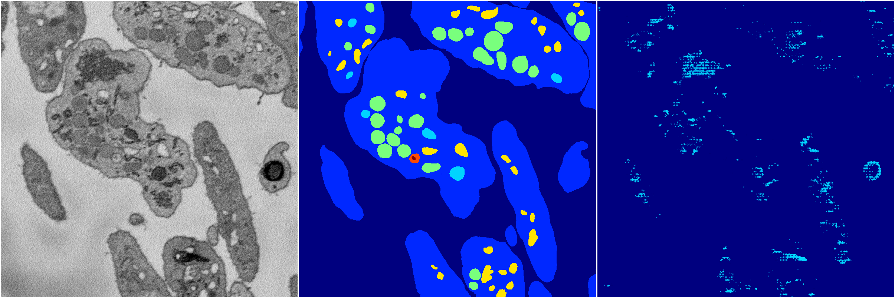</a>
<i>Click image for more details</i>

2 nets

**ari**: min 0.0107. max 0.0856. mean 0.0481.  ([best net](29/0))

**miou**: min 0.0605. max 0.0794. mean 0.0699.  ([best net](29/1))

**accuracy**: min 0.2726. max 0.4783. mean 0.3755.  ([best net](29/1))

**n_params**: min 2701329.0000. max 2701329.0000. mean 2701329.0000.  ([best net](29/1))

---

<a href="20"><h2>random_2d_ed_dense / 0410 / 20</h2></a>
Created 16 Apr 2019, 17:08:25

<a href="20">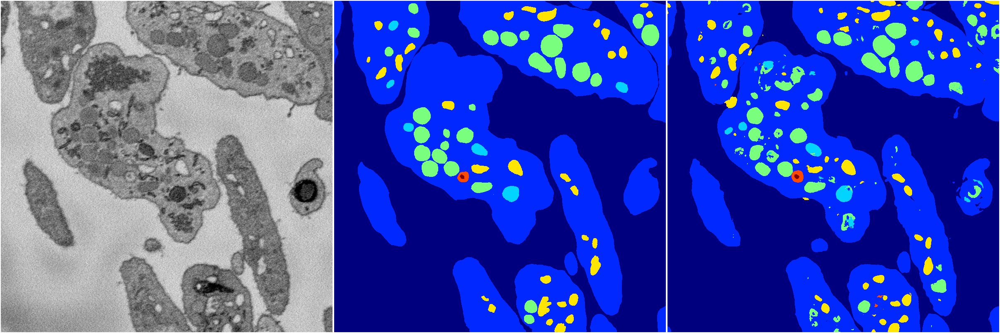</a>
<i>Click image for more details</i>

2 nets

**ari**: min 0.8068. max 0.8145. mean 0.8107.  ([best net](20/1))

**miou**: min 0.5103. max 0.5356. mean 0.5229.  ([best net](20/0))

**accuracy**: min 0.9250. max 0.9279. mean 0.9265.  ([best net](20/1))

**n_params**: min 3278069.0000. max 3278069.0000. mean 3278069.0000.  ([best net](20/0))

---

<a href="28"><h2>random_2d_ed_dense / 0410 / 28</h2></a>
Created 16 Apr 2019, 17:08:25

<a href="28">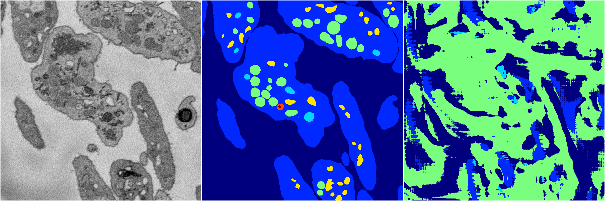</a>
<i>Click image for more details</i>

2 nets

**ari**: min 0.0264. max 0.0484. mean 0.0374.  ([best net](28/0))

**miou**: min 0.0375. max 0.0456. mean 0.0416.  ([best net](28/1))

**accuracy**: min 0.1951. max 0.2057. mean 0.2004.  ([best net](28/0))

**n_params**: min 18572650.0000. max 18572650.0000. mean 18572650.0000.  ([best net](28/0))

---

<a href="27"><h2>random_2d_ed_dense / 0410 / 27</h2></a>
Created 16 Apr 2019, 17:08:25

<a href="27">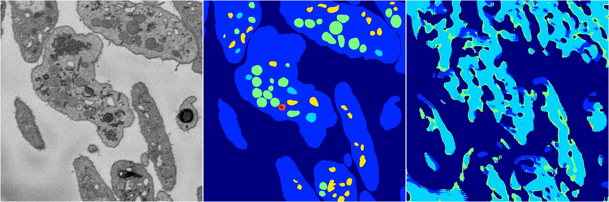</a>
<i>Click image for more details</i>

2 nets

**ari**: min 0.0163. max 0.1446. mean 0.0804.  ([best net](27/1))

**miou**: min 0.0804. max 0.0991. mean 0.0897.  ([best net](27/1))

**accuracy**: min 0.4228. max 0.4930. mean 0.4579.  ([best net](27/0))

**n_params**: min 2112798.0000. max 2112798.0000. mean 2112798.0000.  ([best net](27/0))

---

<a href="19"><h2>random_2d_ed_dense / 0410 / 19</h2></a>
Created 16 Apr 2019, 17:08:25

<a href="19">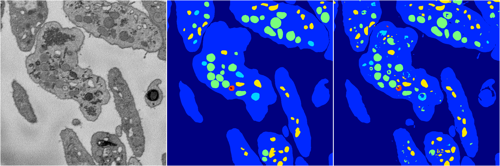</a>
<i>Click image for more details</i>

2 nets

**ari**: min 0.8186. max 0.8258. mean 0.8222.  ([best net](19/1))

**miou**: min 0.5463. max 0.5768. mean 0.5616.  ([best net](19/0))

**accuracy**: min 0.9315. max 0.9339. mean 0.9327.  ([best net](19/1))

**n_params**: min 9027386.0000. max 9027386.0000. mean 9027386.0000.  ([best net](19/1))

---

<a href="18"><h2>random_2d_ed_dense / 0410 / 18</h2></a>
Created 16 Apr 2019, 17:08:25

<a href="18">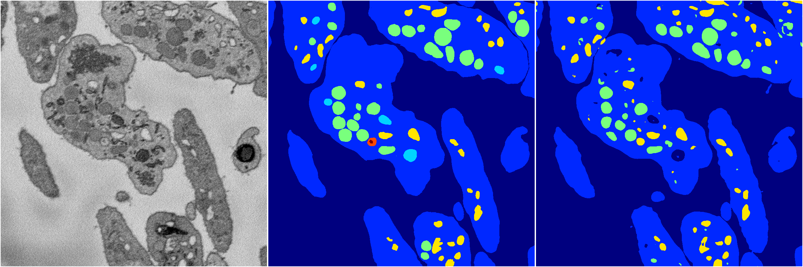</a>
<i>Click image for more details</i>

2 nets

**ari**: min 0.7986. max 0.8141. mean 0.8063.  ([best net](18/1))

**miou**: min 0.4433. max 0.4596. mean 0.4515.  ([best net](18/1))

**accuracy**: min 0.9233. max 0.9313. mean 0.9273.  ([best net](18/1))

**n_params**: min 6170724.0000. max 6170724.0000. mean 6170724.0000.  ([best net](18/0))

---

<a href="10"><h2>random_2d_ed_dense / 0410 / 10</h2></a>
Created 16 Apr 2019, 17:08:25

<a href="10">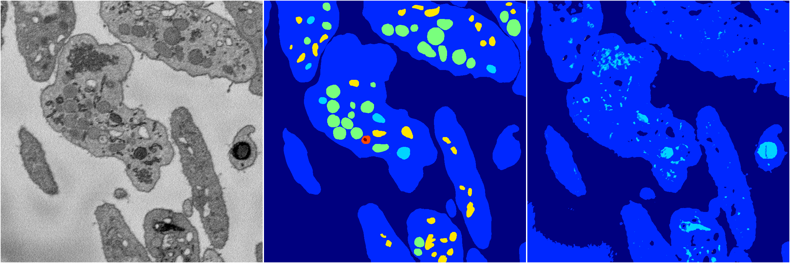</a>
<i>Click image for more details</i>

2 nets

**ari**: min 0.0669. max 0.6506. mean 0.3587.  ([best net](10/1))

**miou**: min 0.0988. max 0.2749. mean 0.1868.  ([best net](10/1))

**accuracy**: min 0.4827. max 0.8637. mean 0.6732.  ([best net](10/1))

**n_params**: min 2428690.0000. max 2428690.0000. mean 2428690.0000.  ([best net](10/1))

---

<a href="11"><h2>random_2d_ed_dense / 0410 / 11</h2></a>
Created 16 Apr 2019, 17:08:25

<i>Click image for more details</i>

2 nets

**ari**: min 0.4524. max 0.5412. mean 0.4968.  ([best net](11/0))

**miou**: min 0.2238. max 0.2240. mean 0.2239.  ([best net](11/1))

**accuracy**: min 0.7576. max 0.8055. mean 0.7816.  ([best net](11/1))

**n_params**: min 983425.0000. max 983425.0000. mean 983425.0000.  ([best net](11/0))

---

<a href="9"><h2>random_2d_ed_dense / 0410 / 9</h2></a>
Created 16 Apr 2019, 17:08:24

<a href="9">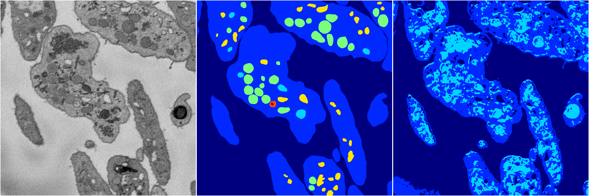</a>
<i>Click image for more details</i>

2 nets

**ari**: min -0.0000. max 0.5471. mean 0.2735.  ([best net](9/1))

**miou**: min 0.0607. max 0.2210. mean 0.1408.  ([best net](9/1))

**accuracy**: min 0.4246. max 0.7490. mean 0.5868.  ([best net](9/1))

**n_params**: min 1882004.0000. max 1882004.0000. mean 1882004.0000.  ([best net](9/0))

---

<a href="1"><h2>random_2d_ed_dense / 0410 / 1</h2></a>
Created 16 Apr 2019, 17:08:24

<i>Click image for more details</i>

2 nets

**ari**: min 0.7588. max 0.8179. mean 0.7883.  ([best net](1/1))

**miou**: min 0.4599. max 0.6033. mean 0.5316.  ([best net](1/1))

**accuracy**: min 0.8957. max 0.9311. mean 0.9134.  ([best net](1/1))

**n_params**: min 10562616.0000. max 10562616.0000. mean 10562616.0000.  ([best net](1/1))

---

<a href="0"><h2>random_2d_ed_dense / 0410 / 0</h2></a>
Created 16 Apr 2019, 17:08:24

<a href="0">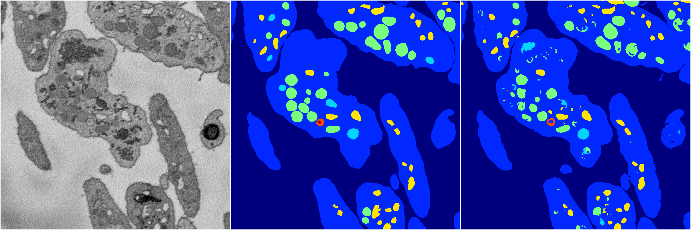</a>
<i>Click image for more details</i>

2 nets

**ari**: min 0.8279. max 0.8300. mean 0.8289.  ([best net](0/1))

**miou**: min 0.6009. max 0.6110. mean 0.6060.  ([best net](0/1))

**accuracy**: min 0.9374. max 0.9378. mean 0.9376.  ([best net](0/0))

**n_params**: min 17217594.0000. max 17217594.0000. mean 17217594.0000.  ([best net](0/0))

---

<a href="2"><h2>random_2d_ed_dense / 0410 / 2</h2></a>
Created 16 Apr 2019, 17:08:24

<a href="2">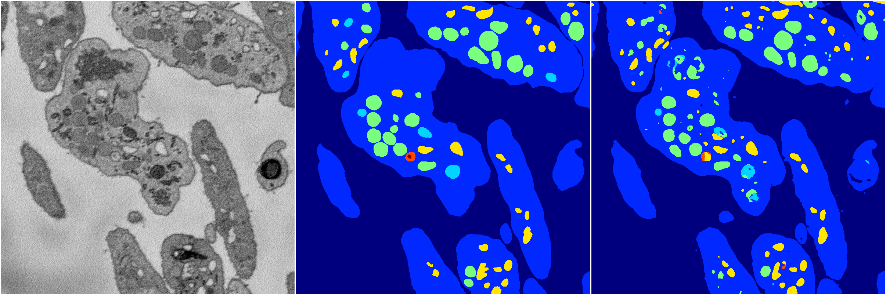</a>
<i>Click image for more details</i>

2 nets

**ari**: min 0.7148. max 0.8237. mean 0.7693.  ([best net](2/1))

**miou**: min 0.2906. max 0.5929. mean 0.4417.  ([best net](2/1))

**accuracy**: min 0.8932. max 0.9334. mean 0.9133.  ([best net](2/1))

**n_params**: min 2288258.0000. max 2288258.0000. mean 2288258.0000.  ([best net](2/0))

---

[Back](..)&nbsp;&nbsp;&nbsp;&nbsp;&nbsp;[Home](https://leapmanlab.github.io/snapshots)

---