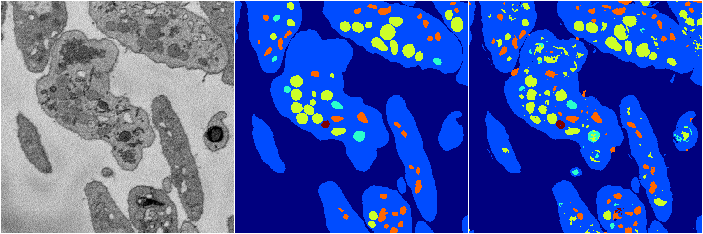
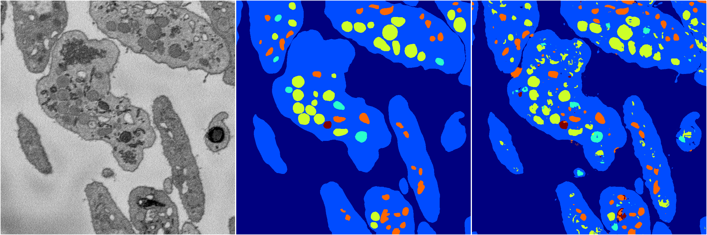

[Back](..)&nbsp;&nbsp;&nbsp;&nbsp;&nbsp;[Home](https://leapmanlab.github.io/snapshots)

---

<a href="1"><h2>random_2d_ed_dense / 0503 / 109 / 1</h2></a>
Created 07 May 2019, 10:52:43

<i>Click for more details</i>

**ari**: 0.7820. **miou**: 0.5853. **accuracy**: 0.9115. **n_params**: 2733124.0000. 

---

<a href="0"><h2>random_2d_ed_dense / 0503 / 109 / 0</h2></a>
Created 07 May 2019, 10:52:43

<i>Click for more details</i>

**ari**: 0.7906. **miou**: 0.5889. **accuracy**: 0.9158. **n_params**: 2733124.0000. 

---

[Back](..)&nbsp;&nbsp;&nbsp;&nbsp;&nbsp;[Home](https://leapmanlab.github.io/snapshots)

---