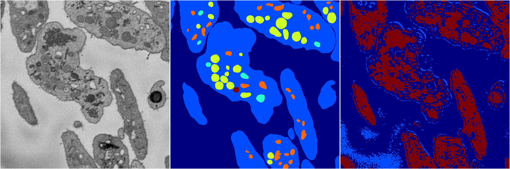
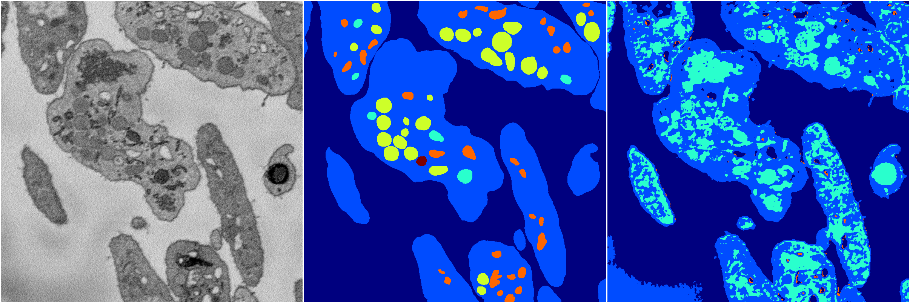

[Back](..)&nbsp;&nbsp;&nbsp;&nbsp;&nbsp;[Home](https://leapmanlab.github.io/snapshots)

---

<a href="0"><h2>random_2d_ed_dense / 0503 / 118 / 0</h2></a>
Created 07 May 2019, 11:56:51

<i>Click for more details</i>

**ari**: 0.1840. **miou**: 0.0988. **accuracy**: 0.4073. **n_params**: 307881.0000. 

---

<a href="1"><h2>random_2d_ed_dense / 0503 / 118 / 1</h2></a>
Created 07 May 2019, 11:56:51

<i>Click for more details</i>

**ari**: 0.5522. **miou**: 0.2783. **accuracy**: 0.7477. **n_params**: 307881.0000. 

---

[Back](..)&nbsp;&nbsp;&nbsp;&nbsp;&nbsp;[Home](https://leapmanlab.github.io/snapshots)

---