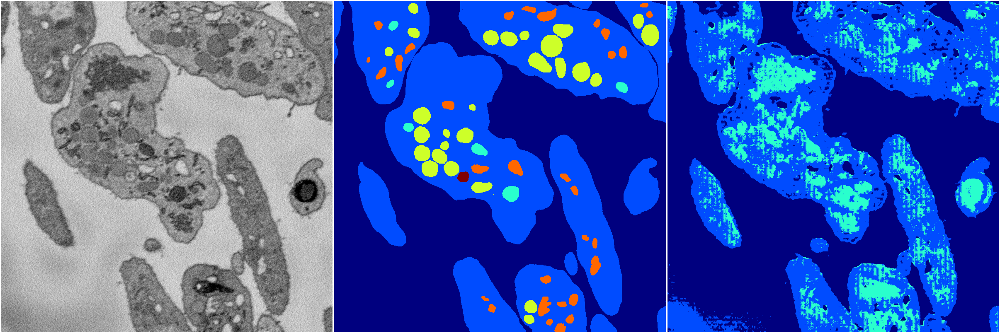
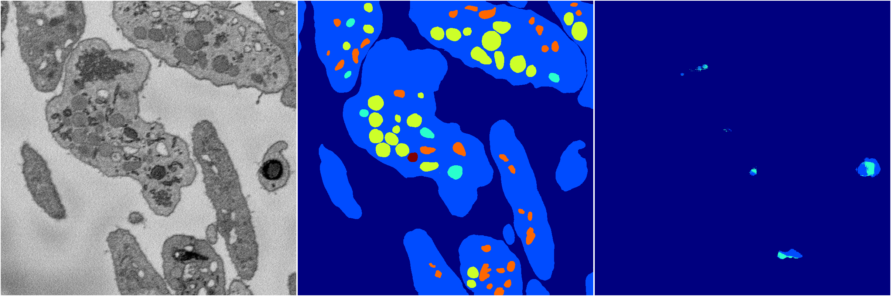

[Back](..)&nbsp;&nbsp;&nbsp;&nbsp;&nbsp;[Home](https://leapmanlab.github.io/snapshots)

---

<a href="1"><h2>random_2d_ed_dense / 0503 / 171 / 1</h2></a>
Created 07 May 2019, 10:52:45

<i>Click for more details</i>

**ari**: 0.5662. **miou**: 0.2718. **accuracy**: 0.7760. **n_params**: 887535.0000. 

---

<a href="0"><h2>random_2d_ed_dense / 0503 / 171 / 0</h2></a>
Created 07 May 2019, 10:52:45

<i>Click for more details</i>

**ari**: 0.0030. **miou**: 0.0821. **accuracy**: 0.4269. **n_params**: 887535.0000. 

---

[Back](..)&nbsp;&nbsp;&nbsp;&nbsp;&nbsp;[Home](https://leapmanlab.github.io/snapshots)

---