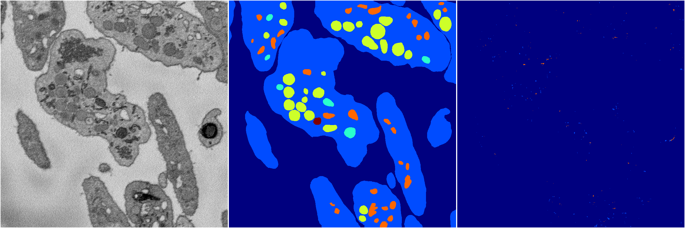

[Back](..)&nbsp;&nbsp;&nbsp;&nbsp;&nbsp;[Home](https://leapmanlab.github.io/snapshots)

---

<a href="1"><h2>random_2d_ed_dense / 0503 / 207 / 1</h2></a>
Created 07 May 2019, 11:56:52

<i>Click for more details</i>

**ari**: -0.0001. **miou**: 0.0708. **accuracy**: 0.4148. **n_params**: 915268.0000. 

---

<a href="0"><h2>random_2d_ed_dense / 0503 / 207 / 0</h2></a>
Created 07 May 2019, 11:56:52

<i>Click for more details</i>

**ari**: 0.5469. **miou**: 0.2597. **accuracy**: 0.8355. **n_params**: 915268.0000. 

---

[Back](..)&nbsp;&nbsp;&nbsp;&nbsp;&nbsp;[Home](https://leapmanlab.github.io/snapshots)

---