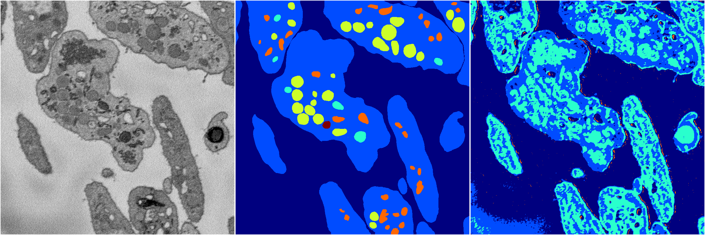
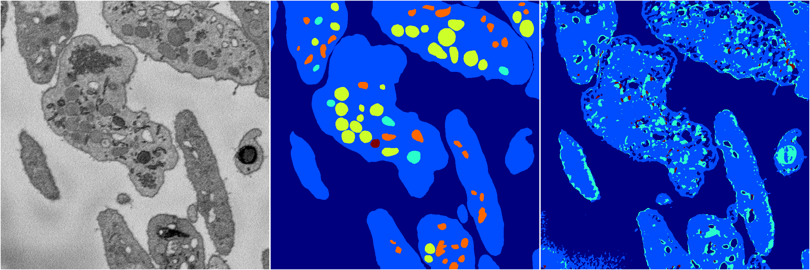

[Back](..)&nbsp;&nbsp;&nbsp;&nbsp;&nbsp;[Home](https://leapmanlab.github.io/snapshots)

---

<a href="1"><h2>random_2d_ed_dense / 0503 / 208 / 1</h2></a>
Created 07 May 2019, 10:52:45

<i>Click for more details</i>

**ari**: 0.5595. **miou**: 0.2325. **accuracy**: 0.6689. **n_params**: 27108965.0000. 

---

<a href="0"><h2>random_2d_ed_dense / 0503 / 208 / 0</h2></a>
Created 07 May 2019, 10:52:45

<i>Click for more details</i>

**ari**: 0.6014. **miou**: 0.2733. **accuracy**: 0.8232. **n_params**: 27108965.0000. 

---

[Back](..)&nbsp;&nbsp;&nbsp;&nbsp;&nbsp;[Home](https://leapmanlab.github.io/snapshots)

---