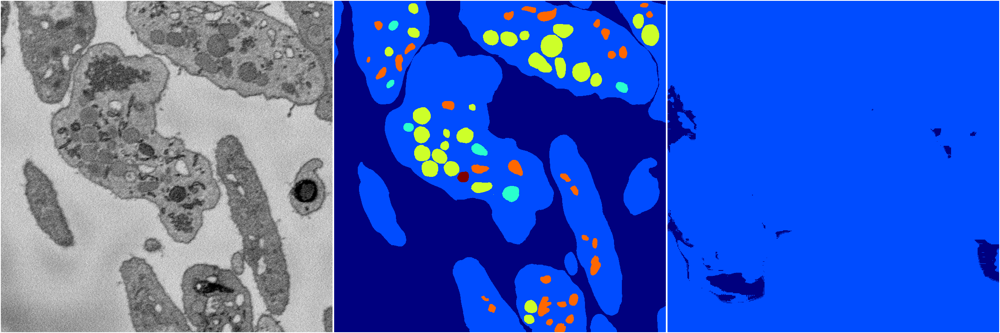

[Back](..)&nbsp;&nbsp;&nbsp;&nbsp;&nbsp;[Home](https://leapmanlab.github.io/snapshots)

---

<a href="0"><h2>random_2d_ed_dense / 0503 / 227 / 0</h2></a>
Created 07 May 2019, 10:52:46

<i>Click for more details</i>

**ari**: 0.2751. **miou**: 0.1163. **accuracy**: 0.4424. **n_params**: 49701782.0000. 

---

<a href="1"><h2>random_2d_ed_dense / 0503 / 227 / 1</h2></a>
Created 07 May 2019, 10:52:46

<i>Click for more details</i>

**ari**: -0.0103. **miou**: 0.0871. **accuracy**: 0.4941. **n_params**: 49701782.0000. 

---

[Back](..)&nbsp;&nbsp;&nbsp;&nbsp;&nbsp;[Home](https://leapmanlab.github.io/snapshots)

---