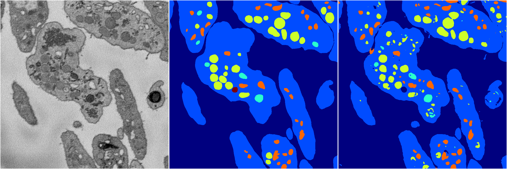
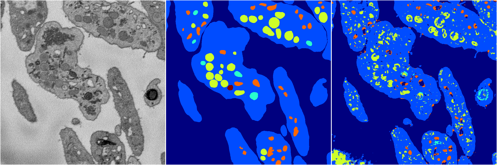

[Back](..)&nbsp;&nbsp;&nbsp;&nbsp;&nbsp;[Home](https://leapmanlab.github.io/snapshots)

---

<a href="1"><h2>random_2d_ed_dense / 0503 / 270 / 1</h2></a>
Created 07 May 2019, 11:56:54

<i>Click for more details</i>

**ari**: 0.8161. **miou**: 0.5415. **accuracy**: 0.9291. **n_params**: 2944085.0000. 

---

<a href="0"><h2>random_2d_ed_dense / 0503 / 270 / 0</h2></a>
Created 07 May 2019, 11:56:54

<i>Click for more details</i>

**ari**: 0.7426. **miou**: 0.4028. **accuracy**: 0.8912. **n_params**: 2944085.0000. 

---

[Back](..)&nbsp;&nbsp;&nbsp;&nbsp;&nbsp;[Home](https://leapmanlab.github.io/snapshots)

---