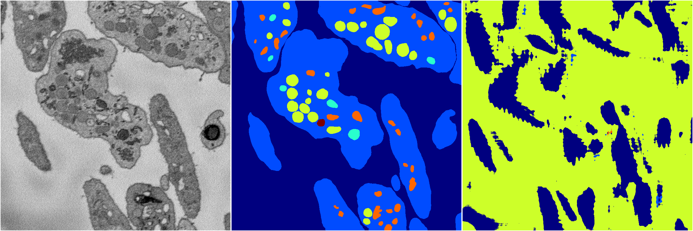

[Back](..)&nbsp;&nbsp;&nbsp;&nbsp;&nbsp;[Home](https://leapmanlab.github.io/snapshots)

---

<a href="1"><h2>random_2d_ed_dense / 0503 / 28 / 1</h2></a>
Created 07 May 2019, 11:56:49

<i>Click for more details</i>

**ari**: 0.0428. **miou**: 0.0320. **accuracy**: 0.1290. **n_params**: 18572539.0000. 

---

<a href="0"><h2>random_2d_ed_dense / 0503 / 28 / 0</h2></a>
Created 07 May 2019, 11:56:49

<i>Click for more details</i>

**ari**: 0.4149. **miou**: 0.1575. **accuracy**: 0.4361. **n_params**: 18572539.0000. 

---

[Back](..)&nbsp;&nbsp;&nbsp;&nbsp;&nbsp;[Home](https://leapmanlab.github.io/snapshots)

---