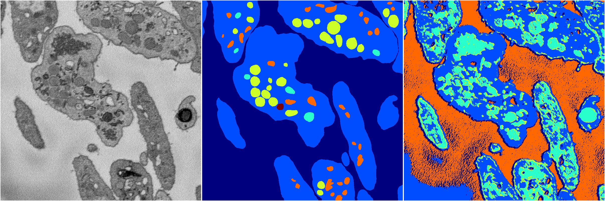

[Back](..)&nbsp;&nbsp;&nbsp;&nbsp;&nbsp;[Home](https://leapmanlab.github.io/snapshots)

---

<a href="0"><h2>random_2d_ed_dense / 0503 / 280 / 0</h2></a>
Created 07 May 2019, 11:56:54

<i>Click for more details</i>

**ari**: 0.5523. **miou**: 0.2652. **accuracy**: 0.7790. **n_params**: 4463506.0000. 

---

<a href="1"><h2>random_2d_ed_dense / 0503 / 280 / 1</h2></a>
Created 07 May 2019, 11:56:53

<i>Click for more details</i>

**ari**: 0.4139. **miou**: 0.1383. **accuracy**: 0.3825. **n_params**: 4463506.0000. 

---

[Back](..)&nbsp;&nbsp;&nbsp;&nbsp;&nbsp;[Home](https://leapmanlab.github.io/snapshots)

---