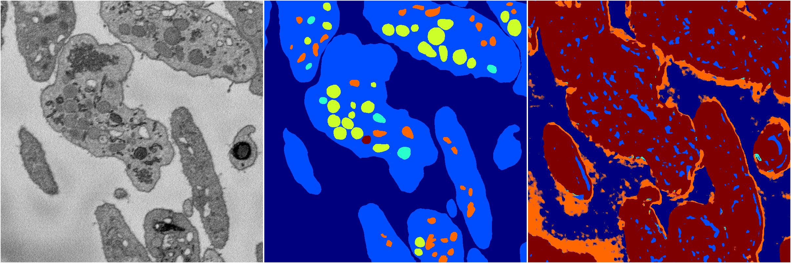
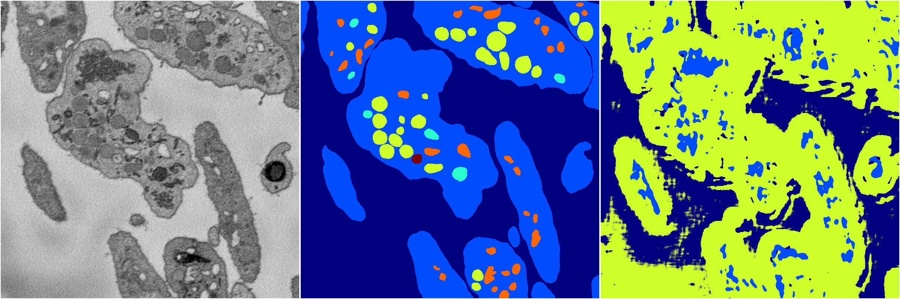

[Back](..)&nbsp;&nbsp;&nbsp;&nbsp;&nbsp;[Home](https://leapmanlab.github.io/snapshots)

---

<a href="0"><h2>random_2d_ed_dense / 0503 / 281 / 0</h2></a>
Created 07 May 2019, 10:52:47

<i>Click for more details</i>

**ari**: 0.2681. **miou**: 0.0958. **accuracy**: 0.2561. **n_params**: 1515279.0000. 

---

<a href="1"><h2>random_2d_ed_dense / 0503 / 281 / 1</h2></a>
Created 07 May 2019, 10:52:47

<i>Click for more details</i>

**ari**: 0.1462. **miou**: 0.1040. **accuracy**: 0.2969. **n_params**: 1515279.0000. 

---

[Back](..)&nbsp;&nbsp;&nbsp;&nbsp;&nbsp;[Home](https://leapmanlab.github.io/snapshots)

---