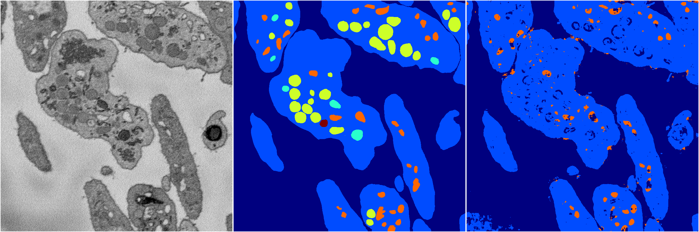

[Back](..)&nbsp;&nbsp;&nbsp;&nbsp;&nbsp;[Home](https://leapmanlab.github.io/snapshots)

---

<a href="1"><h2>random_2d_ed_dense / 0503 / 288 / 1</h2></a>
Created 07 May 2019, 11:56:53

<i>Click for more details</i>

**ari**: 0.7116. **miou**: 0.3512. **accuracy**: 0.8840. **n_params**: 744416.0000. 

---

<a href="0"><h2>random_2d_ed_dense / 0503 / 288 / 0</h2></a>
Created 07 May 2019, 11:56:53

<i>Click for more details</i>

**ari**: 0.6883. **miou**: 0.3734. **accuracy**: 0.8595. **n_params**: 744416.0000. 

---

[Back](..)&nbsp;&nbsp;&nbsp;&nbsp;&nbsp;[Home](https://leapmanlab.github.io/snapshots)

---