[Back](..)&nbsp;&nbsp;&nbsp;&nbsp;&nbsp;[Home](https://leapmanlab.github.io/snapshots)

---

<a href="299"><h2>random_2d_ed_dense / 0503 / 299</h2></a>
Created 07 May 2019, 11:56:54

<i>Click image for more details</i>

2 nets

**ari**: min -0.0028. max 0.1491. mean 0.0731.  ([best net](299/1))

**miou**: min 0.0328. max 0.0811. mean 0.0570.  ([best net](299/0))

**accuracy**: min 0.1416. max 0.4795. mean 0.3105.  ([best net](299/0))

**n_params**: min 6529852.0000. max 6529852.0000. mean 6529852.0000.  ([best net](299/1))

---

<a href="298"><h2>random_2d_ed_dense / 0503 / 298</h2></a>
Created 07 May 2019, 11:56:54

<a href="298">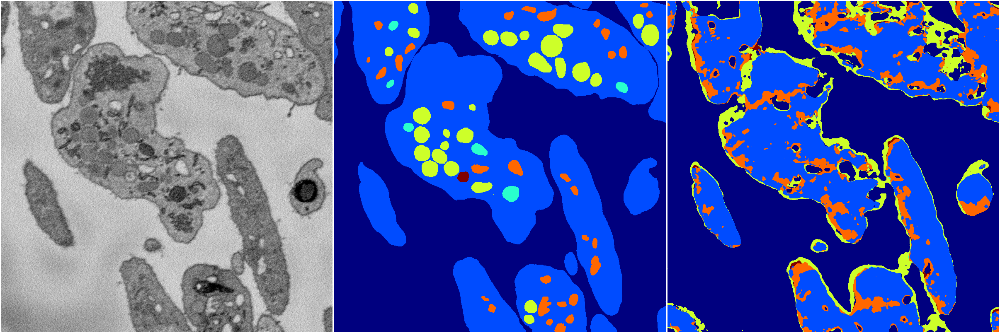</a>
<i>Click image for more details</i>

1 nets

**ari**: min 0.5082. max 0.5082. mean 0.5082.  ([best net](298/1))

**miou**: min 0.2490. max 0.2490. mean 0.2490.  ([best net](298/1))

**accuracy**: min 0.7368. max 0.7368. mean 0.7368.  ([best net](298/1))

**n_params**: min 2598405.0000. max 2598405.0000. mean 2598405.0000.  ([best net](298/1))

---

<a href="289"><h2>random_2d_ed_dense / 0503 / 289</h2></a>
Created 07 May 2019, 11:56:54

<i>Click image for more details</i>

2 nets

**ari**: min 0.8025. max 0.8265. mean 0.8145.  ([best net](289/1))

**miou**: min 0.5881. max 0.6314. mean 0.6098.  ([best net](289/1))

**accuracy**: min 0.9229. max 0.9361. mean 0.9295.  ([best net](289/1))

**n_params**: min 9238994.0000. max 9238994.0000. mean 9238994.0000.  ([best net](289/0))

---

<a href="297"><h2>random_2d_ed_dense / 0503 / 297</h2></a>
Created 07 May 2019, 11:56:54

<i>Click image for more details</i>

2 nets

**ari**: min 0.0043. max 0.4837. mean 0.2440.  ([best net](297/1))

**miou**: min 0.0612. max 0.2434. mean 0.1523.  ([best net](297/1))

**accuracy**: min 0.1830. max 0.8156. mean 0.4993.  ([best net](297/1))

**n_params**: min 857479.0000. max 857479.0000. mean 857479.0000.  ([best net](297/0))

---

<a href="290"><h2>random_2d_ed_dense / 0503 / 290</h2></a>
Created 07 May 2019, 11:56:54

<a href="290">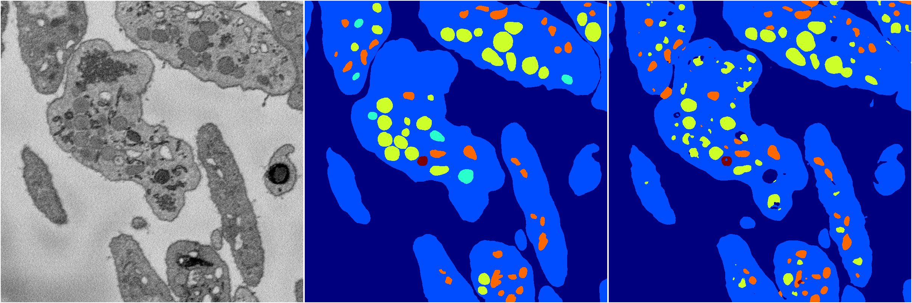</a>
<i>Click image for more details</i>

1 nets

**ari**: min 0.7960. max 0.7960. mean 0.7960.  ([best net](290/1))

**miou**: min 0.5259. max 0.5259. mean 0.5259.  ([best net](290/1))

**accuracy**: min 0.9182. max 0.9182. mean 0.9182.  ([best net](290/1))

**n_params**: min 4432791.0000. max 4432791.0000. mean 4432791.0000.  ([best net](290/1))

---

<a href="270"><h2>random_2d_ed_dense / 0503 / 270</h2></a>
Created 07 May 2019, 11:56:54

<i>Click image for more details</i>

2 nets

**ari**: min 0.7426. max 0.8161. mean 0.7794.  ([best net](270/1))

**miou**: min 0.4028. max 0.5415. mean 0.4722.  ([best net](270/1))

**accuracy**: min 0.8912. max 0.9291. mean 0.9102.  ([best net](270/1))

**n_params**: min 2944085.0000. max 2944085.0000. mean 2944085.0000.  ([best net](270/0))

---

<a href="280"><h2>random_2d_ed_dense / 0503 / 280</h2></a>
Created 07 May 2019, 11:56:54

<a href="280">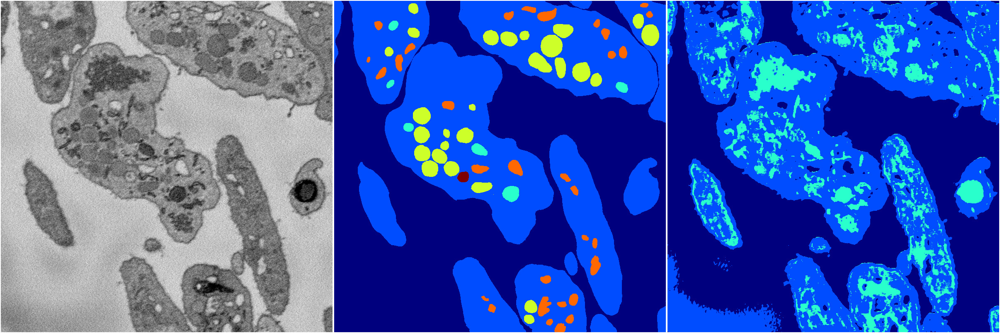</a>
<i>Click image for more details</i>

2 nets

**ari**: min 0.4139. max 0.5523. mean 0.4831.  ([best net](280/0))

**miou**: min 0.1383. max 0.2652. mean 0.2017.  ([best net](280/0))

**accuracy**: min 0.3825. max 0.7790. mean 0.5807.  ([best net](280/0))

**n_params**: min 4463506.0000. max 4463506.0000. mean 4463506.0000.  ([best net](280/1))

---

<a href="271"><h2>random_2d_ed_dense / 0503 / 271</h2></a>
Created 07 May 2019, 11:56:53

<i>Click image for more details</i>

2 nets

**ari**: min 0.0000. max 0.8012. mean 0.4006.  ([best net](271/0))

**miou**: min 0.0787. max 0.4663. mean 0.2725.  ([best net](271/0))

**accuracy**: min 0.4722. max 0.9229. mean 0.6976.  ([best net](271/0))

**n_params**: min 3860188.0000. max 3860188.0000. mean 3860188.0000.  ([best net](271/1))

---

<a href="281"><h2>random_2d_ed_dense / 0503 / 281</h2></a>
Created 07 May 2019, 11:56:53

<i>Click image for more details</i>

2 nets

**ari**: min 0.1462. max 0.2681. mean 0.2071.  ([best net](281/0))

**miou**: min 0.0958. max 0.1040. mean 0.0999.  ([best net](281/1))

**accuracy**: min 0.2561. max 0.2969. mean 0.2765.  ([best net](281/1))

**n_params**: min 1515279.0000. max 1515279.0000. mean 1515279.0000.  ([best net](281/1))

---

<a href="279"><h2>random_2d_ed_dense / 0503 / 279</h2></a>
Created 07 May 2019, 11:56:53

<a href="279">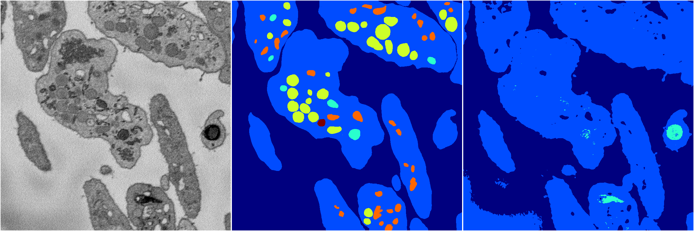</a>
<i>Click image for more details</i>

2 nets

**ari**: min 0.3534. max 0.6304. mean 0.4919.  ([best net](279/0))

**miou**: min 0.2108. max 0.2883. mean 0.2495.  ([best net](279/0))

**accuracy**: min 0.7433. max 0.8613. mean 0.8023.  ([best net](279/0))

**n_params**: min 1602709.0000. max 1602709.0000. mean 1602709.0000.  ([best net](279/1))

---

<a href="288"><h2>random_2d_ed_dense / 0503 / 288</h2></a>
Created 07 May 2019, 11:56:53

<a href="288">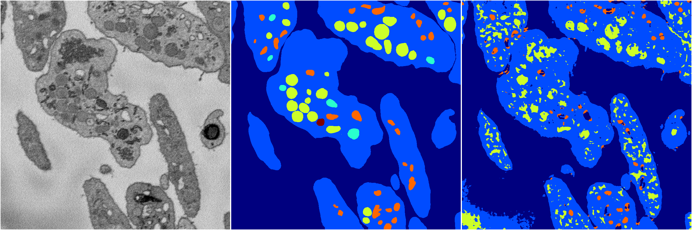</a>
<i>Click image for more details</i>

2 nets

**ari**: min 0.6883. max 0.7116. mean 0.6999.  ([best net](288/1))

**miou**: min 0.3512. max 0.3734. mean 0.3623.  ([best net](288/0))

**accuracy**: min 0.8595. max 0.8840. mean 0.8718.  ([best net](288/1))

**n_params**: min 744416.0000. max 744416.0000. mean 744416.0000.  ([best net](288/0))

---

<a href="272"><h2>random_2d_ed_dense / 0503 / 272</h2></a>
Created 07 May 2019, 11:56:53

<i>Click image for more details</i>

2 nets

**ari**: min 0.7612. max 0.8261. mean 0.7937.  ([best net](272/0))

**miou**: min 0.3910. max 0.6055. mean 0.4982.  ([best net](272/0))

**accuracy**: min 0.9070. max 0.9356. mean 0.9213.  ([best net](272/0))

**n_params**: min 6995004.0000. max 6995004.0000. mean 6995004.0000.  ([best net](272/0))

---

<a href="262"><h2>random_2d_ed_dense / 0503 / 262</h2></a>
Created 07 May 2019, 11:56:53

<a href="262">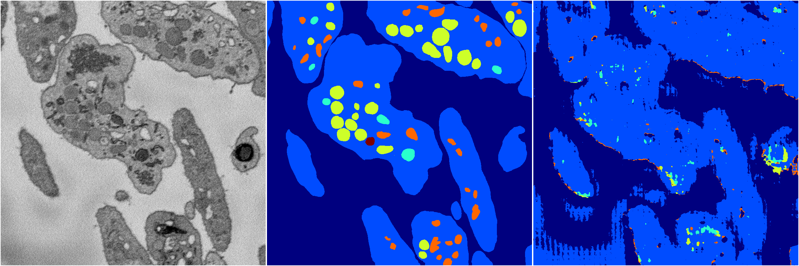</a>
<i>Click image for more details</i>

1 nets

**ari**: min 0.5370. max 0.5370. mean 0.5370.  ([best net](262/0))

**miou**: min 0.2759. max 0.2759. mean 0.2759.  ([best net](262/0))

**accuracy**: min 0.8306. max 0.8306. mean 0.8306.  ([best net](262/0))

**n_params**: min 11941476.0000. max 11941476.0000. mean 11941476.0000.  ([best net](262/0))

---

<a href="261"><h2>random_2d_ed_dense / 0503 / 261</h2></a>
Created 07 May 2019, 11:56:53

<i>Click image for more details</i>

2 nets

**ari**: min 0.0000. max 0.0151. mean 0.0075.  ([best net](261/1))

**miou**: min 0.0796. max 0.0857. mean 0.0827.  ([best net](261/1))

**accuracy**: min 0.4777. max 0.4832. mean 0.4805.  ([best net](261/1))

**n_params**: min 4994120.0000. max 4994120.0000. mean 4994120.0000.  ([best net](261/0))

---

<a href="263"><h2>random_2d_ed_dense / 0503 / 263</h2></a>
Created 07 May 2019, 11:56:53

<a href="263">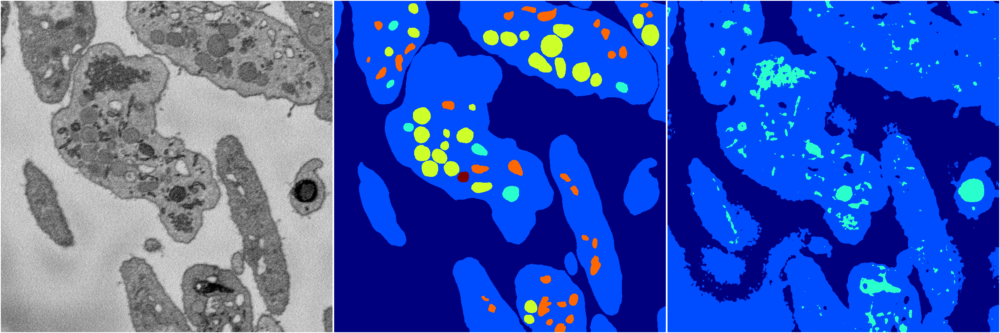</a>
<i>Click image for more details</i>

2 nets

**ari**: min 0.1283. max 0.4578. mean 0.2930.  ([best net](263/0))

**miou**: min 0.0989. max 0.2835. mean 0.1912.  ([best net](263/0))

**accuracy**: min 0.4341. max 0.7902. mean 0.6121.  ([best net](263/0))

**n_params**: min 1186753.0000. max 1186753.0000. mean 1186753.0000.  ([best net](263/1))

---

<a href="253"><h2>random_2d_ed_dense / 0503 / 253</h2></a>
Created 07 May 2019, 11:56:53

<i>Click image for more details</i>

2 nets

**ari**: min 0.7336. max 0.7580. mean 0.7458.  ([best net](253/1))

**miou**: min 0.4597. max 0.5217. mean 0.4907.  ([best net](253/1))

**accuracy**: min 0.8877. max 0.9004. mean 0.8940.  ([best net](253/1))

**n_params**: min 3976560.0000. max 3976560.0000. mean 3976560.0000.  ([best net](253/0))

---

<a href="254"><h2>random_2d_ed_dense / 0503 / 254</h2></a>
Created 07 May 2019, 11:56:53

<a href="254">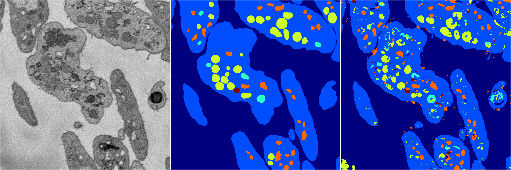</a>
<i>Click image for more details</i>

1 nets

**ari**: min 0.7617. max 0.7617. mean 0.7617.  ([best net](254/0))

**miou**: min 0.5189. max 0.5189. mean 0.5189.  ([best net](254/0))

**accuracy**: min 0.8988. max 0.8988. mean 0.8988.  ([best net](254/0))

**n_params**: min 1071662.0000. max 1071662.0000. mean 1071662.0000.  ([best net](254/0))

---

<a href="252"><h2>random_2d_ed_dense / 0503 / 252</h2></a>
Created 07 May 2019, 11:56:53

<a href="252">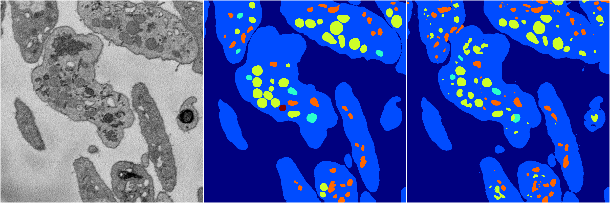</a>
<i>Click image for more details</i>

2 nets

**ari**: min 0.7841. max 0.8101. mean 0.7971.  ([best net](252/1))

**miou**: min 0.4561. max 0.5358. mean 0.4959.  ([best net](252/1))

**accuracy**: min 0.9162. max 0.9267. mean 0.9215.  ([best net](252/1))

**n_params**: min 4005241.0000. max 4005241.0000. mean 4005241.0000.  ([best net](252/1))

---

<a href="245"><h2>random_2d_ed_dense / 0503 / 245</h2></a>
Created 07 May 2019, 11:56:53

<a href="245">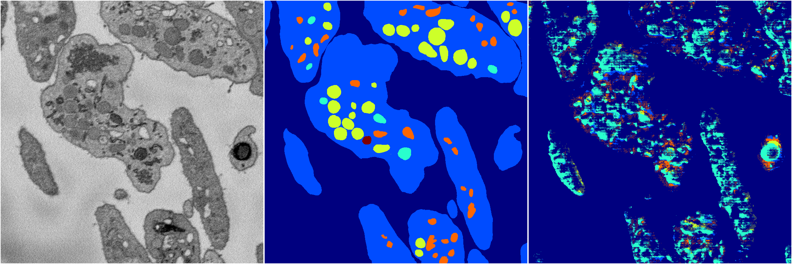</a>
<i>Click image for more details</i>

2 nets

**ari**: min 0.0214. max 0.1037. mean 0.0626.  ([best net](245/1))

**miou**: min 0.0068. max 0.1132. mean 0.0600.  ([best net](245/1))

**accuracy**: min 0.0203. max 0.4951. mean 0.2577.  ([best net](245/1))

**n_params**: min 6066181.0000. max 6066181.0000. mean 6066181.0000.  ([best net](245/0))

---

<a href="244"><h2>random_2d_ed_dense / 0503 / 244</h2></a>
Created 07 May 2019, 11:56:53

<a href="244">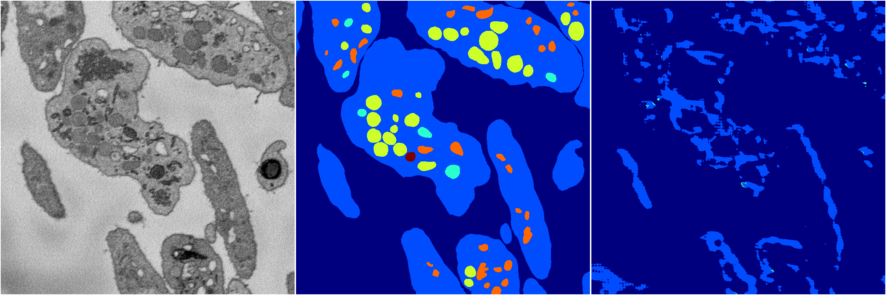</a>
<i>Click image for more details</i>

1 nets

**ari**: min 0.0378. max 0.0378. mean 0.0378.  ([best net](244/0))

**miou**: min 0.1194. max 0.1194. mean 0.1194.  ([best net](244/0))

**accuracy**: min 0.5642. max 0.5642. mean 0.5642.  ([best net](244/0))

**n_params**: min 5391927.0000. max 5391927.0000. mean 5391927.0000.  ([best net](244/0))

---

<a href="243"><h2>random_2d_ed_dense / 0503 / 243</h2></a>
Created 07 May 2019, 11:56:53

<a href="243">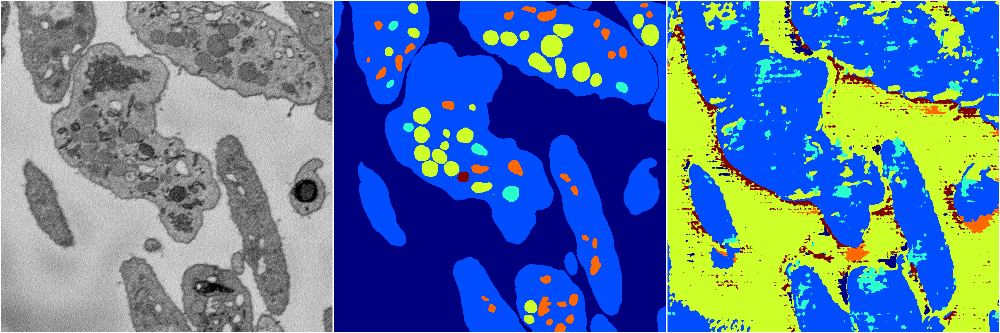</a>
<i>Click image for more details</i>

2 nets

**ari**: min 0.0000. max 0.4101. mean 0.2050.  ([best net](243/1))

**miou**: min 0.0777. max 0.1398. mean 0.1087.  ([best net](243/1))

**accuracy**: min 0.3984. max 0.4664. mean 0.4324.  ([best net](243/0))

**n_params**: min 2343535.0000. max 2343535.0000. mean 2343535.0000.  ([best net](243/0))

---

<a href="236"><h2>random_2d_ed_dense / 0503 / 236</h2></a>
Created 07 May 2019, 11:56:53

<i>Click image for more details</i>

1 nets

**ari**: min 0.6920. max 0.6920. mean 0.6920.  ([best net](236/1))

**miou**: min 0.2814. max 0.2814. mean 0.2814.  ([best net](236/1))

**accuracy**: min 0.8869. max 0.8869. mean 0.8869.  ([best net](236/1))

**n_params**: min 11115788.0000. max 11115788.0000. mean 11115788.0000.  ([best net](236/1))

---

<a href="235"><h2>random_2d_ed_dense / 0503 / 235</h2></a>
Created 07 May 2019, 11:56:53

<a href="235">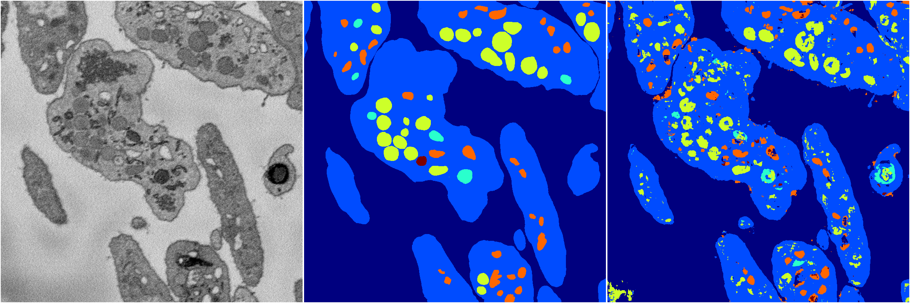</a>
<i>Click image for more details</i>

2 nets

**ari**: min 0.6883. max 0.7501. mean 0.7192.  ([best net](235/0))

**miou**: min 0.4628. max 0.4926. mean 0.4777.  ([best net](235/0))

**accuracy**: min 0.8519. max 0.8911. mean 0.8715.  ([best net](235/0))

**n_params**: min 895893.0000. max 895893.0000. mean 895893.0000.  ([best net](235/0))

---

<a href="234"><h2>random_2d_ed_dense / 0503 / 234</h2></a>
Created 07 May 2019, 11:56:53

<i>Click image for more details</i>

2 nets

**ari**: min 0.6930. max 0.7299. mean 0.7114.  ([best net](234/0))

**miou**: min 0.5014. max 0.5135. mean 0.5075.  ([best net](234/0))

**accuracy**: min 0.8697. max 0.8811. mean 0.8754.  ([best net](234/0))

**n_params**: min 481245.0000. max 481245.0000. mean 481245.0000.  ([best net](234/0))

---

<a href="227"><h2>random_2d_ed_dense / 0503 / 227</h2></a>
Created 07 May 2019, 11:56:53

<a href="227">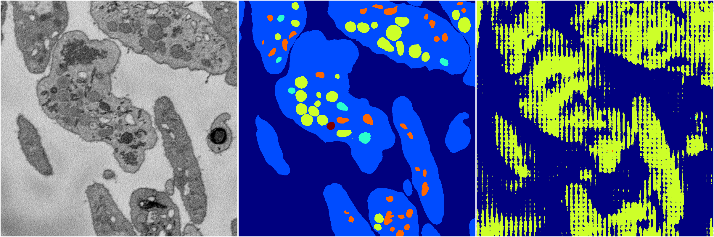</a>
<i>Click image for more details</i>

2 nets

**ari**: min -0.0103. max 0.2751. mean 0.1324.  ([best net](227/0))

**miou**: min 0.0871. max 0.1163. mean 0.1017.  ([best net](227/0))

**accuracy**: min 0.4424. max 0.4941. mean 0.4682.  ([best net](227/1))

**n_params**: min 49701782.0000. max 49701782.0000. mean 49701782.0000.  ([best net](227/1))

---

<a href="226"><h2>random_2d_ed_dense / 0503 / 226</h2></a>
Created 07 May 2019, 11:56:53

<a href="226">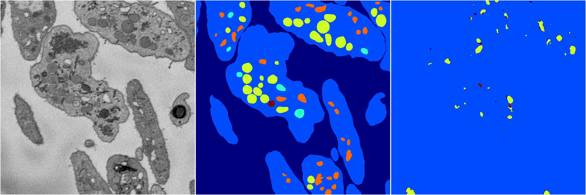</a>
<i>Click image for more details</i>

2 nets

**ari**: min -0.0022. max 0.1146. mean 0.0562.  ([best net](226/0))

**miou**: min 0.0661. max 0.0763. mean 0.0712.  ([best net](226/1))

**accuracy**: min 0.3001. max 0.4549. mean 0.3775.  ([best net](226/1))

**n_params**: min 6227432.0000. max 6227432.0000. mean 6227432.0000.  ([best net](226/0))

---

<a href="225"><h2>random_2d_ed_dense / 0503 / 225</h2></a>
Created 07 May 2019, 11:56:53

<i>Click image for more details</i>

2 nets

**ari**: min 0.0756. max 0.5495. mean 0.3126.  ([best net](225/1))

**miou**: min 0.0997. max 0.2592. mean 0.1794.  ([best net](225/1))

**accuracy**: min 0.4432. max 0.8421. mean 0.6427.  ([best net](225/1))

**n_params**: min 7758959.0000. max 7758959.0000. mean 7758959.0000.  ([best net](225/0))

---

<a href="218"><h2>random_2d_ed_dense / 0503 / 218</h2></a>
Created 07 May 2019, 11:56:52

<i>Click image for more details</i>

2 nets

**ari**: min 0.8108. max 0.8264. mean 0.8186.  ([best net](218/1))

**miou**: min 0.5939. max 0.6361. mean 0.6150.  ([best net](218/1))

**accuracy**: min 0.9246. max 0.9350. mean 0.9298.  ([best net](218/1))

**n_params**: min 11869338.0000. max 11869338.0000. mean 11869338.0000.  ([best net](218/0))

---

<a href="217"><h2>random_2d_ed_dense / 0503 / 217</h2></a>
Created 07 May 2019, 11:56:52

<i>Click image for more details</i>

1 nets

**ari**: min 0.8005. max 0.8005. mean 0.8005.  ([best net](217/0))

**miou**: min 0.5182. max 0.5182. mean 0.5182.  ([best net](217/0))

**accuracy**: min 0.9228. max 0.9228. mean 0.9228.  ([best net](217/0))

**n_params**: min 4254005.0000. max 4254005.0000. mean 4254005.0000.  ([best net](217/0))

---

<a href="216"><h2>random_2d_ed_dense / 0503 / 216</h2></a>
Created 07 May 2019, 11:56:52

<a href="216">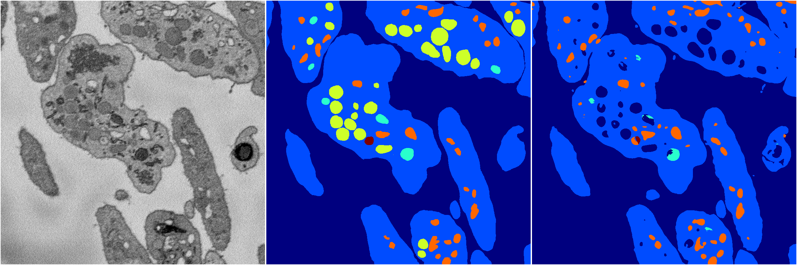</a>
<i>Click image for more details</i>

2 nets

**ari**: min 0.6778. max 0.7823. mean 0.7300.  ([best net](216/1))

**miou**: min 0.4248. max 0.5126. mean 0.4687.  ([best net](216/1))

**accuracy**: min 0.8425. max 0.9131. mean 0.8778.  ([best net](216/1))

**n_params**: min 558351.0000. max 558351.0000. mean 558351.0000.  ([best net](216/0))

---

<a href="208"><h2>random_2d_ed_dense / 0503 / 208</h2></a>
Created 07 May 2019, 11:56:52

<i>Click image for more details</i>

2 nets

**ari**: min 0.5595. max 0.6014. mean 0.5805.  ([best net](208/0))

**miou**: min 0.2325. max 0.2733. mean 0.2529.  ([best net](208/0))

**accuracy**: min 0.6689. max 0.8232. mean 0.7460.  ([best net](208/0))

**n_params**: min 27108965.0000. max 27108965.0000. mean 27108965.0000.  ([best net](208/0))

---

<a href="209"><h2>random_2d_ed_dense / 0503 / 209</h2></a>
Created 07 May 2019, 11:56:52

<a href="209">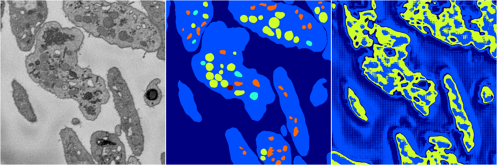</a>
<i>Click image for more details</i>

1 nets

**ari**: min 0.1061. max 0.1061. mean 0.1061.  ([best net](209/0))

**miou**: min 0.1209. max 0.1209. mean 0.1209.  ([best net](209/0))

**accuracy**: min 0.4317. max 0.4317. mean 0.4317.  ([best net](209/0))

**n_params**: min 4325959.0000. max 4325959.0000. mean 4325959.0000.  ([best net](209/0))

---

<a href="207"><h2>random_2d_ed_dense / 0503 / 207</h2></a>
Created 07 May 2019, 11:56:52

<i>Click image for more details</i>

2 nets

**ari**: min -0.0001. max 0.5469. mean 0.2734.  ([best net](207/0))

**miou**: min 0.0708. max 0.2597. mean 0.1653.  ([best net](207/0))

**accuracy**: min 0.4148. max 0.8355. mean 0.6252.  ([best net](207/0))

**n_params**: min 915268.0000. max 915268.0000. mean 915268.0000.  ([best net](207/0))

---

<a href="200"><h2>random_2d_ed_dense / 0503 / 200</h2></a>
Created 07 May 2019, 11:56:52

<a href="200">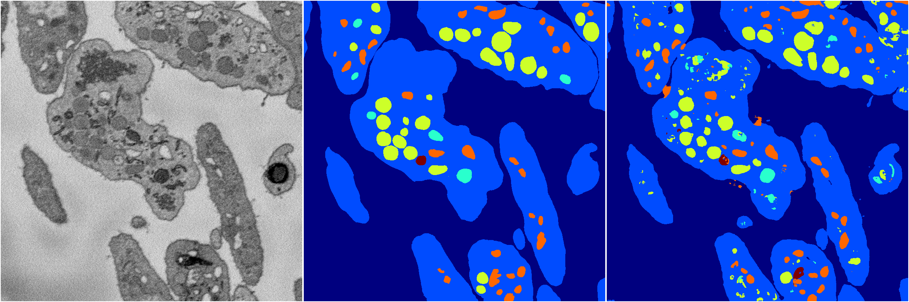</a>
<i>Click image for more details</i>

2 nets

**ari**: min 0.6829. max 0.8034. mean 0.7431.  ([best net](200/0))

**miou**: min 0.2970. max 0.6021. mean 0.4496.  ([best net](200/0))

**accuracy**: min 0.8880. max 0.9260. mean 0.9070.  ([best net](200/0))

**n_params**: min 22664678.0000. max 22664678.0000. mean 22664678.0000.  ([best net](200/0))

---

<a href="199"><h2>random_2d_ed_dense / 0503 / 199</h2></a>
Created 07 May 2019, 11:56:52

<a href="199">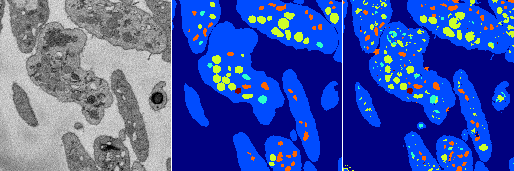</a>
<i>Click image for more details</i>

2 nets

**ari**: min 0.7670. max 0.7800. mean 0.7735.  ([best net](199/0))

**miou**: min 0.5516. max 0.5629. mean 0.5573.  ([best net](199/1))

**accuracy**: min 0.9031. max 0.9072. mean 0.9052.  ([best net](199/0))

**n_params**: min 1595649.0000. max 1595649.0000. mean 1595649.0000.  ([best net](199/0))

---

<a href="198"><h2>random_2d_ed_dense / 0503 / 198</h2></a>
Created 07 May 2019, 11:56:52

<a href="198">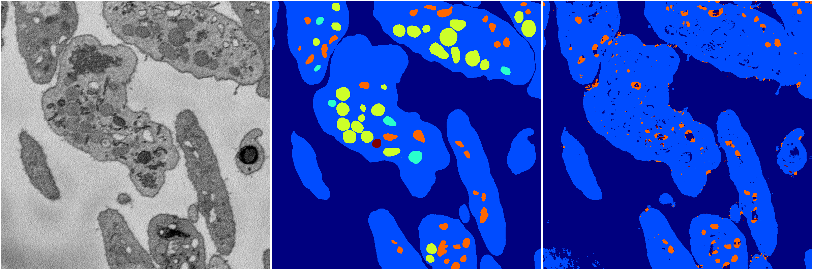</a>
<i>Click image for more details</i>

1 nets

**ari**: min 0.7172. max 0.7172. mean 0.7172.  ([best net](198/1))

**miou**: min 0.3632. max 0.3632. mean 0.3632.  ([best net](198/1))

**accuracy**: min 0.8852. max 0.8852. mean 0.8852.  ([best net](198/1))

**n_params**: min 200766.0000. max 200766.0000. mean 200766.0000.  ([best net](198/1))

---

<a href="191"><h2>random_2d_ed_dense / 0503 / 191</h2></a>
Created 07 May 2019, 11:56:52

<i>Click image for more details</i>

2 nets

**ari**: min -0.0000. max 0.0670. mean 0.0335.  ([best net](191/1))

**miou**: min 0.0785. max 0.1241. mean 0.1013.  ([best net](191/1))

**accuracy**: min 0.4711. max 0.5666. mean 0.5188.  ([best net](191/1))

**n_params**: min 8762433.0000. max 8762433.0000. mean 8762433.0000.  ([best net](191/0))

---

<a href="189"><h2>random_2d_ed_dense / 0503 / 189</h2></a>
Created 07 May 2019, 11:56:52

<a href="189">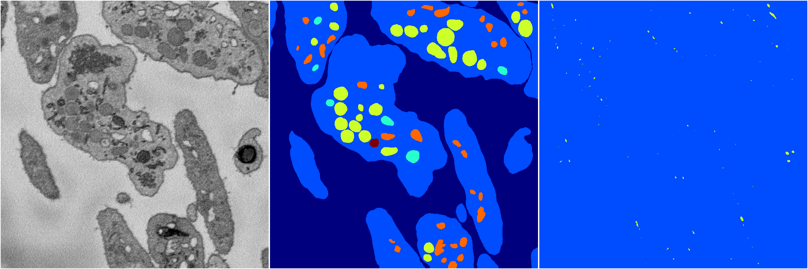</a>
<i>Click image for more details</i>

2 nets

**ari**: min 0.0003. max 0.1948. mean 0.0976.  ([best net](189/1))

**miou**: min 0.0310. max 0.0779. mean 0.0545.  ([best net](189/0))

**accuracy**: min 0.1327. max 0.4657. mean 0.2992.  ([best net](189/0))

**n_params**: min 1023969.0000. max 1023969.0000. mean 1023969.0000.  ([best net](189/0))

---

<a href="190"><h2>random_2d_ed_dense / 0503 / 190</h2></a>
Created 07 May 2019, 11:56:52

<i>Click image for more details</i>

1 nets

**ari**: min 0.5348. max 0.5348. mean 0.5348.  ([best net](190/1))

**miou**: min 0.2589. max 0.2589. mean 0.2589.  ([best net](190/1))

**accuracy**: min 0.7366. max 0.7366. mean 0.7366.  ([best net](190/1))

**n_params**: min 54093.0000. max 54093.0000. mean 54093.0000.  ([best net](190/1))

---

<a href="182"><h2>random_2d_ed_dense / 0503 / 182</h2></a>
Created 07 May 2019, 11:56:52

<a href="182">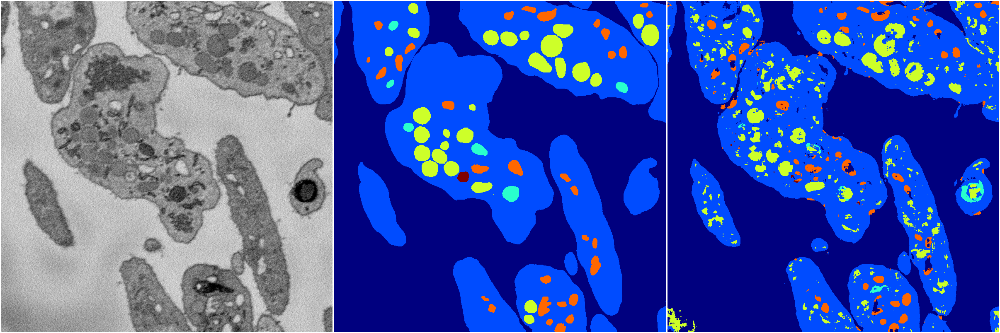</a>
<i>Click image for more details</i>

2 nets

**ari**: min 0.7235. max 0.7382. mean 0.7308.  ([best net](182/1))

**miou**: min 0.4102. max 0.4501. mean 0.4301.  ([best net](182/1))

**accuracy**: min 0.8824. max 0.8898. mean 0.8861.  ([best net](182/0))

**n_params**: min 445043.0000. max 445043.0000. mean 445043.0000.  ([best net](182/0))

---

<a href="180"><h2>random_2d_ed_dense / 0503 / 180</h2></a>
Created 07 May 2019, 11:56:52

<a href="180">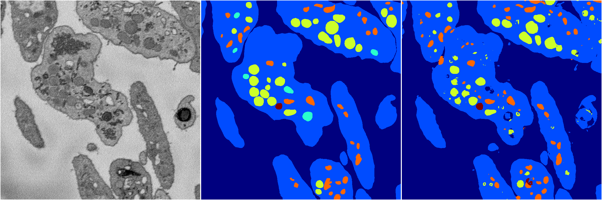</a>
<i>Click image for more details</i>

1 nets

**ari**: min 0.7962. max 0.7962. mean 0.7962.  ([best net](180/0))

**miou**: min 0.5296. max 0.5296. mean 0.5296.  ([best net](180/0))

**accuracy**: min 0.9202. max 0.9202. mean 0.9202.  ([best net](180/0))

**n_params**: min 2947625.0000. max 2947625.0000. mean 2947625.0000.  ([best net](180/0))

---

<a href="181"><h2>random_2d_ed_dense / 0503 / 181</h2></a>
Created 07 May 2019, 11:56:52

<i>Click image for more details</i>

2 nets

**ari**: min 0.7843. max 0.7970. mean 0.7906.  ([best net](181/0))

**miou**: min 0.5406. max 0.5658. mean 0.5532.  ([best net](181/1))

**accuracy**: min 0.9108. max 0.9185. mean 0.9147.  ([best net](181/0))

**n_params**: min 400753.0000. max 400753.0000. mean 400753.0000.  ([best net](181/0))

---

<a href="173"><h2>random_2d_ed_dense / 0503 / 173</h2></a>
Created 07 May 2019, 11:56:52

<i>Click image for more details</i>

2 nets

**ari**: min 0.3967. max 0.5737. mean 0.4852.  ([best net](173/1))

**miou**: min 0.0866. max 0.2898. mean 0.1882.  ([best net](173/1))

**accuracy**: min 0.2340. max 0.8424. mean 0.5382.  ([best net](173/1))

**n_params**: min 248110.0000. max 248110.0000. mean 248110.0000.  ([best net](173/1))

---

<a href="172"><h2>random_2d_ed_dense / 0503 / 172</h2></a>
Created 07 May 2019, 11:56:52

<a href="172">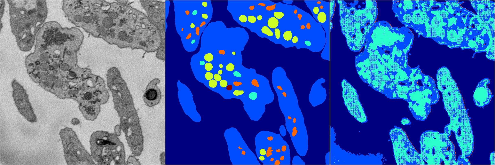</a>
<i>Click image for more details</i>

2 nets

**ari**: min 0.5079. max 0.5232. mean 0.5155.  ([best net](172/1))

**miou**: min 0.2192. max 0.2226. mean 0.2209.  ([best net](172/0))

**accuracy**: min 0.5735. max 0.6206. mean 0.5971.  ([best net](172/0))

**n_params**: min 2702511.0000. max 2702511.0000. mean 2702511.0000.  ([best net](172/0))

---

<a href="171"><h2>random_2d_ed_dense / 0503 / 171</h2></a>
Created 07 May 2019, 11:56:52

<i>Click image for more details</i>

2 nets

**ari**: min 0.0030. max 0.5662. mean 0.2846.  ([best net](171/1))

**miou**: min 0.0821. max 0.2718. mean 0.1769.  ([best net](171/1))

**accuracy**: min 0.4269. max 0.7760. mean 0.6014.  ([best net](171/1))

**n_params**: min 887535.0000. max 887535.0000. mean 887535.0000.  ([best net](171/0))

---

<a href="164"><h2>random_2d_ed_dense / 0503 / 164</h2></a>
Created 07 May 2019, 11:56:52

<i>Click image for more details</i>

2 nets

**ari**: min 0.7543. max 0.7641. mean 0.7592.  ([best net](164/0))

**miou**: min 0.4510. max 0.5175. mean 0.4842.  ([best net](164/0))

**accuracy**: min 0.9009. max 0.9013. mean 0.9011.  ([best net](164/0))

**n_params**: min 422557.0000. max 422557.0000. mean 422557.0000.  ([best net](164/1))

---

<a href="163"><h2>random_2d_ed_dense / 0503 / 163</h2></a>
Created 07 May 2019, 11:56:52

<i>Click image for more details</i>

2 nets

**ari**: min 0.8201. max 0.8272. mean 0.8237.  ([best net](163/1))

**miou**: min 0.6210. max 0.6382. mean 0.6296.  ([best net](163/1))

**accuracy**: min 0.9350. max 0.9363. mean 0.9357.  ([best net](163/1))

**n_params**: min 5461128.0000. max 5461128.0000. mean 5461128.0000.  ([best net](163/0))

---

<a href="162"><h2>random_2d_ed_dense / 0503 / 162</h2></a>
Created 07 May 2019, 11:56:51

<a href="162">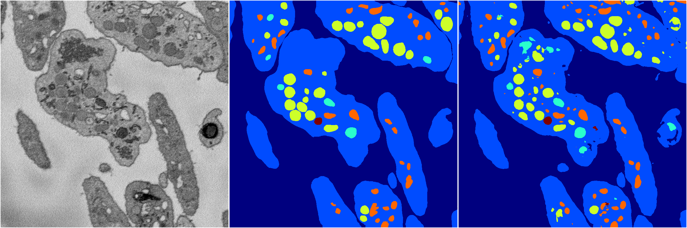</a>
<i>Click image for more details</i>

2 nets

**ari**: min 0.8045. max 0.8107. mean 0.8076.  ([best net](162/1))

**miou**: min 0.4710. max 0.6003. mean 0.5356.  ([best net](162/1))

**accuracy**: min 0.9227. max 0.9275. mean 0.9251.  ([best net](162/1))

**n_params**: min 724961.0000. max 724961.0000. mean 724961.0000.  ([best net](162/0))

---

<a href="154"><h2>random_2d_ed_dense / 0503 / 154</h2></a>
Created 07 May 2019, 11:56:51

<a href="154">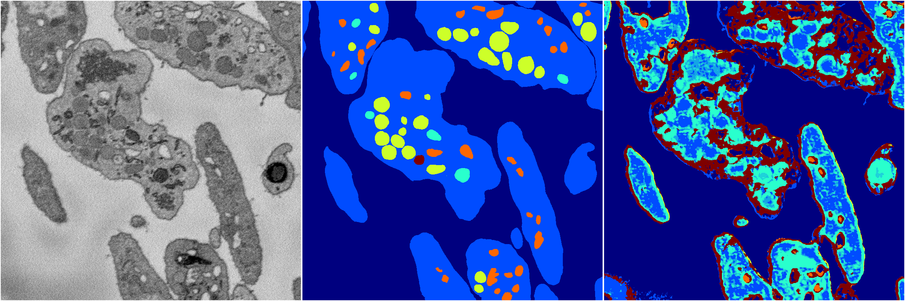</a>
<i>Click image for more details</i>

2 nets

**ari**: min 0.0492. max 0.4261. mean 0.2376.  ([best net](154/1))

**miou**: min 0.0690. max 0.2226. mean 0.1458.  ([best net](154/1))

**accuracy**: min 0.3947. max 0.5394. mean 0.4670.  ([best net](154/1))

**n_params**: min 3037001.0000. max 3037001.0000. mean 3037001.0000.  ([best net](154/0))

---

<a href="155"><h2>random_2d_ed_dense / 0503 / 155</h2></a>
Created 07 May 2019, 11:56:51

<i>Click image for more details</i>

2 nets

**ari**: min 0.3677. max 0.5595. mean 0.4636.  ([best net](155/0))

**miou**: min 0.0039. max 0.2527. mean 0.1283.  ([best net](155/0))

**accuracy**: min 0.0190. max 0.7149. mean 0.3669.  ([best net](155/0))

**n_params**: min 5269586.0000. max 5269586.0000. mean 5269586.0000.  ([best net](155/1))

---

<a href="153"><h2>random_2d_ed_dense / 0503 / 153</h2></a>
Created 07 May 2019, 11:56:51

<i>Click image for more details</i>

2 nets

**ari**: min 0.0251. max 0.6514. mean 0.3382.  ([best net](153/0))

**miou**: min 0.0740. max 0.2909. mean 0.1825.  ([best net](153/0))

**accuracy**: min 0.3173. max 0.8701. mean 0.5937.  ([best net](153/0))

**n_params**: min 1927220.0000. max 1927220.0000. mean 1927220.0000.  ([best net](153/1))

---

<a href="146"><h2>random_2d_ed_dense / 0503 / 146</h2></a>
Created 07 May 2019, 11:56:51

<a href="146">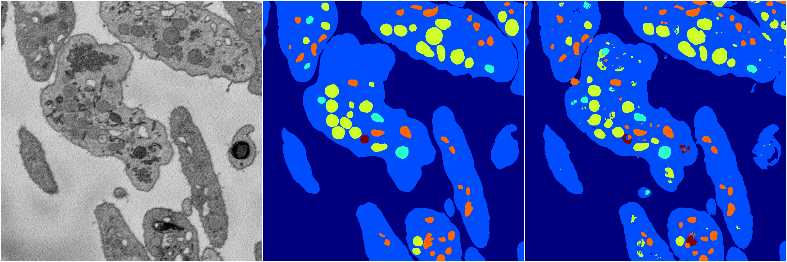</a>
<i>Click image for more details</i>

2 nets

**ari**: min 0.8124. max 0.8209. mean 0.8167.  ([best net](146/0))

**miou**: min 0.5432. max 0.6205. mean 0.5819.  ([best net](146/0))

**accuracy**: min 0.9275. max 0.9323. mean 0.9299.  ([best net](146/0))

**n_params**: min 2069441.0000. max 2069441.0000. mean 2069441.0000.  ([best net](146/0))

---

<a href="144"><h2>random_2d_ed_dense / 0503 / 144</h2></a>
Created 07 May 2019, 11:56:51

<i>Click image for more details</i>

2 nets

**ari**: min 0.8154. max 0.8246. mean 0.8200.  ([best net](144/0))

**miou**: min 0.5980. max 0.6256. mean 0.6118.  ([best net](144/0))

**accuracy**: min 0.9285. max 0.9360. mean 0.9322.  ([best net](144/0))

**n_params**: min 4331739.0000. max 4331739.0000. mean 4331739.0000.  ([best net](144/0))

---

<a href="145"><h2>random_2d_ed_dense / 0503 / 145</h2></a>
Created 07 May 2019, 11:56:51

<a href="145">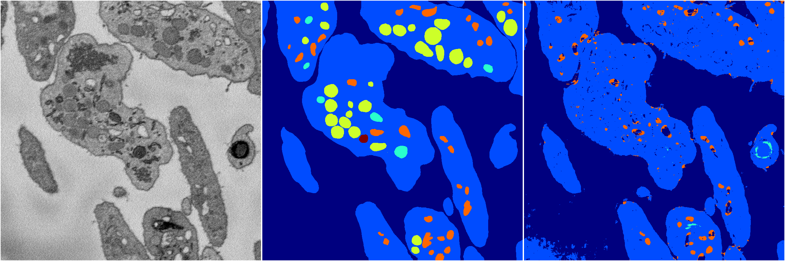</a>
<i>Click image for more details</i>

1 nets

**ari**: min 0.7063. max 0.7063. mean 0.7063.  ([best net](145/0))

**miou**: min 0.3494. max 0.3494. mean 0.3494.  ([best net](145/0))

**accuracy**: min 0.8822. max 0.8822. mean 0.8822.  ([best net](145/0))

**n_params**: min 220054.0000. max 220054.0000. mean 220054.0000.  ([best net](145/0))

---

<a href="135"><h2>random_2d_ed_dense / 0503 / 135</h2></a>
Created 07 May 2019, 11:56:51

<i>Click image for more details</i>

2 nets

**ari**: min 0.0006. max 0.0193. mean 0.0100.  ([best net](135/0))

**miou**: min 0.0183. max 0.0774. mean 0.0479.  ([best net](135/1))

**accuracy**: min 0.0702. max 0.4596. mean 0.2649.  ([best net](135/1))

**n_params**: min 12239062.0000. max 12239062.0000. mean 12239062.0000.  ([best net](135/0))

---

<a href="136"><h2>random_2d_ed_dense / 0503 / 136</h2></a>
Created 07 May 2019, 11:56:51

<a href="136">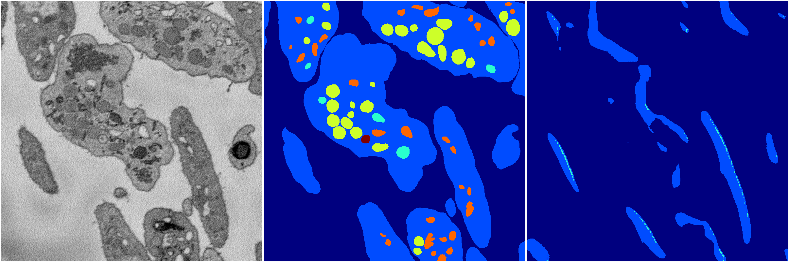</a>
<i>Click image for more details</i>

2 nets

**ari**: min 0.0000. max 0.0586. mean 0.0293.  ([best net](136/0))

**miou**: min 0.0789. max 0.1166. mean 0.0977.  ([best net](136/0))

**accuracy**: min 0.4732. max 0.5487. mean 0.5109.  ([best net](136/0))

**n_params**: min 5498294.0000. max 5498294.0000. mean 5498294.0000.  ([best net](136/1))

---

<a href="137"><h2>random_2d_ed_dense / 0503 / 137</h2></a>
Created 07 May 2019, 11:56:51

<a href="137">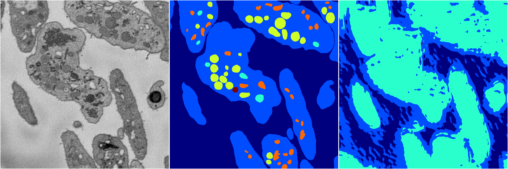</a>
<i>Click image for more details</i>

2 nets

**ari**: min -0.0009. max 0.3635. mean 0.1813.  ([best net](137/0))

**miou**: min 0.0726. max 0.0757. mean 0.0741.  ([best net](137/0))

**accuracy**: min 0.2181. max 0.4338. mean 0.3260.  ([best net](137/1))

**n_params**: min 954803.0000. max 954803.0000. mean 954803.0000.  ([best net](137/0))

---

<a href="126"><h2>random_2d_ed_dense / 0503 / 126</h2></a>
Created 07 May 2019, 11:56:51

<a href="126">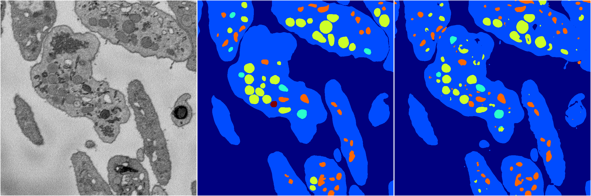</a>
<i>Click image for more details</i>

2 nets

**ari**: min 0.8003. max 0.8153. mean 0.8078.  ([best net](126/0))

**miou**: min 0.5293. max 0.5530. mean 0.5412.  ([best net](126/0))

**accuracy**: min 0.9218. max 0.9283. mean 0.9250.  ([best net](126/0))

**n_params**: min 1834337.0000. max 1834337.0000. mean 1834337.0000.  ([best net](126/1))

---

<a href="127"><h2>random_2d_ed_dense / 0503 / 127</h2></a>
Created 07 May 2019, 11:56:51

<a href="127">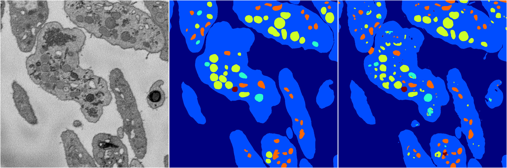</a>
<i>Click image for more details</i>

2 nets

**ari**: min 0.8091. max 0.8160. mean 0.8126.  ([best net](127/0))

**miou**: min 0.6124. max 0.6214. mean 0.6169.  ([best net](127/1))

**accuracy**: min 0.9261. max 0.9295. mean 0.9278.  ([best net](127/0))

**n_params**: min 6961561.0000. max 6961561.0000. mean 6961561.0000.  ([best net](127/0))

---

<a href="128"><h2>random_2d_ed_dense / 0503 / 128</h2></a>
Created 07 May 2019, 11:56:51

<i>Click image for more details</i>

1 nets

**ari**: min 0.7046. max 0.7046. mean 0.7046.  ([best net](128/1))

**miou**: min 0.4009. max 0.4009. mean 0.4009.  ([best net](128/1))

**accuracy**: min 0.8661. max 0.8661. mean 0.8661.  ([best net](128/1))

**n_params**: min 522435.0000. max 522435.0000. mean 522435.0000.  ([best net](128/1))

---

<a href="119"><h2>random_2d_ed_dense / 0503 / 119</h2></a>
Created 07 May 2019, 11:56:51

<i>Click image for more details</i>

2 nets

**ari**: min 0.0119. max 0.0151. mean 0.0135.  ([best net](119/0))

**miou**: min 0.0969. max 0.1077. mean 0.1023.  ([best net](119/1))

**accuracy**: min 0.4732. max 0.4931. mean 0.4831.  ([best net](119/0))

**n_params**: min 7404207.0000. max 7404207.0000. mean 7404207.0000.  ([best net](119/0))

---

<a href="118"><h2>random_2d_ed_dense / 0503 / 118</h2></a>
Created 07 May 2019, 11:56:51

<i>Click image for more details</i>

2 nets

**ari**: min 0.1840. max 0.5522. mean 0.3681.  ([best net](118/1))

**miou**: min 0.0988. max 0.2783. mean 0.1885.  ([best net](118/1))

**accuracy**: min 0.4073. max 0.7477. mean 0.5775.  ([best net](118/1))

**n_params**: min 307881.0000. max 307881.0000. mean 307881.0000.  ([best net](118/1))

---

<a href="117"><h2>random_2d_ed_dense / 0503 / 117</h2></a>
Created 07 May 2019, 11:56:51

<a href="117">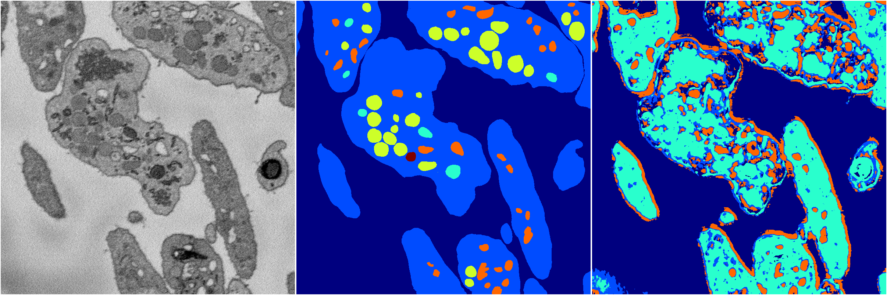</a>
<i>Click image for more details</i>

2 nets

**ari**: min 0.1891. max 0.4000. mean 0.2946.  ([best net](117/0))

**miou**: min 0.1345. max 0.1920. mean 0.1633.  ([best net](117/0))

**accuracy**: min 0.4785. max 0.5003. mean 0.4894.  ([best net](117/0))

**n_params**: min 56293.0000. max 56293.0000. mean 56293.0000.  ([best net](117/1))

---

<a href="110"><h2>random_2d_ed_dense / 0503 / 110</h2></a>
Created 07 May 2019, 11:56:51

<i>Click image for more details</i>

2 nets

**ari**: min 0.7462. max 0.8226. mean 0.7844.  ([best net](110/0))

**miou**: min 0.4746. max 0.6233. mean 0.5489.  ([best net](110/0))

**accuracy**: min 0.8874. max 0.9332. mean 0.9103.  ([best net](110/0))

**n_params**: min 14344497.0000. max 14344497.0000. mean 14344497.0000.  ([best net](110/0))

---

<a href="109"><h2>random_2d_ed_dense / 0503 / 109</h2></a>
Created 07 May 2019, 11:56:51

<i>Click image for more details</i>

2 nets

**ari**: min 0.7820. max 0.7906. mean 0.7863.  ([best net](109/0))

**miou**: min 0.5853. max 0.5889. mean 0.5871.  ([best net](109/0))

**accuracy**: min 0.9115. max 0.9158. mean 0.9136.  ([best net](109/0))

**n_params**: min 2733124.0000. max 2733124.0000. mean 2733124.0000.  ([best net](109/0))

---

<a href="108"><h2>random_2d_ed_dense / 0503 / 108</h2></a>
Created 07 May 2019, 11:56:51

<i>Click image for more details</i>

2 nets

**ari**: min 0.5820. max 0.8221. mean 0.7021.  ([best net](108/0))

**miou**: min 0.2678. max 0.6310. mean 0.4494.  ([best net](108/0))

**accuracy**: min 0.8525. max 0.9338. mean 0.8931.  ([best net](108/0))

**n_params**: min 6540865.0000. max 6540865.0000. mean 6540865.0000.  ([best net](108/1))

---

<a href="101"><h2>random_2d_ed_dense / 0503 / 101</h2></a>
Created 07 May 2019, 11:56:51

<a href="101">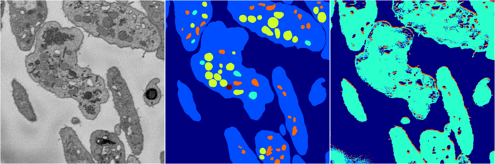</a>
<i>Click image for more details</i>

2 nets

**ari**: min 0.5668. max 0.5938. mean 0.5803.  ([best net](101/0))

**miou**: min 0.1436. max 0.1661. mean 0.1549.  ([best net](101/0))

**accuracy**: min 0.3456. max 0.4209. mean 0.3832.  ([best net](101/0))

**n_params**: min 996532.0000. max 996532.0000. mean 996532.0000.  ([best net](101/0))

---

<a href="100"><h2>random_2d_ed_dense / 0503 / 100</h2></a>
Created 07 May 2019, 11:56:51

<i>Click image for more details</i>

1 nets

**ari**: min 0.0004. max 0.0004. mean 0.0004.  ([best net](100/0))

**miou**: min 0.0750. max 0.0750. mean 0.0750.  ([best net](100/0))

**accuracy**: min 0.4392. max 0.4392. mean 0.4392.  ([best net](100/0))

**n_params**: min 2342550.0000. max 2342550.0000. mean 2342550.0000.  ([best net](100/0))

---

<a href="99"><h2>random_2d_ed_dense / 0503 / 99</h2></a>
Created 07 May 2019, 11:56:51

<a href="99">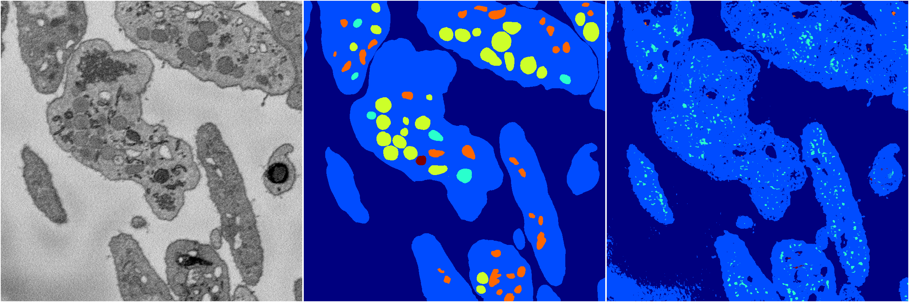</a>
<i>Click image for more details</i>

2 nets

**ari**: min 0.5039. max 0.6349. mean 0.5694.  ([best net](99/1))

**miou**: min 0.2473. max 0.2829. mean 0.2651.  ([best net](99/1))

**accuracy**: min 0.8124. max 0.8528. mean 0.8326.  ([best net](99/1))

**n_params**: min 334659.0000. max 334659.0000. mean 334659.0000.  ([best net](99/0))

---

<a href="92"><h2>random_2d_ed_dense / 0503 / 92</h2></a>
Created 07 May 2019, 11:56:50

<i>Click image for more details</i>

2 nets

**ari**: min 0.7123. max 0.7136. mean 0.7130.  ([best net](92/1))

**miou**: min 0.3769. max 0.3885. mean 0.3827.  ([best net](92/0))

**accuracy**: min 0.8721. max 0.8846. mean 0.8783.  ([best net](92/1))

**n_params**: min 328331.0000. max 328331.0000. mean 328331.0000.  ([best net](92/1))

---

<a href="90"><h2>random_2d_ed_dense / 0503 / 90</h2></a>
Created 07 May 2019, 11:56:50

<a href="90">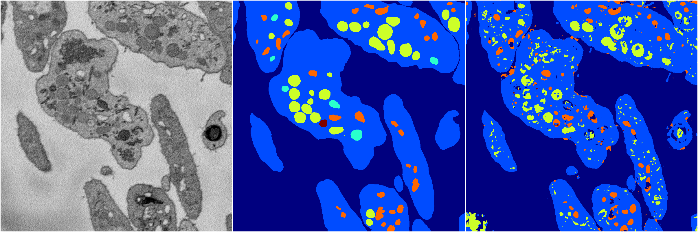</a>
<i>Click image for more details</i>

2 nets

**ari**: min 0.7066. max 0.7442. mean 0.7254.  ([best net](90/1))

**miou**: min 0.4209. max 0.4442. mean 0.4325.  ([best net](90/1))

**accuracy**: min 0.8648. max 0.8889. mean 0.8768.  ([best net](90/1))

**n_params**: min 1744499.0000. max 1744499.0000. mean 1744499.0000.  ([best net](90/0))

---

<a href="91"><h2>random_2d_ed_dense / 0503 / 91</h2></a>
Created 07 May 2019, 11:56:50

<a href="91">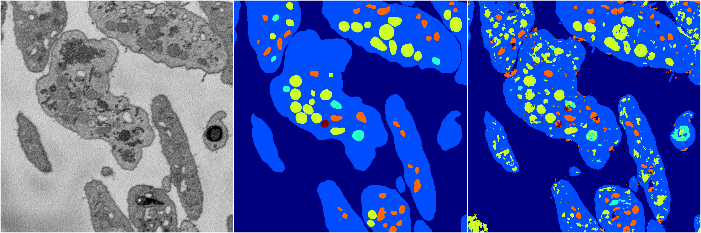</a>
<i>Click image for more details</i>

2 nets

**ari**: min 0.7344. max 0.7383. mean 0.7364.  ([best net](91/1))

**miou**: min 0.4714. max 0.4946. mean 0.4830.  ([best net](91/0))

**accuracy**: min 0.8794. max 0.8808. mean 0.8801.  ([best net](91/1))

**n_params**: min 284582.0000. max 284582.0000. mean 284582.0000.  ([best net](91/1))

---

<a href="83"><h2>random_2d_ed_dense / 0503 / 83</h2></a>
Created 07 May 2019, 11:56:50

<a href="83">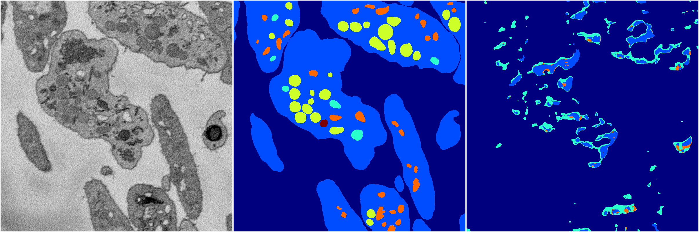</a>
<i>Click image for more details</i>

2 nets

**ari**: min -0.0085. max 0.0394. mean 0.0154.  ([best net](83/1))

**miou**: min 0.0637. max 0.0985. mean 0.0811.  ([best net](83/0))

**accuracy**: min 0.1928. max 0.4951. mean 0.3440.  ([best net](83/0))

**n_params**: min 5314382.0000. max 5314382.0000. mean 5314382.0000.  ([best net](83/0))

---

<a href="82"><h2>random_2d_ed_dense / 0503 / 82</h2></a>
Created 07 May 2019, 11:56:50

<i>Click image for more details</i>

2 nets

**ari**: min 0.0124. max 0.2652. mean 0.1388.  ([best net](82/0))

**miou**: min 0.0890. max 0.1134. mean 0.1012.  ([best net](82/0))

**accuracy**: min 0.4201. max 0.4482. mean 0.4342.  ([best net](82/1))

**n_params**: min 1272870.0000. max 1272870.0000. mean 1272870.0000.  ([best net](82/1))

---

<a href="81"><h2>random_2d_ed_dense / 0503 / 81</h2></a>
Created 07 May 2019, 11:56:50

<a href="81">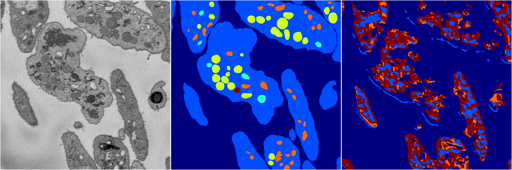</a>
<i>Click image for more details</i>

2 nets

**ari**: min -0.0001. max 0.1985. mean 0.0992.  ([best net](81/1))

**miou**: min 0.0040. max 0.1224. mean 0.0632.  ([best net](81/1))

**accuracy**: min 0.0239. max 0.4600. mean 0.2420.  ([best net](81/1))

**n_params**: min 1366666.0000. max 1366666.0000. mean 1366666.0000.  ([best net](81/1))

---

<a href="73"><h2>random_2d_ed_dense / 0503 / 73</h2></a>
Created 07 May 2019, 11:56:50

<a href="73">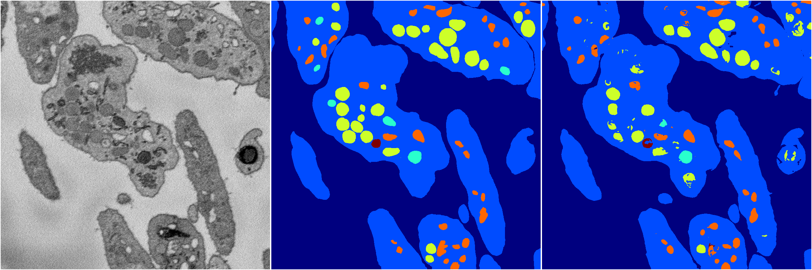</a>
<i>Click image for more details</i>

2 nets

**ari**: min 0.8119. max 0.8234. mean 0.8177.  ([best net](73/1))

**miou**: min 0.4835. max 0.6151. mean 0.5493.  ([best net](73/1))

**accuracy**: min 0.9290. max 0.9354. mean 0.9322.  ([best net](73/1))

**n_params**: min 19969290.0000. max 19969290.0000. mean 19969290.0000.  ([best net](73/1))

---

<a href="72"><h2>random_2d_ed_dense / 0503 / 72</h2></a>
Created 07 May 2019, 11:56:50

<i>Click image for more details</i>

2 nets

**ari**: min 0.7234. max 0.8169. mean 0.7701.  ([best net](72/0))

**miou**: min 0.2890. max 0.5387. mean 0.4139.  ([best net](72/0))

**accuracy**: min 0.9014. max 0.9312. mean 0.9163.  ([best net](72/0))

**n_params**: min 11713013.0000. max 11713013.0000. mean 11713013.0000.  ([best net](72/0))

---

<a href="74"><h2>random_2d_ed_dense / 0503 / 74</h2></a>
Created 07 May 2019, 11:56:50

<a href="74">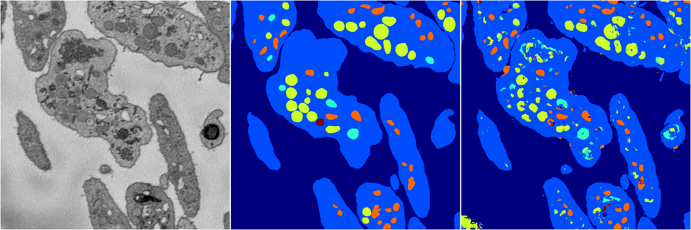</a>
<i>Click image for more details</i>

1 nets

**ari**: min 0.7821. max 0.7821. mean 0.7821.  ([best net](74/0))

**miou**: min 0.5599. max 0.5599. mean 0.5599.  ([best net](74/0))

**accuracy**: min 0.9111. max 0.9111. mean 0.9111.  ([best net](74/0))

**n_params**: min 500763.0000. max 500763.0000. mean 500763.0000.  ([best net](74/0))

---

<a href="65"><h2>random_2d_ed_dense / 0503 / 65</h2></a>
Created 07 May 2019, 11:56:50

<a href="65">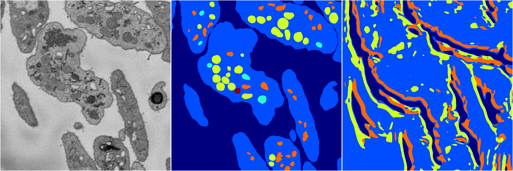</a>
<i>Click image for more details</i>

2 nets

**ari**: min 0.0029. max 0.0442. mean 0.0235.  ([best net](65/0))

**miou**: min 0.0886. max 0.1095. mean 0.0991.  ([best net](65/0))

**accuracy**: min 0.4279. max 0.4965. mean 0.4622.  ([best net](65/1))

**n_params**: min 10074468.0000. max 10074468.0000. mean 10074468.0000.  ([best net](65/0))

---

<a href="64"><h2>random_2d_ed_dense / 0503 / 64</h2></a>
Created 07 May 2019, 11:56:50

<a href="64">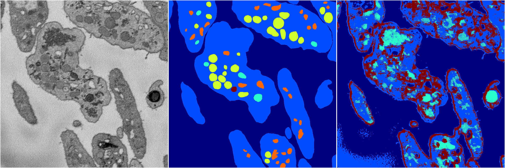</a>
<i>Click image for more details</i>

2 nets

**ari**: min 0.0738. max 0.4998. mean 0.2868.  ([best net](64/0))

**miou**: min 0.1462. max 0.2657. mean 0.2060.  ([best net](64/0))

**accuracy**: min 0.5600. max 0.6832. mean 0.6216.  ([best net](64/0))

**n_params**: min 1587336.0000. max 1587336.0000. mean 1587336.0000.  ([best net](64/0))

---

<a href="63"><h2>random_2d_ed_dense / 0503 / 63</h2></a>
Created 07 May 2019, 11:56:50

<a href="63">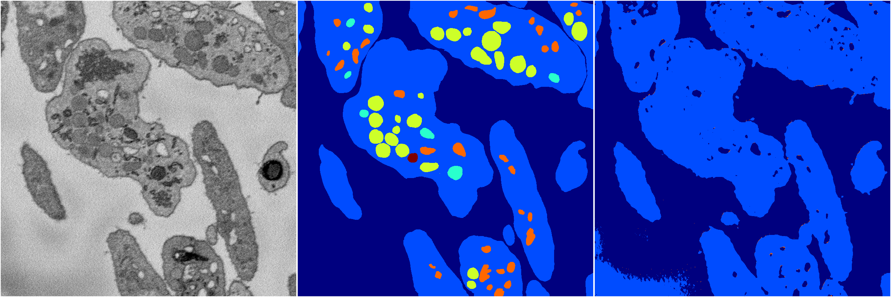</a>
<i>Click image for more details</i>

2 nets

**ari**: min 0.4900. max 0.6503. mean 0.5701.  ([best net](63/0))

**miou**: min 0.2569. max 0.2787. mean 0.2678.  ([best net](63/0))

**accuracy**: min 0.8185. max 0.8670. mean 0.8428.  ([best net](63/0))

**n_params**: min 52581.0000. max 52581.0000. mean 52581.0000.  ([best net](63/0))

---

<a href="54"><h2>random_2d_ed_dense / 0503 / 54</h2></a>
Created 07 May 2019, 11:56:50

<i>Click image for more details</i>

2 nets

**ari**: min 0.8210. max 0.8286. mean 0.8248.  ([best net](54/1))

**miou**: min 0.6180. max 0.6273. mean 0.6227.  ([best net](54/1))

**accuracy**: min 0.9322. max 0.9368. mean 0.9345.  ([best net](54/1))

**n_params**: min 4935556.0000. max 4935556.0000. mean 4935556.0000.  ([best net](54/0))

---

<a href="55"><h2>random_2d_ed_dense / 0503 / 55</h2></a>
Created 07 May 2019, 11:56:50

<i>Click image for more details</i>

2 nets

**ari**: min 0.0000. max 0.8138. mean 0.4069.  ([best net](55/0))

**miou**: min 0.0744. max 0.6080. mean 0.3412.  ([best net](55/0))

**accuracy**: min 0.4465. max 0.9288. mean 0.6877.  ([best net](55/0))

**n_params**: min 9710532.0000. max 9710532.0000. mean 9710532.0000.  ([best net](55/0))

---

<a href="56"><h2>random_2d_ed_dense / 0503 / 56</h2></a>
Created 07 May 2019, 11:56:50

<i>Click image for more details</i>

2 nets

**ari**: min 0.7258. max 0.7564. mean 0.7411.  ([best net](56/1))

**miou**: min 0.2877. max 0.5084. mean 0.3980.  ([best net](56/1))

**accuracy**: min 0.8903. max 0.9023. mean 0.8963.  ([best net](56/1))

**n_params**: min 1232478.0000. max 1232478.0000. mean 1232478.0000.  ([best net](56/0))

---

<a href="47"><h2>random_2d_ed_dense / 0503 / 47</h2></a>
Created 07 May 2019, 11:56:50

<a href="47">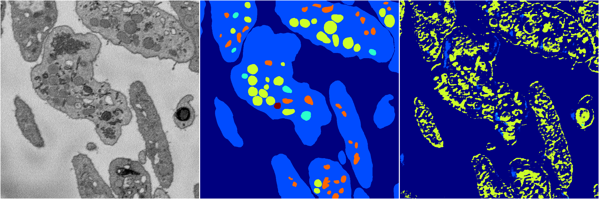</a>
<i>Click image for more details</i>

2 nets

**ari**: min 0.0295. max 0.1198. mean 0.0747.  ([best net](47/0))

**miou**: min 0.0976. max 0.1093. mean 0.1034.  ([best net](47/0))

**accuracy**: min 0.4111. max 0.4878. mean 0.4495.  ([best net](47/0))

**n_params**: min 7839976.0000. max 7839976.0000. mean 7839976.0000.  ([best net](47/1))

---

<a href="46"><h2>random_2d_ed_dense / 0503 / 46</h2></a>
Created 07 May 2019, 11:56:50

<i>Click image for more details</i>

2 nets

**ari**: min 0.0135. max 0.1967. mean 0.1051.  ([best net](46/0))

**miou**: min 0.0203. max 0.1656. mean 0.0929.  ([best net](46/0))

**accuracy**: min 0.0703. max 0.6303. mean 0.3503.  ([best net](46/0))

**n_params**: min 3269509.0000. max 3269509.0000. mean 3269509.0000.  ([best net](46/0))

---

<a href="45"><h2>random_2d_ed_dense / 0503 / 45</h2></a>
Created 07 May 2019, 11:56:50

<a href="45">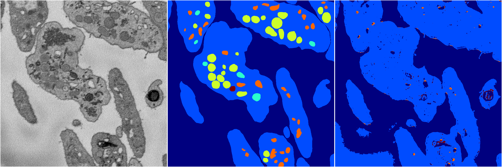</a>
<i>Click image for more details</i>

2 nets

**ari**: min 0.0948. max 0.6066. mean 0.3507.  ([best net](45/1))

**miou**: min 0.0838. max 0.2888. mean 0.1863.  ([best net](45/1))

**accuracy**: min 0.4119. max 0.8518. mean 0.6318.  ([best net](45/1))

**n_params**: min 666421.0000. max 666421.0000. mean 666421.0000.  ([best net](45/0))

---

<a href="37"><h2>random_2d_ed_dense / 0503 / 37</h2></a>
Created 07 May 2019, 11:56:50

<i>Click image for more details</i>

2 nets

**ari**: min 0.8130. max 0.8190. mean 0.8160.  ([best net](37/0))

**miou**: min 0.6219. max 0.6261. mean 0.6240.  ([best net](37/1))

**accuracy**: min 0.9333. max 0.9355. mean 0.9344.  ([best net](37/0))

**n_params**: min 27703059.0000. max 27703059.0000. mean 27703059.0000.  ([best net](37/1))

---

<a href="38"><h2>random_2d_ed_dense / 0503 / 38</h2></a>
Created 07 May 2019, 11:56:49

<i>Click image for more details</i>

2 nets

**ari**: min 0.7585. max 0.7786. mean 0.7685.  ([best net](38/0))

**miou**: min 0.3918. max 0.5083. mean 0.4501.  ([best net](38/0))

**accuracy**: min 0.9064. max 0.9143. mean 0.9103.  ([best net](38/0))

**n_params**: min 4450015.0000. max 4450015.0000. mean 4450015.0000.  ([best net](38/0))

---

<a href="36"><h2>random_2d_ed_dense / 0503 / 36</h2></a>
Created 07 May 2019, 11:56:49

<a href="36">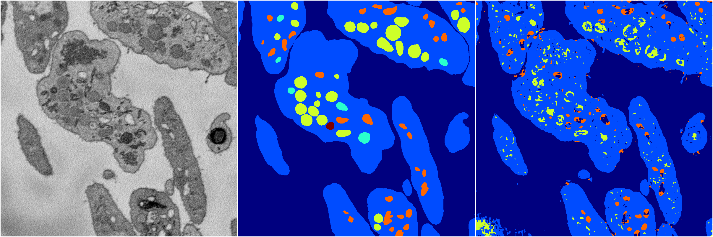</a>
<i>Click image for more details</i>

2 nets

**ari**: min 0.6918. max 0.7319. mean 0.7118.  ([best net](36/0))

**miou**: min 0.3769. max 0.3951. mean 0.3860.  ([best net](36/0))

**accuracy**: min 0.8572. max 0.8852. mean 0.8712.  ([best net](36/0))

**n_params**: min 115201.0000. max 115201.0000. mean 115201.0000.  ([best net](36/0))

---

<a href="29"><h2>random_2d_ed_dense / 0503 / 29</h2></a>
Created 07 May 2019, 11:56:49

<a href="29">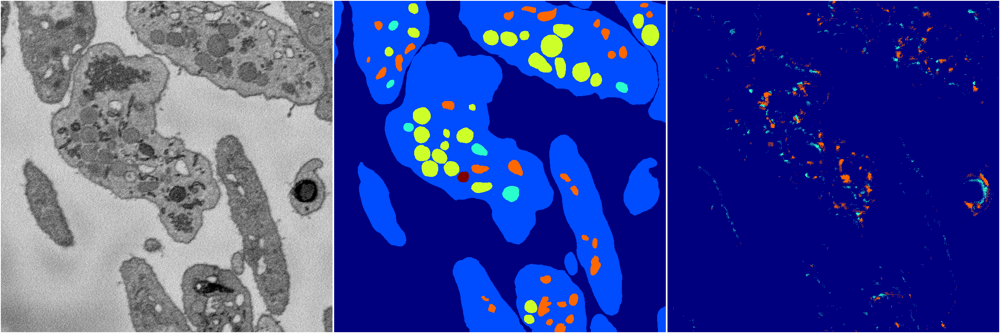</a>
<i>Click image for more details</i>

2 nets

**ari**: min 0.0006. max 0.0279. mean 0.0142.  ([best net](29/1))

**miou**: min 0.0842. max 0.0858. mean 0.0850.  ([best net](29/0))

**accuracy**: min 0.3295. max 0.4766. mean 0.4030.  ([best net](29/0))

**n_params**: min 2701250.0000. max 2701250.0000. mean 2701250.0000.  ([best net](29/1))

---

<a href="28"><h2>random_2d_ed_dense / 0503 / 28</h2></a>
Created 07 May 2019, 11:56:49

<a href="28">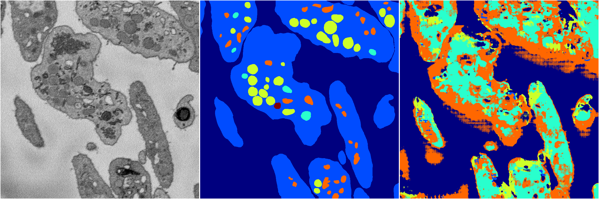</a>
<i>Click image for more details</i>

2 nets

**ari**: min 0.0428. max 0.4149. mean 0.2289.  ([best net](28/0))

**miou**: min 0.0320. max 0.1575. mean 0.0948.  ([best net](28/0))

**accuracy**: min 0.1290. max 0.4361. mean 0.2825.  ([best net](28/0))

**n_params**: min 18572539.0000. max 18572539.0000. mean 18572539.0000.  ([best net](28/0))

---

<a href="27"><h2>random_2d_ed_dense / 0503 / 27</h2></a>
Created 07 May 2019, 11:56:49

<a href="27">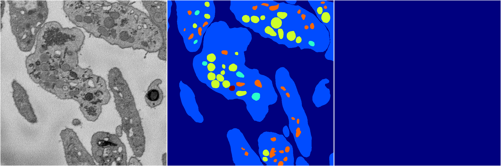</a>
<i>Click image for more details</i>

2 nets

**ari**: min -0.0000. max -0.0000. mean -0.0000.  ([best net](27/0))

**miou**: min 0.0751. max 0.0751. mean 0.0751.  ([best net](27/0))

**accuracy**: min 0.4503. max 0.4503. mean 0.4503.  ([best net](27/0))

**n_params**: min 2112714.0000. max 2112714.0000. mean 2112714.0000.  ([best net](27/0))

---

<a href="20"><h2>random_2d_ed_dense / 0503 / 20</h2></a>
Created 07 May 2019, 11:56:49

<i>Click image for more details</i>

2 nets

**ari**: min 0.8152. max 0.8169. mean 0.8161.  ([best net](20/1))

**miou**: min 0.6025. max 0.6161. mean 0.6093.  ([best net](20/1))

**accuracy**: min 0.9292. max 0.9315. mean 0.9303.  ([best net](20/1))

**n_params**: min 3277997.0000. max 3277997.0000. mean 3277997.0000.  ([best net](20/1))

---

<a href="19"><h2>random_2d_ed_dense / 0503 / 19</h2></a>
Created 07 May 2019, 11:56:49

<i>Click image for more details</i>

2 nets

**ari**: min 0.7816. max 0.8145. mean 0.7980.  ([best net](19/0))

**miou**: min 0.4795. max 0.5217. mean 0.5006.  ([best net](19/0))

**accuracy**: min 0.9160. max 0.9266. mean 0.9213.  ([best net](19/0))

**n_params**: min 9027313.0000. max 9027313.0000. mean 9027313.0000.  ([best net](19/0))

---

<a href="18"><h2>random_2d_ed_dense / 0503 / 18</h2></a>
Created 07 May 2019, 11:56:49

<a href="18">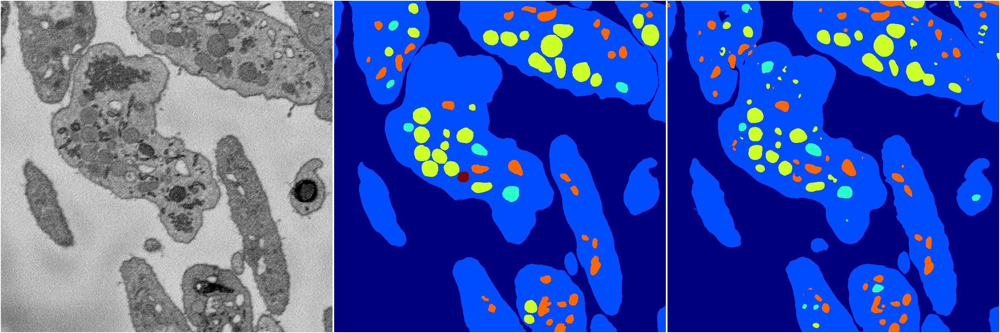</a>
<i>Click image for more details</i>

2 nets

**ari**: min 0.8031. max 0.8124. mean 0.8078.  ([best net](18/0))

**miou**: min 0.4799. max 0.5808. mean 0.5303.  ([best net](18/0))

**accuracy**: min 0.9277. max 0.9317. mean 0.9297.  ([best net](18/0))

**n_params**: min 6170684.0000. max 6170684.0000. mean 6170684.0000.  ([best net](18/1))

---

<a href="11"><h2>random_2d_ed_dense / 0503 / 11</h2></a>
Created 07 May 2019, 11:56:49

<i>Click image for more details</i>

2 nets

**ari**: min 0.5127. max 0.6403. mean 0.5765.  ([best net](11/0))

**miou**: min 0.2752. max 0.2944. mean 0.2848.  ([best net](11/1))

**accuracy**: min 0.8098. max 0.8657. mean 0.8378.  ([best net](11/0))

**n_params**: min 983377.0000. max 983377.0000. mean 983377.0000.  ([best net](11/0))

---

<a href="10"><h2>random_2d_ed_dense / 0503 / 10</h2></a>
Created 07 May 2019, 11:56:49

<a href="10">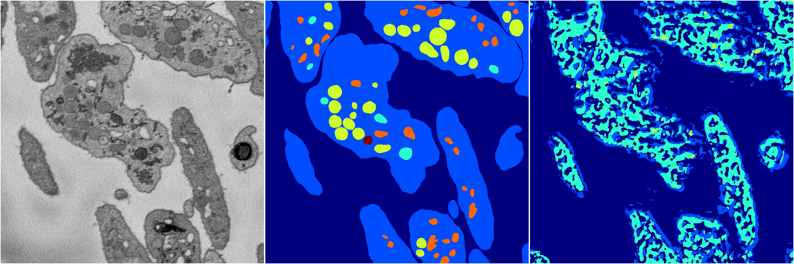</a>
<i>Click image for more details</i>

2 nets

**ari**: min 0.2073. max 0.2781. mean 0.2427.  ([best net](10/1))

**miou**: min 0.1223. max 0.1445. mean 0.1334.  ([best net](10/0))

**accuracy**: min 0.4368. max 0.5363. mean 0.4866.  ([best net](10/0))

**n_params**: min 2428633.0000. max 2428633.0000. mean 2428633.0000.  ([best net](10/0))

---

<a href="9"><h2>random_2d_ed_dense / 0503 / 9</h2></a>
Created 07 May 2019, 11:56:49

<i>Click image for more details</i>

2 nets

**ari**: min 0.5900. max 0.6101. mean 0.6000.  ([best net](9/0))

**miou**: min 0.2705. max 0.2994. mean 0.2849.  ([best net](9/1))

**accuracy**: min 0.8290. max 0.8580. mean 0.8435.  ([best net](9/0))

**n_params**: min 1881922.0000. max 1881922.0000. mean 1881922.0000.  ([best net](9/0))

---

<a href="1"><h2>random_2d_ed_dense / 0503 / 1</h2></a>
Created 07 May 2019, 11:56:49

<a href="1">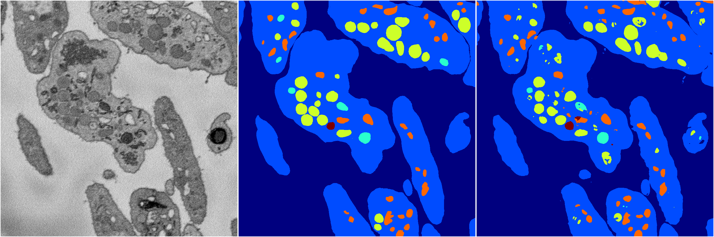</a>
<i>Click image for more details</i>

2 nets

**ari**: min 0.8196. max 0.8276. mean 0.8236.  ([best net](1/1))

**miou**: min 0.6217. max 0.6336. mean 0.6277.  ([best net](1/1))

**accuracy**: min 0.9312. max 0.9352. mean 0.9332.  ([best net](1/1))

**n_params**: min 10562527.0000. max 10562527.0000. mean 10562527.0000.  ([best net](1/0))

---

<a href="2"><h2>random_2d_ed_dense / 0503 / 2</h2></a>
Created 07 May 2019, 11:56:49

<i>Click image for more details</i>

2 nets

**ari**: min 0.7577. max 0.8266. mean 0.7921.  ([best net](2/0))

**miou**: min 0.4347. max 0.6240. mean 0.5293.  ([best net](2/0))

**accuracy**: min 0.9071. max 0.9352. mean 0.9212.  ([best net](2/0))

**n_params**: min 2288236.0000. max 2288236.0000. mean 2288236.0000.  ([best net](2/1))

---

<a href="0"><h2>random_2d_ed_dense / 0503 / 0</h2></a>
Created 07 May 2019, 11:56:49

<i>Click image for more details</i>

2 nets

**ari**: min 0.8161. max 0.8217. mean 0.8189.  ([best net](0/1))

**miou**: min 0.5499. max 0.6046. mean 0.5773.  ([best net](0/1))

**accuracy**: min 0.9316. max 0.9329. mean 0.9323.  ([best net](0/1))

**n_params**: min 17217478.0000. max 17217478.0000. mean 17217478.0000.  ([best net](0/0))

---

[Back](..)&nbsp;&nbsp;&nbsp;&nbsp;&nbsp;[Home](https://leapmanlab.github.io/snapshots)

---