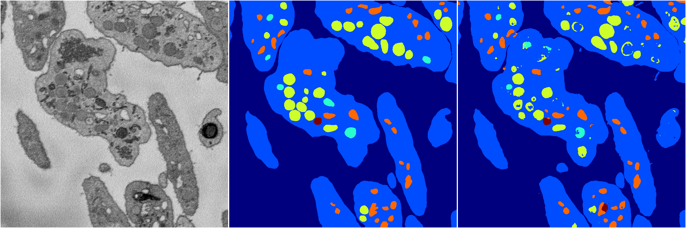

[Back](..)&nbsp;&nbsp;&nbsp;&nbsp;&nbsp;[Home](https://leapmanlab.github.io/snapshots)

---

<a href="0410"><h2>random_2d_ed_dense / 0410</h2></a>
Created 07 May 2019, 10:52:52

<i>Click image for more details</i>

157 nets

**ari**: min -0.0107. max 0.8300. mean 0.5218.  ([best net](0410/0/1))

**miou**: min 0.0101. max 0.6110. mean 0.2873.  ([best net](0410/0/1))

**accuracy**: min 0.0480. max 0.9378. mean 0.7275.  ([best net](0410/0/0))

**n_params**: min 52600.0000. max 49701896.0000. mean 4947826.3248.  ([best net](0410/227/1))

---

<a href="0503"><h2>random_2d_ed_dense / 0503</h2></a>
Created 07 May 2019, 10:52:48

<i>Click image for more details</i>

189 nets

**ari**: min -0.0103. max 0.8286. mean 0.5010.  ([best net](0503/54/1))

**miou**: min 0.0039. max 0.6382. mean 0.3207.  ([best net](0503/163/1))

**accuracy**: min 0.0190. max 0.9368. mean 0.7021.  ([best net](0503/54/1))

**n_params**: min 52581.0000. max 49701782.0000. mean 5352774.0582.  ([best net](0503/227/1))

---

<a href="0306"><h2>random_2d_ed_dense / 0306</h2></a>
Created 07 May 2019, 10:52:40

<i>Click image for more details</i>

4 nets

**ari**: min 0.2643. max 0.7797. mean 0.5799.  ([best net](0306/13))

**miou**: min 0.0002. max 0.3855. mean 0.2274.  ([best net](0306/13))

**accuracy**: min 0.0009. max 0.9153. mean 0.6682.  ([best net](0306/13))

**n_params**: min 661767.0000. max 6357218.0000. mean 3382928.7500.  ([best net](0306/13))

---

[Back](..)&nbsp;&nbsp;&nbsp;&nbsp;&nbsp;[Home](https://leapmanlab.github.io/snapshots)

---