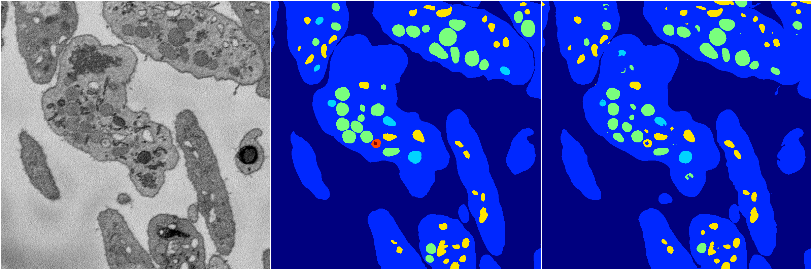
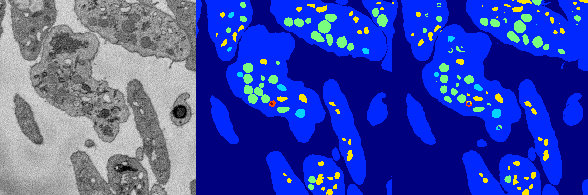

[Back](..)&nbsp;&nbsp;&nbsp;&nbsp;&nbsp;[Home](https://leapmanlab.github.io/snapshots)

---

<a href="0"><h2>random_hybrid_3d / 0416 / 104 / 0</h2></a>
Created 29 Apr 2019, 14:48:40

<i>Click for more details</i>

**ari**: 0.8432. **miou**: 0.5089. **accuracy**: 0.9430. **n_params**: 1401778.0000. 

---

<a href="1"><h2>random_hybrid_3d / 0416 / 104 / 1</h2></a>
Created 29 Apr 2019, 14:48:40

<i>Click for more details</i>

**ari**: 0.8416. **miou**: 0.5710. **accuracy**: 0.9429. **n_params**: 1400126.0000. 

---

[Back](..)&nbsp;&nbsp;&nbsp;&nbsp;&nbsp;[Home](https://leapmanlab.github.io/snapshots)

---