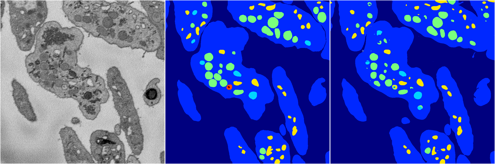
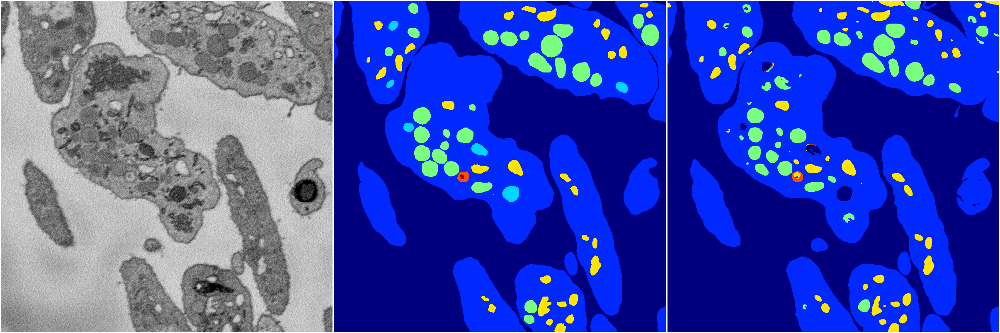

[Back](..)&nbsp;&nbsp;&nbsp;&nbsp;&nbsp;[Home](https://leapmanlab.github.io/snapshots)

---

<a href="0"><h2>random_hybrid_3d / 0416 / 114 / 0</h2></a>
Created 25 Apr 2019, 13:50:43

<i>Click for more details</i>

**ari**: 0.8371. **miou**: 0.5082. **accuracy**: 0.9412. **n_params**: 8074250.0000. 

---

<a href="1"><h2>random_hybrid_3d / 0416 / 114 / 1</h2></a>
Created 25 Apr 2019, 13:50:43

<i>Click for more details</i>

**ari**: 0.8297. **miou**: 0.4814. **accuracy**: 0.9352. **n_params**: 8074999.0000. 

---

[Back](..)&nbsp;&nbsp;&nbsp;&nbsp;&nbsp;[Home](https://leapmanlab.github.io/snapshots)

---