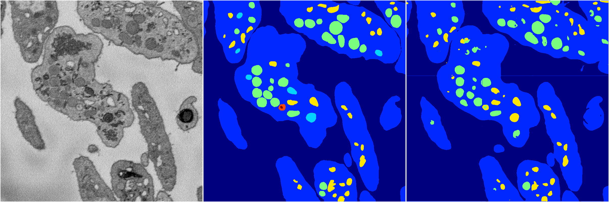
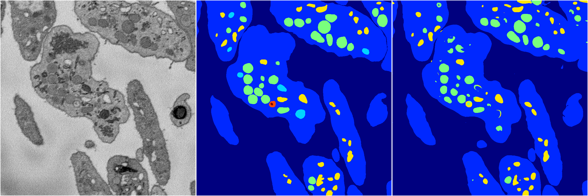

[Back](..)&nbsp;&nbsp;&nbsp;&nbsp;&nbsp;[Home](https://leapmanlab.github.io/snapshots)

---

<a href="1"><h2>random_hybrid_3d / 0416 / 117 / 1</h2></a>
Created 25 Apr 2019, 13:50:43

<i>Click for more details</i>

**ari**: 0.8307. **miou**: 0.4166. **accuracy**: 0.9335. **n_params**: 891093.0000. 

---

<a href="0"><h2>random_hybrid_3d / 0416 / 117 / 0</h2></a>
Created 25 Apr 2019, 13:50:43

<i>Click for more details</i>

**ari**: 0.8313. **miou**: 0.4245. **accuracy**: 0.9350. **n_params**: 891093.0000. 

---

[Back](..)&nbsp;&nbsp;&nbsp;&nbsp;&nbsp;[Home](https://leapmanlab.github.io/snapshots)

---