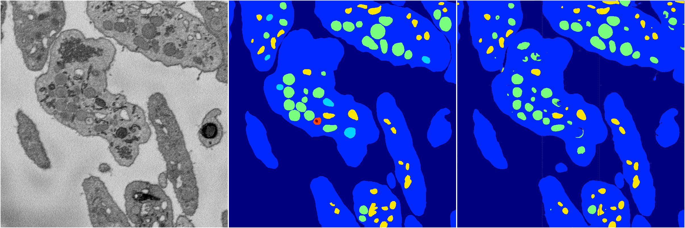
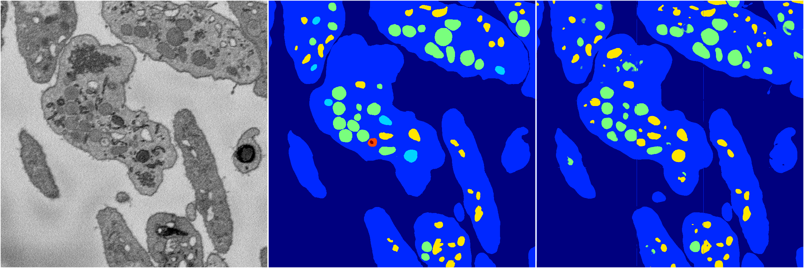

[Back](..)&nbsp;&nbsp;&nbsp;&nbsp;&nbsp;[Home](https://leapmanlab.github.io/snapshots)

---

<a href="0"><h2>random_hybrid_3d / 0416 / 118 / 0</h2></a>
Created 20 Apr 2019, 00:17:12

<i>Click for more details</i>

**ari**: 0.8307. **miou**: 0.4224. **accuracy**: 0.9332. **n_params**: 218137.0000. 

---

<a href="1"><h2>random_hybrid_3d / 0416 / 118 / 1</h2></a>
Created 20 Apr 2019, 00:17:12

<i>Click for more details</i>

**ari**: 0.8309. **miou**: 0.4162. **accuracy**: 0.9328. **n_params**: 218137.0000. 

---

[Back](..)&nbsp;&nbsp;&nbsp;&nbsp;&nbsp;[Home](https://leapmanlab.github.io/snapshots)

---