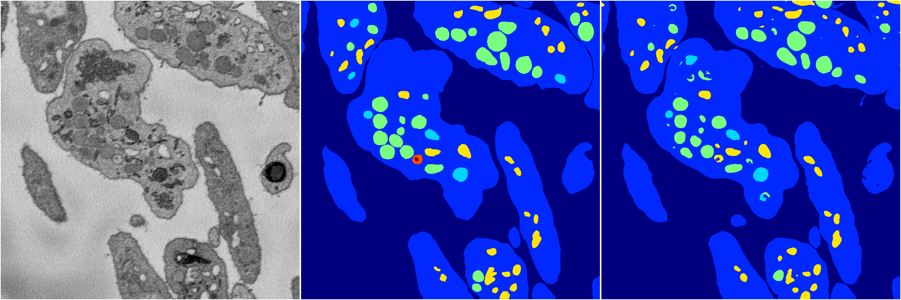
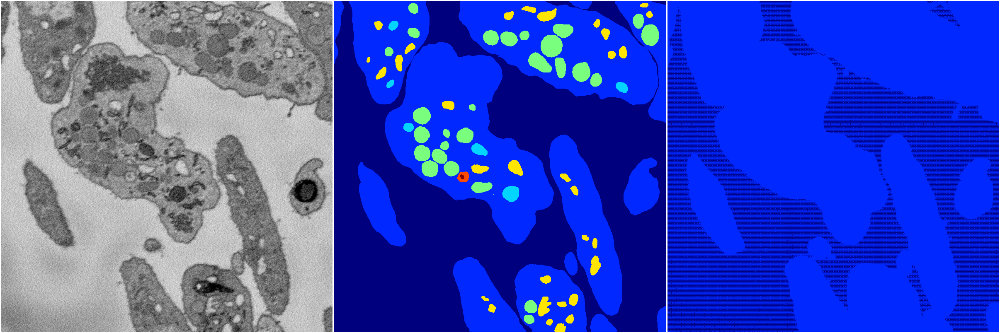

[Back](..)&nbsp;&nbsp;&nbsp;&nbsp;&nbsp;[Home](https://leapmanlab.github.io/snapshots)

---

<a href="1"><h2>random_hybrid_3d / 0416 / 121 / 1</h2></a>
Created 20 Apr 2019, 00:17:13

<i>Click for more details</i>

**ari**: 0.8402. **miou**: 0.5167. **accuracy**: 0.9429. **n_params**: 2287218.0000. 

---

<a href="0"><h2>random_hybrid_3d / 0416 / 121 / 0</h2></a>
Created 20 Apr 2019, 00:17:13

<i>Click for more details</i>

**ari**: 0.0860. **miou**: 0.1329. **accuracy**: 0.6374. **n_params**: 2287071.0000. 

---

[Back](..)&nbsp;&nbsp;&nbsp;&nbsp;&nbsp;[Home](https://leapmanlab.github.io/snapshots)

---