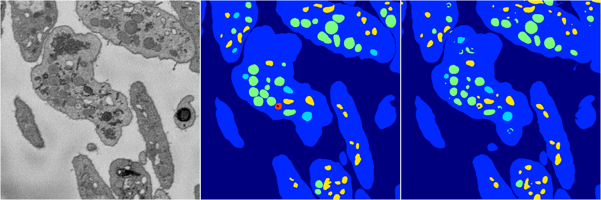
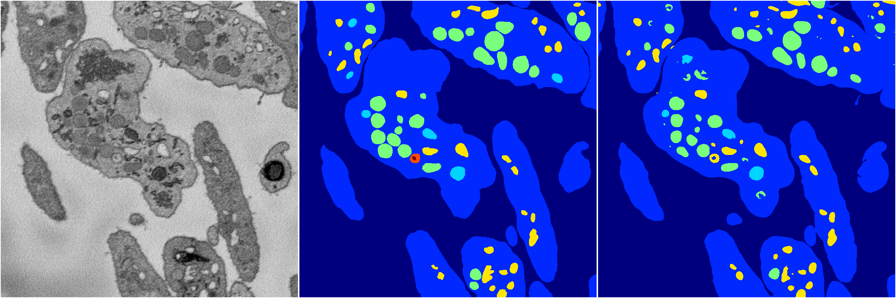

[Back](..)&nbsp;&nbsp;&nbsp;&nbsp;&nbsp;[Home](https://leapmanlab.github.io/snapshots)

---

<a href="1"><h2>random_hybrid_3d / 0416 / 127 / 1</h2></a>
Created 29 Apr 2019, 14:48:51

<i>Click for more details</i>

**ari**: 0.8397. **miou**: 0.5124. **accuracy**: 0.9426. **n_params**: 438218.0000. 

---

<a href="0"><h2>random_hybrid_3d / 0416 / 127 / 0</h2></a>
Created 29 Apr 2019, 14:48:49

<i>Click for more details</i>

**ari**: 0.8408. **miou**: 0.5042. **accuracy**: 0.9419. **n_params**: 438071.0000. 

---

[Back](..)&nbsp;&nbsp;&nbsp;&nbsp;&nbsp;[Home](https://leapmanlab.github.io/snapshots)

---