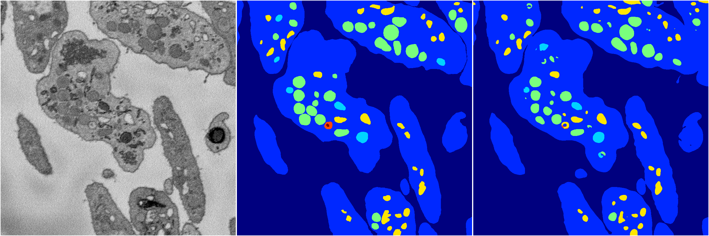
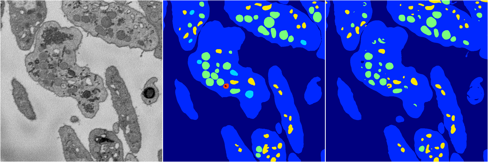

[Back](..)&nbsp;&nbsp;&nbsp;&nbsp;&nbsp;[Home](https://leapmanlab.github.io/snapshots)

---

<a href="0"><h2>random_hybrid_3d / 0416 / 134 / 0</h2></a>
Created 18 Apr 2019, 16:41:04

<i>Click for more details</i>

**ari**: 0.8426. **miou**: 0.5633. **accuracy**: 0.9431. **n_params**: 2567390.0000. 

---

<a href="1"><h2>random_hybrid_3d / 0416 / 134 / 1</h2></a>
Created 18 Apr 2019, 16:41:04

<i>Click for more details</i>

**ari**: 0.8280. **miou**: 0.4372. **accuracy**: 0.9370. **n_params**: 2567390.0000. 

---

[Back](..)&nbsp;&nbsp;&nbsp;&nbsp;&nbsp;[Home](https://leapmanlab.github.io/snapshots)

---