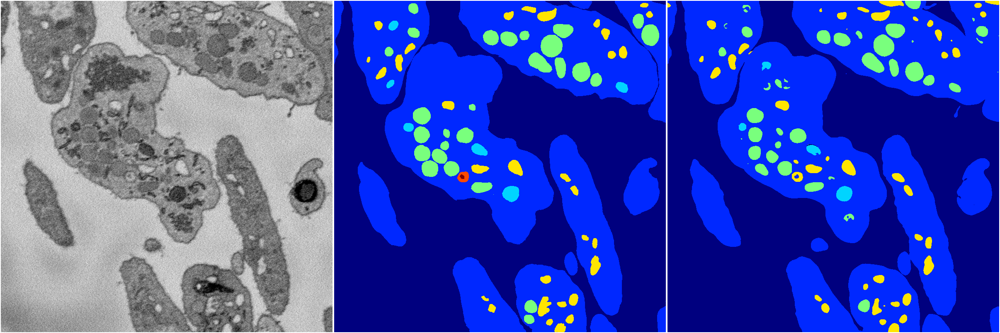

[Back](..)&nbsp;&nbsp;&nbsp;&nbsp;&nbsp;[Home](https://leapmanlab.github.io/snapshots)

---

<a href="1"><h2>random_hybrid_3d / 0416 / 139 / 1</h2></a>
Created 18 Apr 2019, 16:41:04

<i>Click for more details</i>

**ari**: 0.8391. **miou**: 0.4276. **accuracy**: 0.9374. **n_params**: 605364.0000. 

---

<a href="0"><h2>random_hybrid_3d / 0416 / 139 / 0</h2></a>
Created 18 Apr 2019, 16:41:04

<i>Click for more details</i>

**ari**: 0.8412. **miou**: 0.4973. **accuracy**: 0.9419. **n_params**: 605217.0000. 

---

[Back](..)&nbsp;&nbsp;&nbsp;&nbsp;&nbsp;[Home](https://leapmanlab.github.io/snapshots)

---