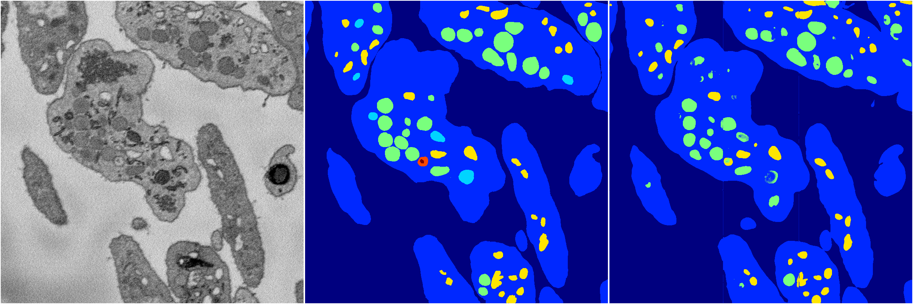

[Back](..)&nbsp;&nbsp;&nbsp;&nbsp;&nbsp;[Home](https://leapmanlab.github.io/snapshots)

---

<a href="0"><h2>random_hybrid_3d / 0416 / 142 / 0</h2></a>
Created 20 Apr 2019, 00:17:14

<i>Click for more details</i>

**ari**: 0.8248. **miou**: 0.4626. **accuracy**: 0.9341. **n_params**: 4001823.0000. 

---

<a href="1"><h2>random_hybrid_3d / 0416 / 142 / 1</h2></a>
Created 20 Apr 2019, 00:17:14

<i>Click for more details</i>

**ari**: 0.8374. **miou**: 0.4232. **accuracy**: 0.9354. **n_params**: 4001676.0000. 

---

[Back](..)&nbsp;&nbsp;&nbsp;&nbsp;&nbsp;[Home](https://leapmanlab.github.io/snapshots)

---