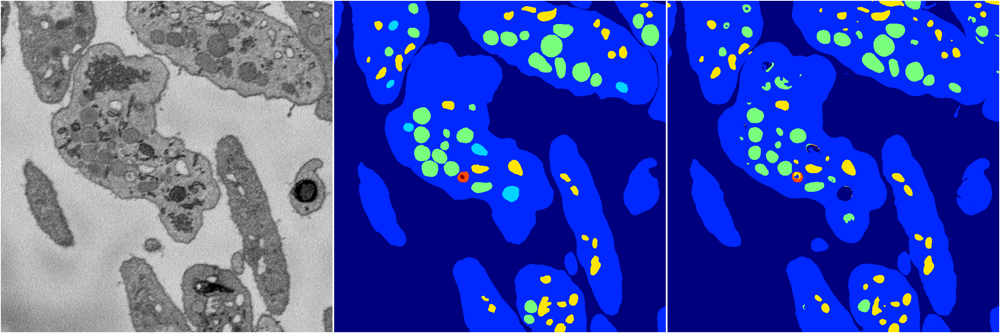

[Back](..)&nbsp;&nbsp;&nbsp;&nbsp;&nbsp;[Home](https://leapmanlab.github.io/snapshots)

---

<a href="1"><h2>random_hybrid_3d / 0416 / 145 / 1</h2></a>
Created 20 Apr 2019, 00:17:13

<i>Click for more details</i>

**ari**: 0.8361. **miou**: 0.5063. **accuracy**: 0.9402. **n_params**: 340086.0000. 

---

<a href="0"><h2>random_hybrid_3d / 0416 / 145 / 0</h2></a>
Created 20 Apr 2019, 00:17:13

<i>Click for more details</i>

**ari**: 0.8314. **miou**: 0.4725. **accuracy**: 0.9354. **n_params**: 339939.0000. 

---

[Back](..)&nbsp;&nbsp;&nbsp;&nbsp;&nbsp;[Home](https://leapmanlab.github.io/snapshots)

---