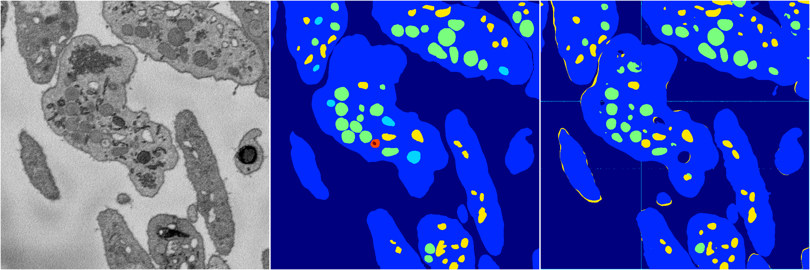

[Back](..)&nbsp;&nbsp;&nbsp;&nbsp;&nbsp;[Home](https://leapmanlab.github.io/snapshots)

---

<a href="0"><h2>random_hybrid_3d / 0416 / 151 / 0</h2></a>
Created 29 Apr 2019, 14:49:03

<i>Click for more details</i>

**ari**: 0.8380. **miou**: 0.5430. **accuracy**: 0.9415. **n_params**: 423087.0000. 

---

<a href="1"><h2>random_hybrid_3d / 0416 / 151 / 1</h2></a>
Created 29 Apr 2019, 14:49:02

<i>Click for more details</i>

**ari**: 0.8045. **miou**: 0.4216. **accuracy**: 0.9258. **n_params**: 422940.0000. 

---

[Back](..)&nbsp;&nbsp;&nbsp;&nbsp;&nbsp;[Home](https://leapmanlab.github.io/snapshots)

---