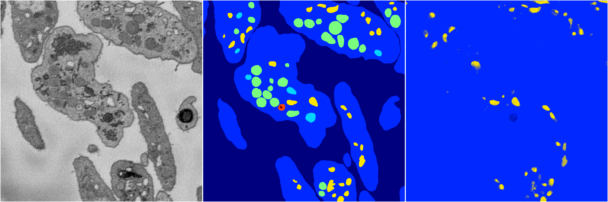
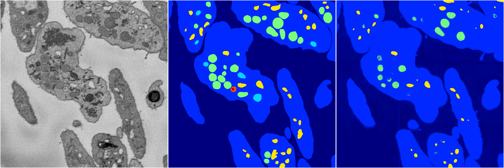

[Back](..)&nbsp;&nbsp;&nbsp;&nbsp;&nbsp;[Home](https://leapmanlab.github.io/snapshots)

---

<a href="1"><h2>random_hybrid_3d / 0416 / 153 / 1</h2></a>
Created 20 Apr 2019, 00:17:14

<i>Click for more details</i>

**ari**: 0.0330. **miou**: 0.1179. **accuracy**: 0.4694. **n_params**: 247864.0000. 

---

<a href="0"><h2>random_hybrid_3d / 0416 / 153 / 0</h2></a>
Created 20 Apr 2019, 00:17:14

<i>Click for more details</i>

**ari**: 0.7241. **miou**: 0.3717. **accuracy**: 0.9064. **n_params**: 247717.0000. 

---

[Back](..)&nbsp;&nbsp;&nbsp;&nbsp;&nbsp;[Home](https://leapmanlab.github.io/snapshots)

---