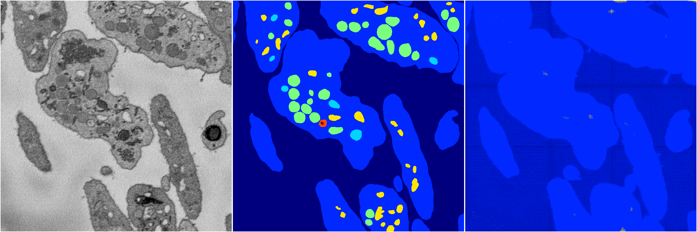

[Back](..)&nbsp;&nbsp;&nbsp;&nbsp;&nbsp;[Home](https://leapmanlab.github.io/snapshots)

---

<a href="1"><h2>random_hybrid_3d / 0416 / 157 / 1</h2></a>
Created 29 Apr 2019, 14:49:03

<i>Click for more details</i>

**ari**: 0.8408. **miou**: 0.6462. **accuracy**: 0.9429. **n_params**: 3764110.0000. 

---

<a href="0"><h2>random_hybrid_3d / 0416 / 157 / 0</h2></a>
Created 29 Apr 2019, 14:49:03

<i>Click for more details</i>

**ari**: 0.2489. **miou**: 0.1786. **accuracy**: 0.7227. **n_params**: 3762738.0000. 

---

[Back](..)&nbsp;&nbsp;&nbsp;&nbsp;&nbsp;[Home](https://leapmanlab.github.io/snapshots)

---