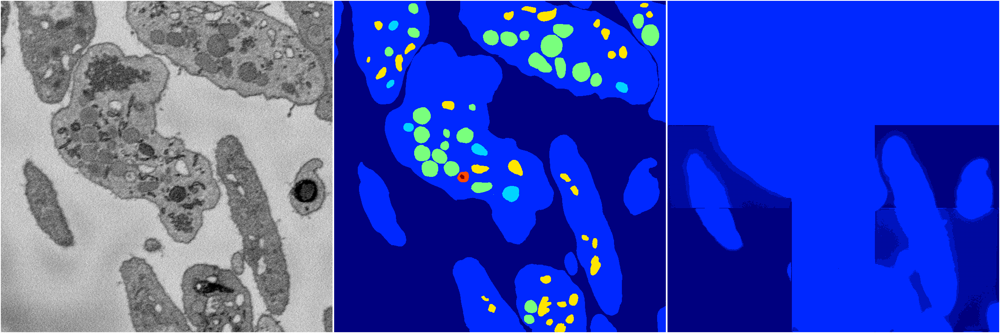

[Back](..)&nbsp;&nbsp;&nbsp;&nbsp;&nbsp;[Home](https://leapmanlab.github.io/snapshots)

---

<a href="0"><h2>random_hybrid_3d / 0416 / 161 / 0</h2></a>
Created 29 Apr 2019, 14:49:10

<i>Click for more details</i>

**ari**: 0.8379. **miou**: 0.4910. **accuracy**: 0.9403. **n_params**: 951567.0000. 

---

<a href="1"><h2>random_hybrid_3d / 0416 / 161 / 1</h2></a>
Created 29 Apr 2019, 14:49:10

<i>Click for more details</i>

**ari**: 0.4689. **miou**: 0.2119. **accuracy**: 0.8224. **n_params**: 951350.0000. 

---

[Back](..)&nbsp;&nbsp;&nbsp;&nbsp;&nbsp;[Home](https://leapmanlab.github.io/snapshots)

---