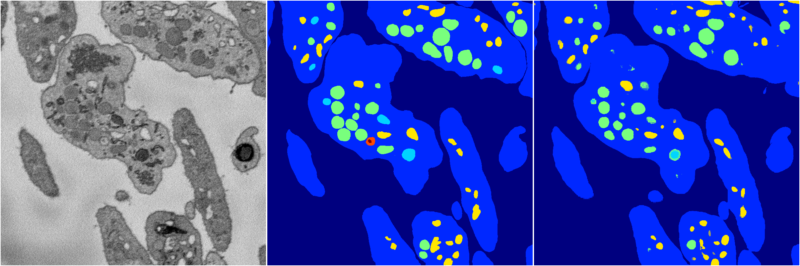

[Back](..)&nbsp;&nbsp;&nbsp;&nbsp;&nbsp;[Home](https://leapmanlab.github.io/snapshots)

---

<a href="0"><h2>random_hybrid_3d / 0416 / 164 / 0</h2></a>
Created 29 Apr 2019, 14:49:06

<i>Click for more details</i>

**ari**: 0.8310. **miou**: 0.4335. **accuracy**: 0.9357. **n_params**: 1233337.0000. 

---

<a href="1"><h2>random_hybrid_3d / 0416 / 164 / 1</h2></a>
Created 29 Apr 2019, 14:49:06

<i>Click for more details</i>

**ari**: 0.8406. **miou**: 0.5096. **accuracy**: 0.9424. **n_params**: 1235017.0000. 

---

[Back](..)&nbsp;&nbsp;&nbsp;&nbsp;&nbsp;[Home](https://leapmanlab.github.io/snapshots)

---