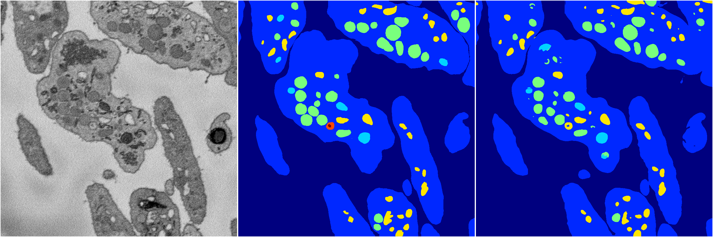
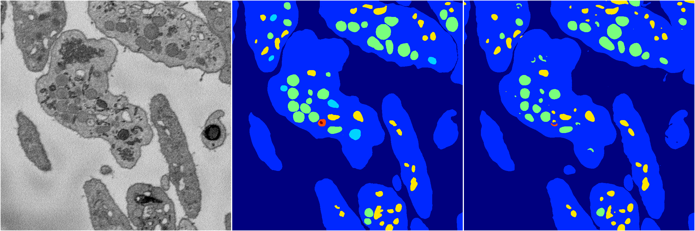

[Back](..)&nbsp;&nbsp;&nbsp;&nbsp;&nbsp;[Home](https://leapmanlab.github.io/snapshots)

---

<a href="1"><h2>random_hybrid_3d / 0416 / 168 / 1</h2></a>
Created 25 Apr 2019, 14:02:51

<i>Click for more details</i>

**ari**: 0.8435. **miou**: 0.5086. **accuracy**: 0.9427. **n_params**: 1939318.0000. 

---

<a href="0"><h2>random_hybrid_3d / 0416 / 168 / 0</h2></a>
Created 25 Apr 2019, 14:02:51

<i>Click for more details</i>

**ari**: 0.8289. **miou**: 0.4943. **accuracy**: 0.9370. **n_params**: 1939318.0000. 

---

[Back](..)&nbsp;&nbsp;&nbsp;&nbsp;&nbsp;[Home](https://leapmanlab.github.io/snapshots)

---