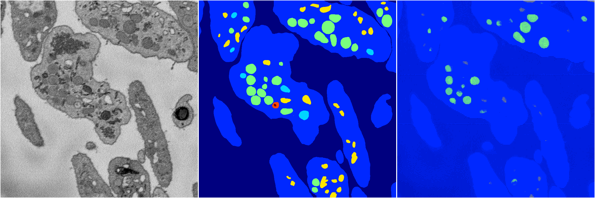

[Back](..)&nbsp;&nbsp;&nbsp;&nbsp;&nbsp;[Home](https://leapmanlab.github.io/snapshots)

---

<a href="0"><h2>random_hybrid_3d / 0416 / 169 / 0</h2></a>
Created 18 Apr 2019, 16:41:05

<i>Click for more details</i>

**ari**: 0.8429. **miou**: 0.5350. **accuracy**: 0.9435. **n_params**: 71089.0000. 

---

<a href="1"><h2>random_hybrid_3d / 0416 / 169 / 1</h2></a>
Created 18 Apr 2019, 16:41:05

<i>Click for more details</i>

**ari**: 0.1014. **miou**: 0.1955. **accuracy**: 0.6301. **n_params**: 70942.0000. 

---

[Back](..)&nbsp;&nbsp;&nbsp;&nbsp;&nbsp;[Home](https://leapmanlab.github.io/snapshots)

---