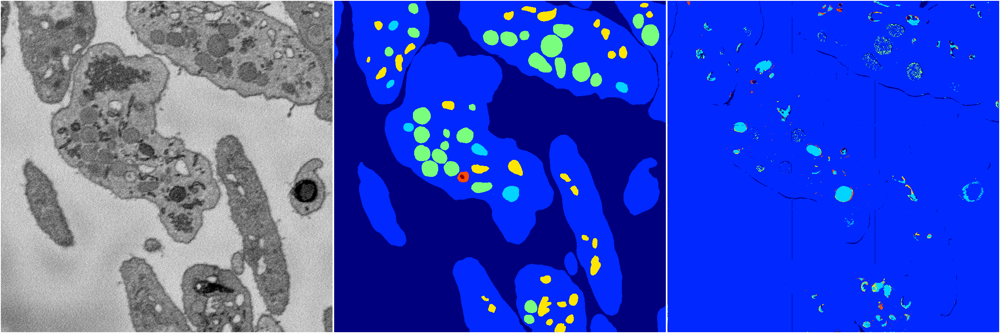

[Back](..)&nbsp;&nbsp;&nbsp;&nbsp;&nbsp;[Home](https://leapmanlab.github.io/snapshots)

---

<a href="1"><h2>random_hybrid_3d / 0416 / 183 / 1</h2></a>
Created 07 May 2019, 10:53:02

<i>Click for more details</i>

**ari**: 0.1045. **miou**: 0.2392. **accuracy**: 0.4843. **n_params**: 11655.0000. 

---

<a href="0"><h2>random_hybrid_3d / 0416 / 183 / 0</h2></a>
Created 07 May 2019, 10:53:02

<i>Click for more details</i>

**ari**: 0.0285. **miou**: 0.1558. **accuracy**: 0.4956. **n_params**: 11655.0000. 

---

[Back](..)&nbsp;&nbsp;&nbsp;&nbsp;&nbsp;[Home](https://leapmanlab.github.io/snapshots)

---