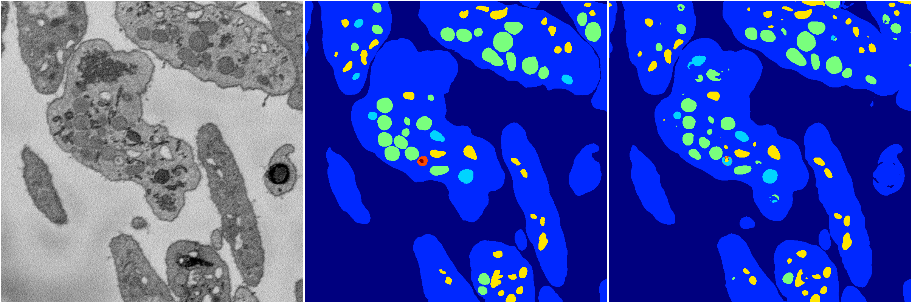
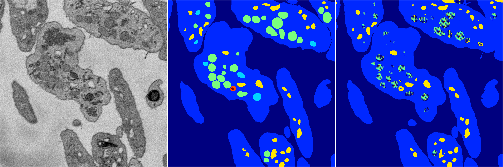

[Back](..)&nbsp;&nbsp;&nbsp;&nbsp;&nbsp;[Home](https://leapmanlab.github.io/snapshots)

---

<a href="1"><h2>random_hybrid_3d / 0416 / 192 / 1</h2></a>
Created 29 Apr 2019, 14:49:20

<i>Click for more details</i>

**ari**: 0.8384. **miou**: 0.5652. **accuracy**: 0.9417. **n_params**: 10098434.0000. 

---

<a href="0"><h2>random_hybrid_3d / 0416 / 192 / 0</h2></a>
Created 29 Apr 2019, 14:49:20

<i>Click for more details</i>

**ari**: 0.8181. **miou**: 0.3921. **accuracy**: 0.9263. **n_params**: 10100009.0000. 

---

[Back](..)&nbsp;&nbsp;&nbsp;&nbsp;&nbsp;[Home](https://leapmanlab.github.io/snapshots)

---