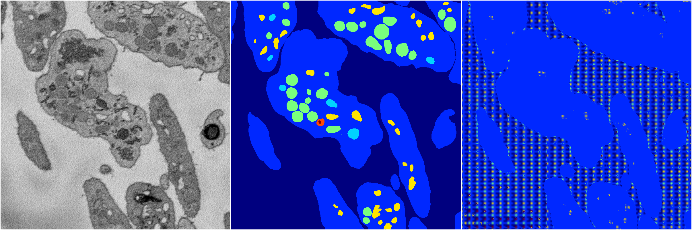
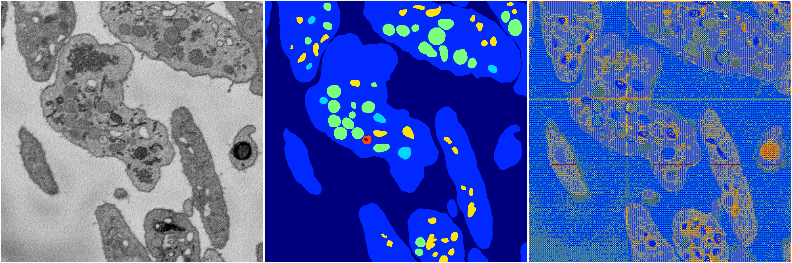

[Back](..)&nbsp;&nbsp;&nbsp;&nbsp;&nbsp;[Home](https://leapmanlab.github.io/snapshots)

---

<a href="1"><h2>random_hybrid_3d / 0416 / 198 / 1</h2></a>
Created 25 Apr 2019, 14:02:51

<i>Click for more details</i>

**ari**: 0.0909. **miou**: 0.1422. **accuracy**: 0.6222. **n_params**: 146163.0000. 

---

<a href="0"><h2>random_hybrid_3d / 0416 / 198 / 0</h2></a>
Created 25 Apr 2019, 14:02:51

<i>Click for more details</i>

**ari**: 0.0370. **miou**: 0.1007. **accuracy**: 0.3743. **n_params**: 145939.0000. 

---

[Back](..)&nbsp;&nbsp;&nbsp;&nbsp;&nbsp;[Home](https://leapmanlab.github.io/snapshots)

---