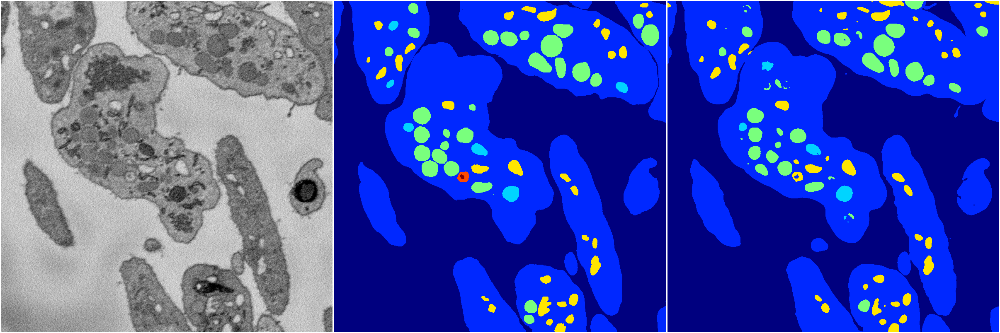

[Back](..)&nbsp;&nbsp;&nbsp;&nbsp;&nbsp;[Home](https://leapmanlab.github.io/snapshots)

---

<a href="1"><h2>random_hybrid_3d / 0416 / 2 / 1</h2></a>
Created 20 Apr 2019, 00:17:09

<i>Click for more details</i>

**ari**: 0.8418. **miou**: 0.5930. **accuracy**: 0.9432. **n_params**: 29701.0000. 

---

<a href="0"><h2>random_hybrid_3d / 0416 / 2 / 0</h2></a>
Created 20 Apr 2019, 00:17:09

<i>Click for more details</i>

**ari**: 0.8334. **miou**: 0.6577. **accuracy**: 0.9409. **n_params**: 29309.0000. 

---

[Back](..)&nbsp;&nbsp;&nbsp;&nbsp;&nbsp;[Home](https://leapmanlab.github.io/snapshots)

---