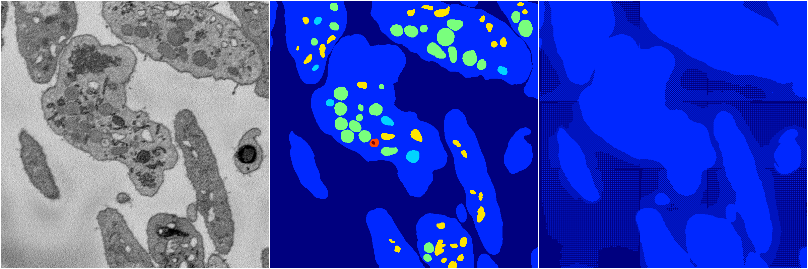
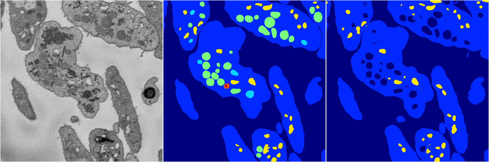

[Back](..)&nbsp;&nbsp;&nbsp;&nbsp;&nbsp;[Home](https://leapmanlab.github.io/snapshots)

---

<a href="0"><h2>random_hybrid_3d / 0416 / 22 / 0</h2></a>
Created 16 Apr 2019, 17:08:35

<i>Click for more details</i>

**ari**: 0.4815. **miou**: 0.2132. **accuracy**: 0.8252. **n_params**: 4896636.0000. 

---

<a href="1"><h2>random_hybrid_3d / 0416 / 22 / 1</h2></a>
Created 16 Apr 2019, 17:08:35

<i>Click for more details</i>

**ari**: 0.7786. **miou**: 0.3430. **accuracy**: 0.9130. **n_params**: 4896636.0000. 

---

[Back](..)&nbsp;&nbsp;&nbsp;&nbsp;&nbsp;[Home](https://leapmanlab.github.io/snapshots)

---