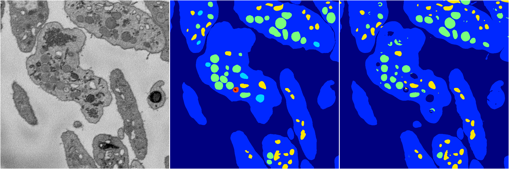
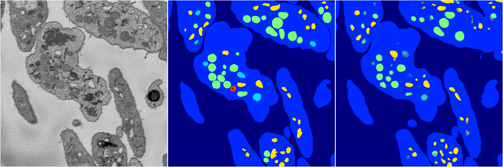

[Back](..)&nbsp;&nbsp;&nbsp;&nbsp;&nbsp;[Home](https://leapmanlab.github.io/snapshots)

---

<a href="1"><h2>random_hybrid_3d / 0416 / 225 / 1</h2></a>
Created 18 Apr 2019, 16:41:06

<i>Click for more details</i>

**ari**: 0.8285. **miou**: 0.4345. **accuracy**: 0.9353. **n_params**: 3266659.0000. 

---

<a href="0"><h2>random_hybrid_3d / 0416 / 225 / 0</h2></a>
Created 18 Apr 2019, 16:41:06

<i>Click for more details</i>

**ari**: 0.8289. **miou**: 0.4204. **accuracy**: 0.9343. **n_params**: 3265630.0000. 

---

[Back](..)&nbsp;&nbsp;&nbsp;&nbsp;&nbsp;[Home](https://leapmanlab.github.io/snapshots)

---