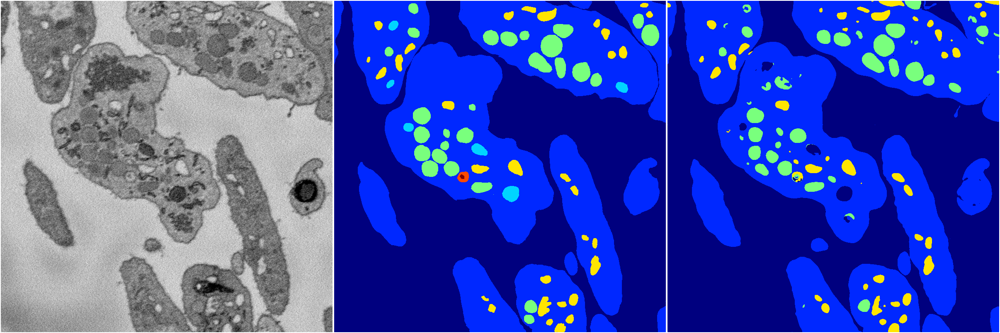
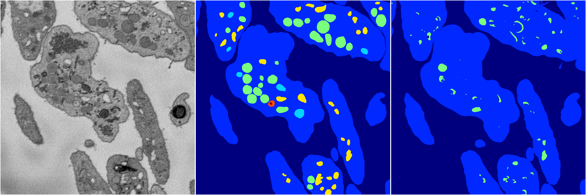

[Back](..)&nbsp;&nbsp;&nbsp;&nbsp;&nbsp;[Home](https://leapmanlab.github.io/snapshots)

---

<a href="1"><h2>random_hybrid_3d / 0416 / 230 / 1</h2></a>
Created 18 Apr 2019, 16:41:06

<i>Click for more details</i>

**ari**: 0.8345. **miou**: 0.4421. **accuracy**: 0.9360. **n_params**: 119548.0000. 

---

<a href="0"><h2>random_hybrid_3d / 0416 / 230 / 0</h2></a>
Created 18 Apr 2019, 16:41:06

<i>Click for more details</i>

**ari**: 0.7957. **miou**: 0.2878. **accuracy**: 0.9144. **n_params**: 119548.0000. 

---

[Back](..)&nbsp;&nbsp;&nbsp;&nbsp;&nbsp;[Home](https://leapmanlab.github.io/snapshots)

---