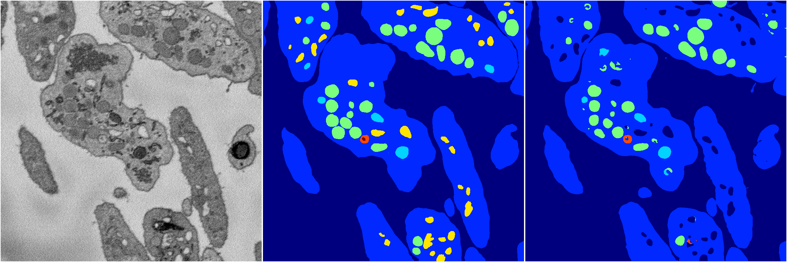

[Back](..)&nbsp;&nbsp;&nbsp;&nbsp;&nbsp;[Home](https://leapmanlab.github.io/snapshots)

---

<a href="1"><h2>random_hybrid_3d / 0416 / 237 / 1</h2></a>
Created 29 Apr 2019, 14:49:26

<i>Click for more details</i>

**ari**: 0.8441. **miou**: 0.6557. **accuracy**: 0.9442. **n_params**: 609800.0000. 

---

<a href="0"><h2>random_hybrid_3d / 0416 / 237 / 0</h2></a>
Created 29 Apr 2019, 14:49:26

<i>Click for more details</i>

**ari**: 0.8040. **miou**: 0.4761. **accuracy**: 0.9253. **n_params**: 611375.0000. 

---

[Back](..)&nbsp;&nbsp;&nbsp;&nbsp;&nbsp;[Home](https://leapmanlab.github.io/snapshots)

---