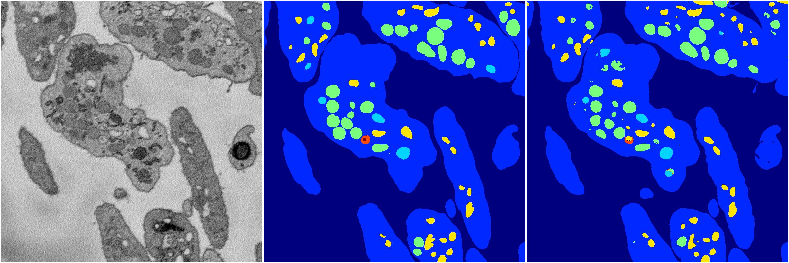
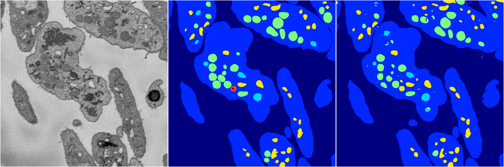

[Back](..)&nbsp;&nbsp;&nbsp;&nbsp;&nbsp;[Home](https://leapmanlab.github.io/snapshots)

---

<a href="1"><h2>random_hybrid_3d / 0416 / 245 / 1</h2></a>
Created 29 Apr 2019, 14:49:26

<i>Click for more details</i>

**ari**: 0.8427. **miou**: 0.5504. **accuracy**: 0.9427. **n_params**: 764448.0000. 

---

<a href="0"><h2>random_hybrid_3d / 0416 / 245 / 0</h2></a>
Created 29 Apr 2019, 14:49:26

<i>Click for more details</i>

**ari**: 0.8407. **miou**: 0.5350. **accuracy**: 0.9421. **n_params**: 764301.0000. 

---

[Back](..)&nbsp;&nbsp;&nbsp;&nbsp;&nbsp;[Home](https://leapmanlab.github.io/snapshots)

---