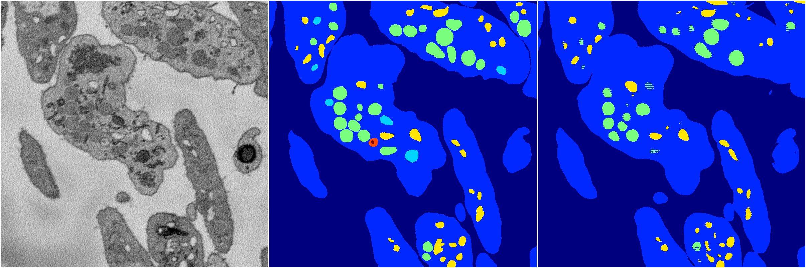

[Back](..)&nbsp;&nbsp;&nbsp;&nbsp;&nbsp;[Home](https://leapmanlab.github.io/snapshots)

---

<a href="1"><h2>random_hybrid_3d / 0416 / 265 / 1</h2></a>
Created 07 May 2019, 10:53:08

<i>Click for more details</i>

**ari**: 0.8190. **miou**: 0.4255. **accuracy**: 0.9337. **n_params**: 7378559.0000. 

---

<a href="0"><h2>random_hybrid_3d / 0416 / 265 / 0</h2></a>
Created 07 May 2019, 10:53:08

<i>Click for more details</i>

**ari**: 0.8398. **miou**: 0.4328. **accuracy**: 0.9387. **n_params**: 7378559.0000. 

---

[Back](..)&nbsp;&nbsp;&nbsp;&nbsp;&nbsp;[Home](https://leapmanlab.github.io/snapshots)

---