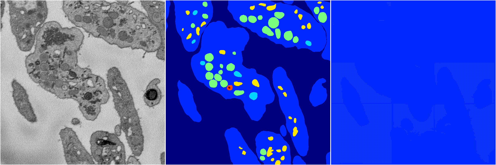
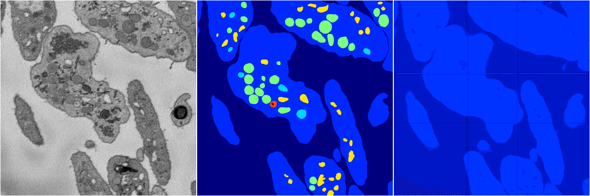

[Back](..)&nbsp;&nbsp;&nbsp;&nbsp;&nbsp;[Home](https://leapmanlab.github.io/snapshots)

---

<a href="1"><h2>random_hybrid_3d / 0416 / 290 / 1</h2></a>
Created 07 May 2019, 10:53:09

<i>Click for more details</i>

**ari**: -0.0107. **miou**: 0.0729. **accuracy**: 0.4787. **n_params**: 599561.0000. 

---

<a href="0"><h2>random_hybrid_3d / 0416 / 290 / 0</h2></a>
Created 07 May 2019, 10:53:09

<i>Click for more details</i>

**ari**: 0.0062. **miou**: 0.0958. **accuracy**: 0.5055. **n_params**: 599183.0000. 

---

[Back](..)&nbsp;&nbsp;&nbsp;&nbsp;&nbsp;[Home](https://leapmanlab.github.io/snapshots)

---