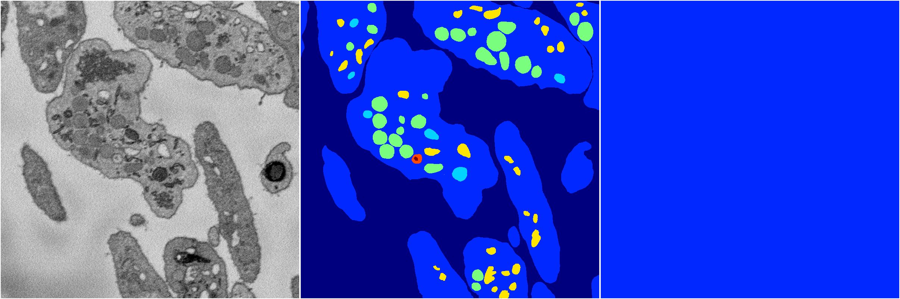

[Back](..)&nbsp;&nbsp;&nbsp;&nbsp;&nbsp;[Home](https://leapmanlab.github.io/snapshots)

---

<a href="0"><h2>random_hybrid_3d / 0416 / 32 / 0</h2></a>
Created 18 Apr 2019, 16:41:01

<i>Click for more details</i>

**ari**: -0.0000. **miou**: 0.0659. **accuracy**: 0.4613. **n_params**: 106815.0000. 

---

<a href="1"><h2>random_hybrid_3d / 0416 / 32 / 1</h2></a>
Created 18 Apr 2019, 16:41:01

<i>Click for more details</i>

**ari**: 0.7733. **miou**: 0.3193. **accuracy**: 0.9120. **n_params**: 106353.0000. 

---

[Back](..)&nbsp;&nbsp;&nbsp;&nbsp;&nbsp;[Home](https://leapmanlab.github.io/snapshots)

---