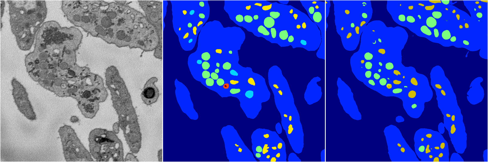
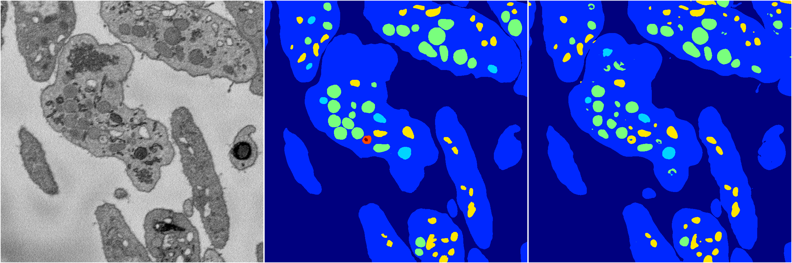

[Back](..)&nbsp;&nbsp;&nbsp;&nbsp;&nbsp;[Home](https://leapmanlab.github.io/snapshots)

---

<a href="0"><h2>random_hybrid_3d / 0416 / 37 / 0</h2></a>
Created 07 May 2019, 10:52:55

<i>Click for more details</i>

**ari**: 0.8286. **miou**: 0.4040. **accuracy**: 0.9324. **n_params**: 14827388.0000. 

---

<a href="1"><h2>random_hybrid_3d / 0416 / 37 / 1</h2></a>
Created 07 May 2019, 10:52:55

<i>Click for more details</i>

**ari**: 0.8394. **miou**: 0.5271. **accuracy**: 0.9416. **n_params**: 14827241.0000. 

---

[Back](..)&nbsp;&nbsp;&nbsp;&nbsp;&nbsp;[Home](https://leapmanlab.github.io/snapshots)

---