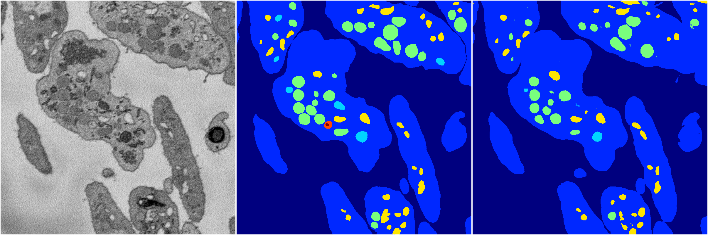

[Back](..)&nbsp;&nbsp;&nbsp;&nbsp;&nbsp;[Home](https://leapmanlab.github.io/snapshots)

---

<a href="1"><h2>random_hybrid_3d / 0416 / 38 / 1</h2></a>
Created 16 Apr 2019, 17:08:36

<i>Click for more details</i>

**ari**: 0.8419. **miou**: 0.5726. **accuracy**: 0.9431. **n_params**: 156785.0000. 

---

<a href="0"><h2>random_hybrid_3d / 0416 / 38 / 0</h2></a>
Created 16 Apr 2019, 17:08:36

<i>Click for more details</i>

**ari**: 0.8317. **miou**: 0.4706. **accuracy**: 0.9392. **n_params**: 156022.0000. 

---

[Back](..)&nbsp;&nbsp;&nbsp;&nbsp;&nbsp;[Home](https://leapmanlab.github.io/snapshots)

---