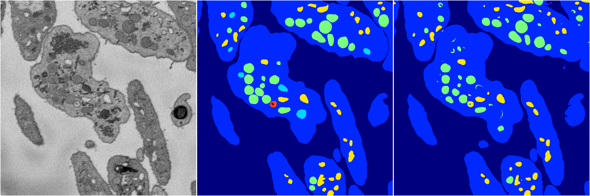
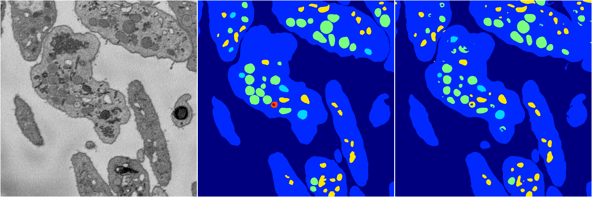

[Back](..)&nbsp;&nbsp;&nbsp;&nbsp;&nbsp;[Home](https://leapmanlab.github.io/snapshots)

---

<a href="0"><h2>random_hybrid_3d / 0416 / 51 / 0</h2></a>
Created 25 Apr 2019, 13:50:37

<i>Click for more details</i>

**ari**: 0.8379. **miou**: 0.4279. **accuracy**: 0.9368. **n_params**: 718621.0000. 

---

<a href="1"><h2>random_hybrid_3d / 0416 / 51 / 1</h2></a>
Created 25 Apr 2019, 13:50:37

<i>Click for more details</i>

**ari**: 0.8425. **miou**: 0.5054. **accuracy**: 0.9421. **n_params**: 718474.0000. 

---

[Back](..)&nbsp;&nbsp;&nbsp;&nbsp;&nbsp;[Home](https://leapmanlab.github.io/snapshots)

---