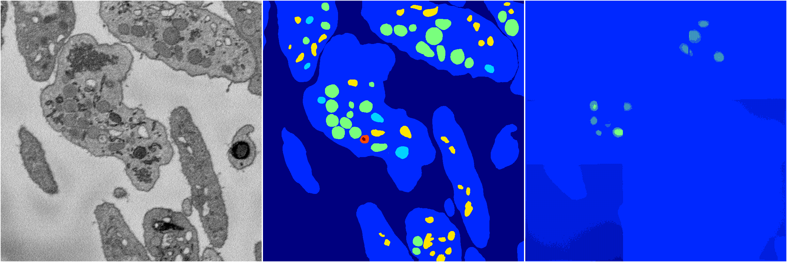
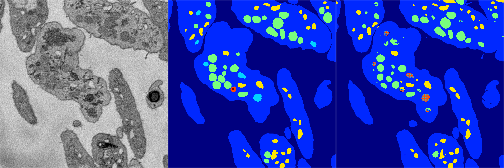

[Back](..)&nbsp;&nbsp;&nbsp;&nbsp;&nbsp;[Home](https://leapmanlab.github.io/snapshots)

---

<a href="0"><h2>random_hybrid_3d / 0416 / 60 / 0</h2></a>
Created 29 Apr 2019, 14:48:25

<i>Click for more details</i>

**ari**: 0.1700. **miou**: 0.1801. **accuracy**: 0.6750. **n_params**: 194218.0000. 

---

<a href="1"><h2>random_hybrid_3d / 0416 / 60 / 1</h2></a>
Created 29 Apr 2019, 14:48:25

<i>Click for more details</i>

**ari**: 0.8398. **miou**: 0.4560. **accuracy**: 0.9363. **n_params**: 194071.0000. 

---

[Back](..)&nbsp;&nbsp;&nbsp;&nbsp;&nbsp;[Home](https://leapmanlab.github.io/snapshots)

---