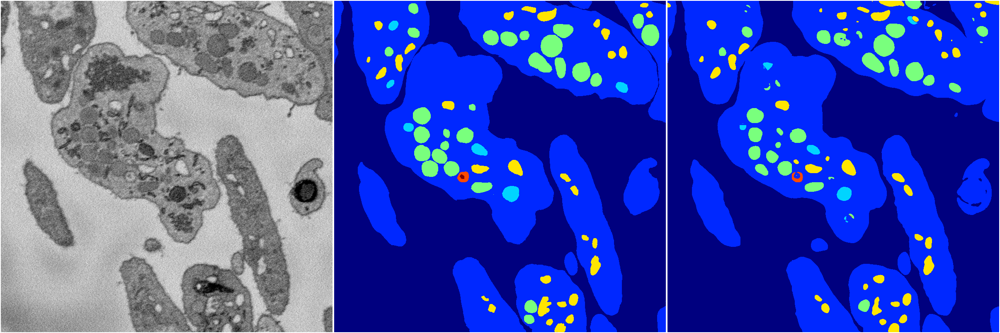
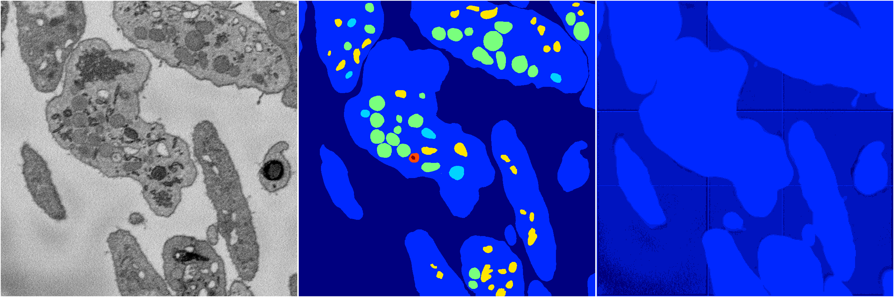

[Back](..)&nbsp;&nbsp;&nbsp;&nbsp;&nbsp;[Home](https://leapmanlab.github.io/snapshots)

---

<a href="1"><h2>random_hybrid_3d / 0416 / 65 / 1</h2></a>
Created 25 Apr 2019, 13:50:39

<i>Click for more details</i>

**ari**: 0.8404. **miou**: 0.5504. **accuracy**: 0.9423. **n_params**: 1920417.0000. 

---

<a href="0"><h2>random_hybrid_3d / 0416 / 65 / 0</h2></a>
Created 25 Apr 2019, 13:50:39

<i>Click for more details</i>

**ari**: 0.5327. **miou**: 0.2215. **accuracy**: 0.8430. **n_params**: 1920270.0000. 

---

[Back](..)&nbsp;&nbsp;&nbsp;&nbsp;&nbsp;[Home](https://leapmanlab.github.io/snapshots)

---